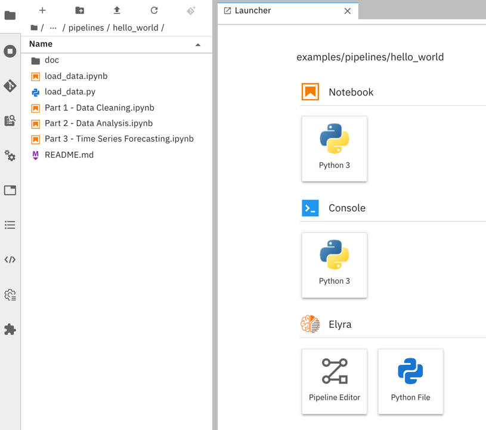

<!--

Copyright 2018-2020 IBM Corporation

Licensed under the Apache License, Version 2.0 (the "License");
you may not use this file except in compliance with the License.
You may obtain a copy of the License at

http://www.apache.org/licenses/LICENSE-2.0

Unless required by applicable law or agreed to in writing, software
distributed under the License is distributed on an "AS IS" BASIS,
WITHOUT WARRANTIES OR CONDITIONS OF ANY KIND, either express or implied.
See the License for the specific language governing permissions and
limitations under the License.

-->


[](https://badge.fury.io/py/elyra)
[](https://pepy.tech/project/elyra)
[](https://elyra.readthedocs.io/en/latest/?badge=latest)
[](https://github.com/elyra-ai/elyra/issues)
[](https://gitter.im/elyra-ai/community?utm_source=badge&utm_medium=badge&utm_campaign=pr-badge)

# Elyra

Elyra is a set of AI-centric extensions to JupyterLab Notebooks.

Elyra currently includes:

- Notebook Pipelines visual editor
- Ability to run notebooks as batch jobs
- Reusable Code Snippets
- Hybrid runtime support (based on [Jupyter Enterprise Gateway](https://github.com/jupyter/enterprise_gateway))
- Python script execution capabilities within the editor
- Python script navigation using auto-generated outlines using Table of Contents
- Notebook navigation using auto-generated Table of Contents
- Notebook versioning based on Git integration
- Reusable configuration and editor for runtimes



The [Elyra Getting Started Guide](https://elyra.readthedocs.io/en/latest/getting_started/overview.html)
includes more details on these features.

## Try Elyra

#### Using Binder
You can try out some of Elyra features using the [My Binder](https://mybinder.readthedocs.io/en/latest/) service.

Click on a link below to try Elyra, on a sandbox environment, without having to install anything.

- [](https://mybinder.org/v2/gh/elyra-ai/elyra/v1.5.3?urlpath=lab/tree/binder-demo) (Latest stable version - see [changelog](/docs/source/getting_started/changelog.md) for recent updates)
- [](https://mybinder.org/v2/gh/elyra-ai/elyra/master?urlpath=lab/tree/binder-demo) (Development version - expect longer image load time due to just-in-time build)

#### Using Docker

You can also try Elyra by running one of the docker images from [Docker Hub](https://hub.docker.com/r/elyra/elyra/tags):
- `elyra/elyra:latest` has the latest released version installed.
- `elyra/elyra:x.y.z` has a specific version installed.
- `elyra/elyra:dev` is automatically re-built each time a change is committed to the master branch.

The command below starts the most recent development build in a clean environment:

```
docker run -it -p 8888:8888 elyra/elyra:1.5.3 jupyter lab --debug
```

To make a local directory containing your Notebooks (e.g. ${HOME}/opensource/jupyter-notebooks/) available in your
docker container, you can use a mount command similar to the following:

```
docker run -it -p 8888:8888 -v ${HOME}/opensource/jupyter-notebooks/:/home/jovyan/work -w /home/jovyan/work elyra/elyra:1.5.3 jupyter lab --debug
```

These should produce output similar to that below, where you can then find the URL to be used
to access Elyra in your local browser.

```
    To access the notebook, open this file in a browser:
        file:///home/jovyan/.local/share/jupyter/runtime/nbserver-6-open.html
    Or copy and paste one of these URLs:
        http://4d17829ecd4c:8888/?token=d690bde267ec75d6f88c64a39825f8b05b919dd084451f82
     or http://127.0.0.1:8888/?token=d690bde267ec75d6f88c64a39825f8b05b919dd084451f82
```

## Installation
Elyra can be installed via PyPi:

### Prerequisites :
* [NodeJS 12+](https://nodejs.org/en/)
* [Python 3.X](https://www.anaconda.com/distribution/)

##### Optional :
* [Anaconda](https://www.anaconda.com/distribution/) 

#### JupyterLab support

* [JupyterLab](https://github.com/jupyterlab/jupyterlab) 1.x is supported on **Elyra 0.10.x and below**

via PyPi:
```bash
pip install elyra==0.10.3 && jupyter lab build
```

* [JupyterLab](https://github.com/jupyterlab/jupyterlab) 2.x is supported on **Elyra 1.0.0 and above**

via PyPi:
```bash
pip install --upgrade elyra && jupyter lab build
```

Note: Ubuntu and CentOS users may need to use `pip3 install elyra` 

using Conda:
```bash
conda install -c conda-forge elyra && jupyter lab build
```

### Verify Installation 
```bash
jupyter serverextension list
```
Should output:
```
config dir: /usr/local/etc/jupyter
    elyra  enabled
    - Validating...
      elyra 1.5.3 OK
    jupyterlab  enabled
    - Validating...
      jupyterlab 2.2.8 OK
    jupyterlab_git  enabled
    - Validating...
      jupyterlab_git 0.23.1 OK
    nbdime  enabled
    - Validating...
      nbdime 2.0.0 OK
```
```bash
jupyter labextension list
```
Should output:
```
Known labextensions:
   app dir: /.../share/jupyter/lab
        @elyra/code-snippet-extension v1.5.3  enabled  OK*
        @elyra/metadata-extension v1.5.3  enabled  OK*
        @elyra/pipeline-editor-extension v1.5.3  enabled  OK*
        @elyra/python-editor-extension v1.5.3  enabled  OK*
        @elyra/theme-extension v1.5.3  enabled  OK*
        @jupyterlab/git v0.22.3  enabled  OK
        @jupyterlab/toc v4.0.0  enabled  OK
        nbdime-jupyterlab v2.0.0  enabled  OK
```
NOTE: If you don't see the Elyra server extension enabled, you may need to explicitly enable
it with `jupyter serverextension enable elyra`

## Configuring Runtimes for Pipeline execution

The Elyra Pipeline editor delegates execution of pipelines to remote runtimes. Configure these
external runtimes as documented in
[Runtime Configuration](https://elyra.readthedocs.io/en/latest/user_guide/runtime-conf.html).

## Starting Elyra
After verifying Elyra has been installed, start Elyra with:
```bash
jupyter lab
```

## Contributing to Elyra
If you are interested in helping make Elyra better, we encourage you to take a look at our 
[Contributing](CONTRIBUTING.md) page,  
[Development Workflow](https://elyra.readthedocs.io/en/latest/developer_guide/development-workflow.html)
documentation, and invite you to attend our weekly dev community meetings.

### Weekly Dev Community Meeting 
Join us weekly to discuss Elyra development topics.  Everyone is welcome and participation is optional.

**When**: Thursdays at [9AM Pacific](https://www.thetimezoneconverter.com/?t=9%3A00%20am&tz=San%20Francisco&)

**Where**: [Webex](https://ibm.webex.com/meet/akchin)

**What**: [Meeting Notes](https://hackmd.io/SgvSqrWWR2248mCw2BZ5gg?both)
