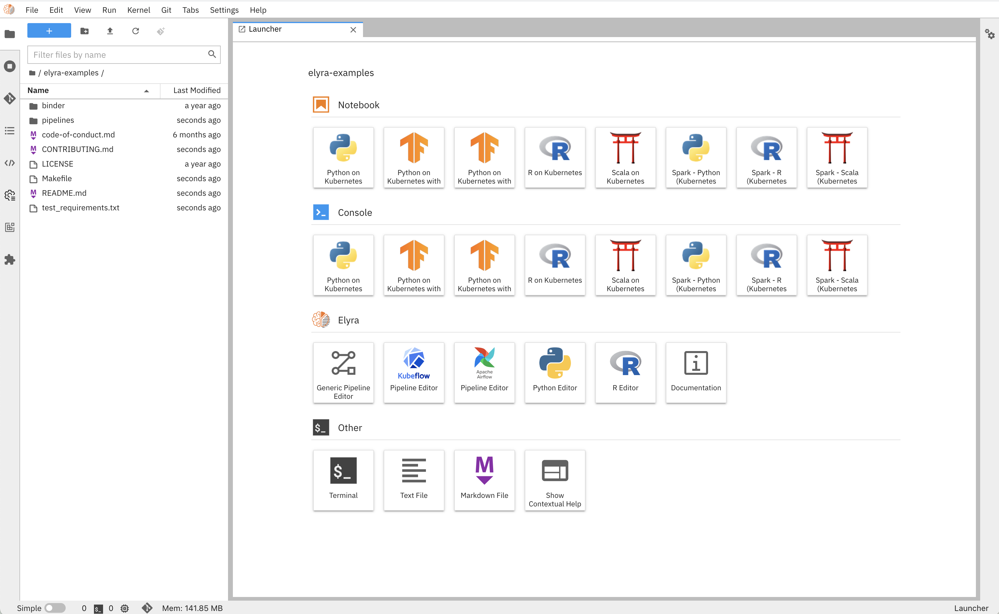

<!--

Copyright 2018-2025 Elyra Authors

Licensed under the Apache License, Version 2.0 (the "License");
you may not use this file except in compliance with the License.
You may obtain a copy of the License at

http://www.apache.org/licenses/LICENSE-2.0

Unless required by applicable law or agreed to in writing, software
distributed under the License is distributed on an "AS IS" BASIS,
WITHOUT WARRANTIES OR CONDITIONS OF ANY KIND, either express or implied.
See the License for the specific language governing permissions and
limitations under the License.

-->


[](https://badge.fury.io/py/elyra)
[](https://anaconda.org/conda-forge/elyra)
[](https://pepy.tech/project/elyra)
[](https://elyra.readthedocs.io/en/latest/?badge=latest)
[](https://github.com/elyra-ai/elyra/issues)
[](https://bestpractices.coreinfrastructure.org/projects/5761)
[](https://gitter.im/elyra-ai/community?utm_source=badge&utm_medium=badge&utm_campaign=pr-badge)

# Elyra

Elyra is a set of AI-centric extensions to JupyterLab Notebooks.

Elyra currently includes the following functionality:

- [Visual Pipeline Editor](https://elyra.readthedocs.io/en/latest/getting_started/overview.html#ai-pipelines-visual-editor)
- [Ability to run a notebook, Python or R script as a batch job](https://elyra.readthedocs.io/en/latest/getting_started/overview.html#ability-to-run-a-notebook-python-or-r-script-as-a-batch-job)
- [Reusable Code Snippets](https://elyra.readthedocs.io/en/latest/getting_started/overview.html#reusable-code-snippets)
- [Hybrid runtime support](https://elyra.readthedocs.io/en/latest/getting_started/overview.html#hybrid-runtime-support) based on [Jupyter Enterprise Gateway](https://github.com/jupyter/enterprise_gateway)
- [Python and R script editors with local/remote execution capabilities](https://elyra.readthedocs.io/en/latest/getting_started/overview.html#python-and-r-scripts-execution-support)
- [Python script navigation using auto-generated Table of Contents](https://elyra.readthedocs.io/en/latest/getting_started/overview.html##python-and-r-scripts-execution-support)
- [Python script integrated debugger (Experimental)](https://elyra.readthedocs.io/en/latest/getting_started/overview.html##python-and-r-scripts-execution-support)
- [Notebook navigation using auto-generated outlines using Table of Contents](https://elyra.readthedocs.io/en/latest/getting_started/overview.html#notebook-navigation-using-auto-generated-table-of-contents)
- [Language Server Protocol integration](https://elyra.readthedocs.io/en/latest/getting_started/overview.html#language-server-protocol-integration)
- [Version control using Git integration](https://elyra.readthedocs.io/en/latest/getting_started/overview.html#version-control-using-git-integration)



The [Elyra Getting Started Guide](https://elyra.readthedocs.io/en/latest/getting_started/overview.html) includes more details on these features. A version-specific summary of new features is located on the [releases page](https://github.com/elyra-ai/elyra/releases).

## Try Elyra

#### Using container images

You can also try Elyra by running one of the container images from [Docker Hub](https://hub.docker.com/r/elyra/elyra/tags) or [quay.io](https://quay.io/repository/elyra/elyra?tab=tags):
- `elyra/elyra:latest` has the latest released version installed.
- `elyra/elyra:x.y.z` has a specific version installed.

Note: You can also [build a container image from the `main` branch ("dev build")](https://github.com/elyra-ai/elyra/tree/main/etc/docker/elyra) to try out features that have not been released yet.

To run one of the container images, issue the following command, specifying a tag of your choice.

```
docker run -it -p 8888:8888 elyra/elyra:4.0.0rc2 jupyter lab --debug
```

To make a local directory containing your Notebooks (e.g. ${HOME}/opensource/jupyter-notebooks/) available in your
docker container, you can use a mount command similar to the following:

```
docker run -it -p 8888:8888 -v ${HOME}/opensource/jupyter-notebooks/:/home/jovyan/work -w /home/jovyan/work elyra/elyra:4.0.0rc2 jupyter lab --debug
```

These should produce output similar to that below, where you can then find the URL to be used to access Elyra in your local browser.

```
    To access the notebook, open this file in a browser:
        file:///home/jovyan/.local/share/jupyter/runtime/nbserver-6-open.html
    Or copy and paste one of these URLs:
        http://4d17829ecd4c:8888/?token=d690bde267ec75d6f88c64a39825f8b05b919dd084451f82
     or http://127.0.0.1:8888/?token=d690bde267ec75d6f88c64a39825f8b05b919dd084451f82
```

Refer to the [installation documentation](https://elyra.readthedocs.io/en/stable/getting_started/installation.html#docker) for details.

## Installation

For detailed information refer to the [installation documentation](https://elyra.readthedocs.io/en/stable/getting_started/installation.html).

### Prerequisites :
* [Node.js 22](https://nodejs.org/en/)
* [Python 3.9+](https://www.python.org/downloads/)
* [Miniconda](https://docs.conda.io/en/latest/miniconda.html) / [Micromamba](https://mamba.readthedocs.io/en/latest/installation/micromamba-installation.html) (optional)

### Install current release (for JupyterLab 4.x)

The current release version is displayed at the top of this page.

  - Install from PyPI

    ```bash
    pip3 install --upgrade "elyra[all]"
    ```

  - Install from conda-forge

    ```bash
    conda install -c conda-forge "elyra[all]"
    ```

### Install older release

Installation instructions and JupyterLab support vary by release. Note that a JupyterLab build is required. Installation instructions are located in the [release-specific documentation](https://elyra.readthedocs.io/en/stable/), which can be accessed by selecting a specific version.

<details>
  <summary>Elyra 4.x (JupyterLab 4.2.5+)</summary>

  - Install from PyPI

    ```bash
    pip3 install --upgrade "elyra[all]"
    ```

  - Install from conda-forge

    ```bash
    conda install -c conda-forge "elyra[all]"
    ```
</details>

<details>
  <summary>Elyra 3.7 < 4.0 (JupyterLab 3.x)</summary>

  - Install from PyPI

    ```bash
    pip3 install --upgrade "elyra[all]<4.0.0"
    ```

  - Install from conda-forge

    ```bash
    conda install -c conda-forge "elyra[all]<4.0.0"
    ```
</details>

<details>
  <summary>Elyra 3.1 < 3.7 (JupyterLab 3.x)</summary>

  - Install from PyPI

    ```bash
    pip3 install --upgrade "elyra[all]>=3.1.0" && jupyter lab build
    ```

  - Install from conda-forge

    ```bash
    conda install -c conda-forge "elyra[all]>=3.1.0" && jupyter lab build
    ```
</details>

<details>
  <summary>Elyra 2.0 < 3.1 (JupyterLab 3.x)</summary>

  - Install from PyPI

    ```bash
    pip3 install --upgrade "elyra>=2.0.1" && jupyter lab build
    ```

  - Install from conda-forge

    ```bash
    conda install -c conda-forge "elyra>=2.0.1" && jupyter lab build
    ```
</details>

### Verify Installation

Run the following commands to verify the installation. Note that in the example output below the `[version]` placeholder is displayed instead of an actual version identifier, which might change with every release.

```bash
jupyter server extension list
```
Should output:
```
Config dir: /.../.jupyter

Config dir: /.../etc/jupyter
    elyra enabled
    - Validating elyra...
      elyra  OK
    jupyter_lsp enabled
    - Validating jupyter_lsp...
      jupyter_lsp [version] OK
    jupyter_resource_usage enabled
    - Validating jupyter_resource_usage...
      jupyter_resource_usage [version] OK
    jupyter_server_mathjax enabled
    - Validating jupyter_server_mathjax...
      jupyter_server_mathjax  OK
    jupyterlab enabled
    - Validating jupyterlab...
      jupyterlab [version] OK
    jupyterlab_git enabled
    - Validating jupyterlab_git...
      jupyterlab_git [version] OK
    nbclassic enabled
    - Validating nbclassic...
      nbclassic  OK
    nbdime enabled
    - Validating nbdime...
      nbdime [version] OK

Config dir: /.../etc/jupyter
```

NOTE: If you don't see the Elyra server extension enabled, you may need to explicitly enable
it with `jupyter server extension enable elyra`

```bash
jupyter labextension list
```
Should output:
```
JupyterLab [version]
/.../share/jupyter/labextensions
        nbdime-jupyterlab [version] enabled OK
        @jupyter-server/resource-usage [version] enabled OK (python, jupyter-resource-usage)
        @krassowski/jupyterlab-lsp [version] enabled OK (python, jupyterlab_lsp)
        @elyra/code-snippet-extension [version] enabled OK
        @elyra/metadata-extension [version] enabled OK
        @elyra/pipeline-editor-extension [version] enabled OK
        @elyra/python-editor-extension [version] enabled OK
        @elyra/scala-editor-extension [version] enabled OK
        @elyra/r-editor-extension [version] enabled OK
        @elyra/theme-extension [version] enabled OK
        @jupyterlab/git [version] enabled OK (python, jupyterlab-git)

Other labextensions (built into JupyterLab)
   app dir: /.../share/jupyter/lab
```

## Starting Elyra
After verifying Elyra has been installed, start Elyra with:
```bash
jupyter lab
```

## Getting Help

We welcome your questions, ideas, and feedback. Check the [`Getting Help` section in the `Getting Started guide`](https://elyra.readthedocs.io/en/latest/getting_started/getting-help.html) to learn more about the channels you can use to get in touch with us.

## Contributing to Elyra
If you are interested in helping make Elyra better, we encourage you to take a look at our
[Contributing](CONTRIBUTING.md) page,
[Development Workflow](https://elyra.readthedocs.io/en/latest/developer_guide/development-workflow.html)
documentation, and invite you to attend our weekly dev community meetings.

## Meetup with Us!
Our daily and weekly community meeting schedule can be found [here](https://github.com/elyra-ai/community#daily-dev-meetings).
