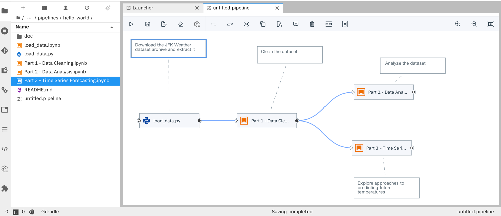
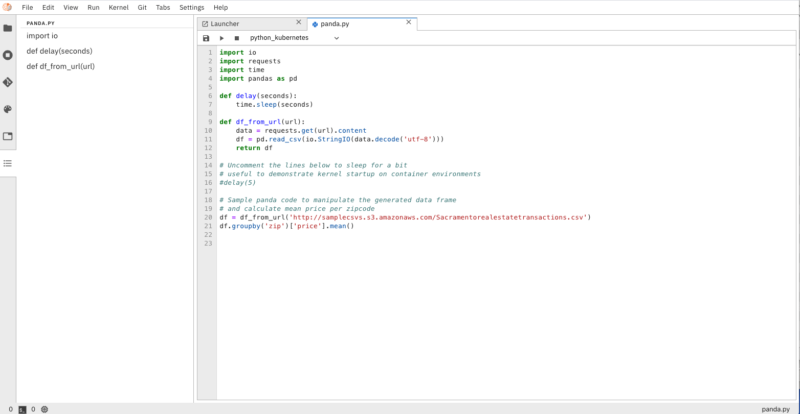
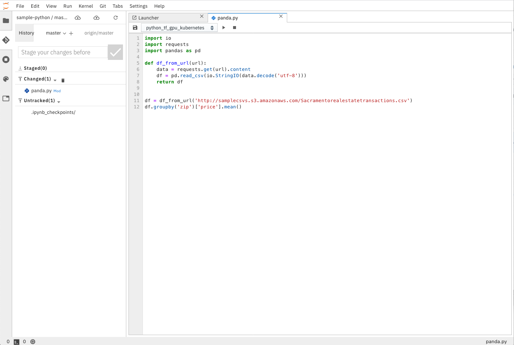
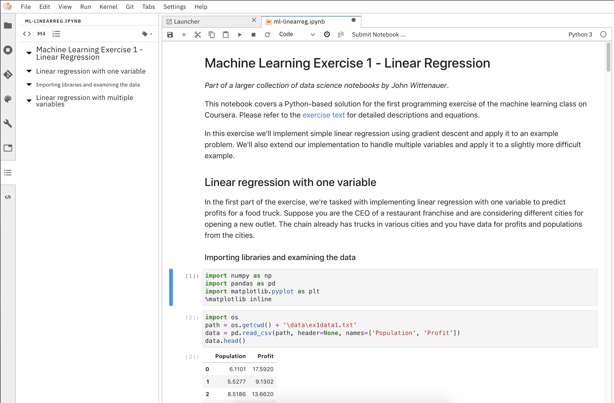

<!--

Copyright 2018-2020 IBM Corporation

Licensed under the Apache License, Version 2.0 (the "License");
you may not use this file except in compliance with the License.
You may obtain a copy of the License at

http://www.apache.org/licenses/LICENSE-2.0

Unless required by applicable law or agreed to in writing, software
distributed under the License is distributed on an "AS IS" BASIS,
WITHOUT WARRANTIES OR CONDITIONS OF ANY KIND, either express or implied.
See the License for the specific language governing permissions and
limitations under the License.

-->


[](https://badge.fury.io/py/elyra)
[](https://pepy.tech/project/jupyterlab/month)
[](https://github.com/elyra-ai/elyra/issues)
[](https://gitter.im/elyra-ai/community?utm_source=badge&utm_medium=badge&utm_campaign=pr-badge)
[](https://mybinder.org/v2/gh/elyra-ai/elyra/master?urlpath=lab/)

# Elyra

Elyra is a set of AI-centric extensions to JupyterLab Notebooks.

Elyra currently includes:
* [Notebook Pipelines visual editor](#notebook-pipelines-visual-editor)
* [Ability to run a notebook as a batch job](#ability-to-run-a-notebook-as-a-batch-job)
* [Hybrid runtime support](#hybrid-runtime-support)
* [Python script execution capabilities within the editor](#python-script-execution-support)
* [Notebook versioning based on git integration](#notebook-versioning-based-on-git-integration)
* [Notebook navigation using auto-generated **Table of Contents**](#notebook-navigation-using-auto-generated-table-of-contents)
* [Reusable configuration for runtimes](#reusable-configuration-for-runtimes)


#### Notebook Pipelines visual editor

Building an AI pipeline for a model is hard, breaking down and modularizing a pipeline is harder.
A typical machine/deep learning pipeline begins as a series of preprocessing steps followed by
experimentation/optimization and finally deployment. Each of these steps represent a challenge in
the model development lifecycle.

Elyra provides a **Notebook Pipeline visual editor** for building Notebook-based AI pipelines,
simplifying the conversion of multiple notebooks into batch jobs or workflow.

Currently, the only supported pipeline runtime is
[**Kubeflow Pipelines**](https://www.kubeflow.org/docs/pipelines/overview/pipelines-overview/),
but others can be easily added.



The pipeline visual editor also enables detailed customization of your pipeline, allowing
users to choose which docker image to use when executing your notebook, setup environment
variables required to properly run your notebook, as well as configuring dependency files 
that need to be available to child notebooks.


#### Ability to run a notebook as a batch job

Elyra also extends the notebook UI to simplify the submission of a single notebook as a batch job


#### Hybrid runtime support

Elyra leverages Jupyter Enterprise Gateway to enable Jupyter Notebooks
to share resources across distributed clusters such as Apache Spark, Kubernetes, OpenShift, and the like. 

It simplifies the task of running notebooks interactively on cloud machines,
seamlessly leveraging the power of cloud-based resources such as GPUs and TPUs.  

#### Python script execution support

Elyra exposes **Python Scripts** as first-class citizens, introducing the ability to
create python scripts directly from the workspace launcher, and leveraging the
**Hybrid Runtime Support** to allow users to locally edit their scripts and execute
them against local or cloud-based resources seamlessly.



#### Notebook versioning based on git integration

The integrated support for git repositories simplify tracking changes, allowing rollback to working versions
of the code, backups and, most importantly, sharing among team members - fostering productivity by
enabling a collaborative working environment.



#### Notebook navigation using auto-generated **Table of Contents**

The enhanced notebook navigation recognizes **markdown** titles, subtitles, etc to auto-generate
a Notebook **Table of Contents** providing enhanced navigation capabilities. 



#### Reusable configuration for runtimes

Elyra introduces a 'shared configuration service' that simplifies workspace configuration management,
enabling things like external runtime access details to be configured once and shared
across multiple components.  

----

## Installation
Elyra can be installed via PyPi:

### Prerequisites :
* [NodeJS 12+](https://nodejs.org/en/)
* [Python 3.X](https://www.anaconda.com/distribution/)
* [Elyra Metadata Runtime](#configuring-runtime-metadata)
##### Optional :
* [Anaconda](https://www.anaconda.com/distribution/) 
* [Docker](https://docs.docker.com/install//) - If using the docker image


via PyPi:
```bash
pip install elyra && jupyter lab build
```
Note: Ubuntu and CentOS users may need to use `pip3 install elyra` 

### Verify Installation 
```bash
jupyter serverextension list
```
Should output:
```
config dir: /usr/local/etc/jupyter
    elyra  enabled
    - Validating...
      elyra  OK
    jupyterlab  enabled
    - Validating...
      jupyterlab 1.2.7 OK
    jupyterlab_git  enabled
    - Validating...
      jupyterlab_git  OK
    nbdime  enabled
    - Validating...
      nbdime 1.1.0 OK
```
```bash
jupyter labextension list
```
Should output:
```
Known labextensions:
   app dir: /usr/local/share/jupyter/lab
        @elyra/application v0.6.1  enabled  OK
        @elyra/notebook-scheduler-extension v0.6.1  enabled  OK
        @elyra/pipeline-editor-extension v0.6.1  enabled  OK
        @elyra/python-runner-extension v0.6.1  enabled  OK
        @jupyterlab/git v0.9.0  enabled  OK
        @jupyterlab/toc v2.0.0  enabled  OK
        nbdime-jupyterlab v1.0.0  enabled  OK
```
NOTE: If you don't see the elyra server extension enabled, you may need to explicitly enable
it with `jupyter serverextension enable elyra`

## Starting Elyra
After verifying Elyra has been installed, start Elyra with:
```bash
jupyter lab
```

## Runtime Configuration

### Prerequisites
* A Kubeflow Pipelines Endpoint
* IBM Cloud Object Storage or other S3 Based Object Store (Optional)

### Configuring Runtime Metadata
**AI Pipelines** require configuring a pipeline runtime to enable its full potential. 
AI Pipelines currently only support `Kubeflow Pipelines` with plans to expand support for other runtimes
in the future.

To configure runtime metadata for `Kubeflow Pipelines` use the `jupyter runtimes install kfp` command providing appropriate options.  This command will create a json file in your local Jupyter Data directory under its `metadata/runtimes` subdirectories.  If not known, the Jupyter Data directory can be discovered by issuing a ```jupyter --data-dir```
command on your terminal.

Here's an example invocation of `jupyter runtimes install kfp` to create runtime metadata for use by `Kubeflow Pipelines` corresponding to the example values in the table below. Following its invocation, a file containing the runtime metadata can be found in `[JUPYTER DATA DIR]/metadata/runtimes/my_kfp.json`.
```bash
jupyter runtimes install kfp --name=my_kfp \
       --display_name="My Kubeflow Pipeline Runtime" \
       --api_endpoint=https://kubernetes-service.ibm.com/pipeline \
       --cos_endpoint=minio-service.kubeflow:9000 \
       --cos_username=minio \
       --cos_password=minio123 \
       --cos_bucket=test-bucket
```
This produces the following content in `my_kfp.json`:
```json
{
    "display_name": "My Kubeflow Pipeline Runtime",
    "schema_name": "kfp",
    "metadata": {
        "api_endpoint": "https://kubernetes-service.ibm.com/pipeline",
        "cos_endpoint": "minio-service.kubeflow:9000",
        "cos_username": "minio",
        "cos_password": "minio123",
        "cos_bucket": "test-bucket"
    }
}
```
NOTE: In case of typing a custom bucket name using minio cloud storage, make sure the bucket name has no underscores

To validate your new configuration is available, run:
```bash
jupyter runtimes list

Available metadata for external runtimes:
  my_kfp    /Users/jdoe/Library/Jupyter/metadata/runtimes/my_kfp.json
```

Existing runtime metadata configurations can be removed via `jupyter runtimes remove --name=[runtime]`:
```bash
jupyter runtimes remove --name=my_kfp
```

`Elyra` depends on its runtime metadata to determine how to communicate with your KubeFlow Pipelines
Server and with your chosen Object Store to store artifacts.   

|Parameter   | Description  | Example |
|:---:|:------|:---:|
|api_endpoint| The KubeFlow Pipelines API Endpoint you wish to run your Pipeline. |  `https://kubernetes-service.ibm.com/pipeline`   |
|cos_endpoint| This should be the URL address of your S3 Object Storage. If running an Object Storage Service within a kubernetes cluster (Minio), you can use the kubernetes local DNS address.   | `minio-service.kubeflow:9000` |
|cos_username| Username used to access the Object Store. SEE NOTE. | `minio` |
|cos_password| Password used to access the Object Store. SEE NOTE. | `minio123` |
|cos_bucket|   Name of the bucket you want your artifacts in. If the bucket doesn't exist, it will be created| `test-bucket` |

NOTE: If using IBM Cloud Object Storage, you must generate a set of [HMAC Credentials](https://cloud.ibm.com/docs/services/cloud-object-storage/hmac?topic=cloud-object-storage-uhc-hmac-credentials-main) 
and grant that key at least [Writer](https://cloud.ibm.com/docs/services/cloud-object-storage/iam?topic=cloud-object-storage-iam-bucket-permissions) level privileges.
Your `access_key_id` and `secret_access_key` will be used as your `cos_username` and `cos_password` respectively.

## Development Workflow
### Building

`Elyra` is divided in two parts, a collection of Jupyter Notebook backend extensions,
and their respective JupyterLab UI extensions. Our JupyterLab extensions are located in our `packages`
directory. 

#### Requirements

* [Yarn](https://yarnpkg.com/lang/en/docs/install) 

#### Installation

```bash
make clean install
```

You can check that the notebook server extension was successful installed with:
```bash
jupyter serverextension list
```

You can check that the JupyterLab extension was successful installed with:
```bash
jupyter labextension list
```
