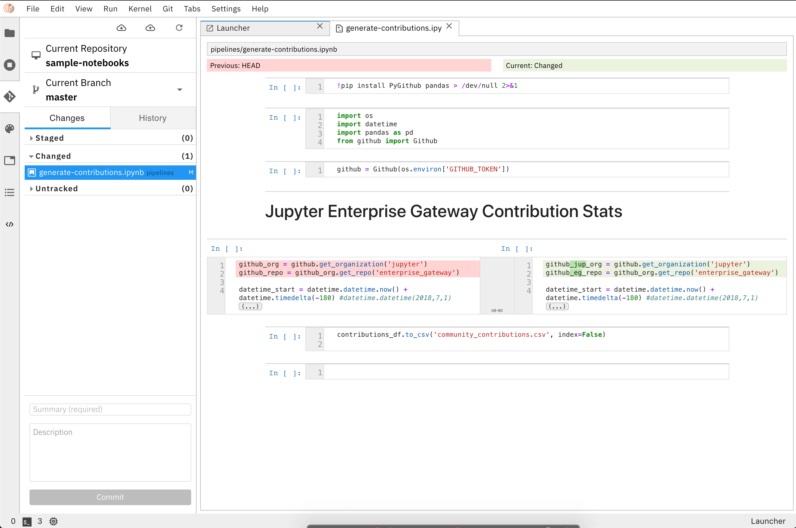

<!--

Copyright 2018-2019 IBM Corporation

Licensed under the Apache License, Version 2.0 (the "License");
you may not use this file except in compliance with the License.
You may obtain a copy of the License at

http://www.apache.org/licenses/LICENSE-2.0

Unless required by applicable law or agreed to in writing, software
distributed under the License is distributed on an "AS IS" BASIS,
WITHOUT WARRANTIES OR CONDITIONS OF ANY KIND, either express or implied.
See the License for the specific language governing permissions and
limitations under the License.

-->

# AI Workspace

AI Workspace aims to do for AI model development, what the
Eclipse IDE did for Java in the early 2000s. It extends the JupyterLab Notebook
platform with an Enterprise AI centric approach.


An **AI Pipeline** visual editor is also available and can be used to chain notebooks
together. Currently the only supported pipeline runtime is **Kubeflow Pipelines**,
but others can be easily added.


The pipeline visual editor also enables detailed customization of your pipeline, enabling
users to choose which docker image to use when executing your notebook, setup environment
variables required to properly run your notebook, as well as configuring dependency files 
that needs to be flown to child notebooks.


It provides **Enhanced Python Support** where Python scripts can be developed and
executed. It also leverages the **Hybrid Runtime Support** to enable running
these scripts either locally or in remote environments.


Native Integration with **Git and GitHub** enables seamless versioning for your Notebooks and
Python Scripts.



A metadata service provides the ability to configure runtimes, data sources and other
additional configurations required to tie all these components together and easily
enable portability of the workspace.

## Installation
AI Workspace can be installed via PyPi or via Docker 

### Prerequisites :
* [NodeJS](https://nodejs.org/en/)
* Python 3.X
* [AI Workspace Metadata Runtime](#configuring-runtime-metadata)
##### Optional :
* [Anaconda](https://www.anaconda.com/distribution/) 
* [Docker](https://docs.docker.com/install//) - If using the docker image

To Install AI Workspace:

via PyPi:
```bash
pip install ai-workspace && jupyter lab build
```
via Docker:
```bash
 docker run -it -p 8888:8888 -v [LOCAL METADATA RUNTIME DIR]:/home/jovyan/.local/share/jupyter/metadata/runtime 
                             -v [LOCAL NOTEBOOK DIR]:/opt/work ai-workspace/ai-workspace:dev 
```

## Runtime Configuration

### Prerequisites
* A Kubeflow Pipelines Endpoint
* IBM Cloud Object Storage or other S3 Based Object Store (Optional)

### Configuring Runtime Metadata
**AI Pipelines** requires configuring a pipeline runtime to enable its full potential. 
AI Pipelines currently only supports `Kubeflow Pipelines` with plans to expand to support other runtimes
in the future.

To configure runtime metadata for `Kubeflow Pipelines` use the `jupyter runtime install kfp` command providing appropriate options.  This command will create a json file in your local Jupyter Data directory under its `metadata/runtime` subdirectories.  If not known, the Jupyter Data directory can be discovered by issuing a ```jupyter --data-dir```
command on your terminal.

Here's an example invocation of `jupyter runtime install kfp` to create runtime metadata for use by `Kubeflow Pipelines` corresponding to the example values in the table below. Following its invocation, a file containing the runtime metadata can be found in `[JUPYTER DATA DIR]/metadata/runtime/my_kfp.json`.
```bash
jupyter runtime install kfp --name=my_kfp --display_name="My Kubeflow Pipeline Runtime" --api_endpoint=https://kubernetes-service.ibm.com/pipeline --cos_endpoint=minio-service.kubeflow:9000 --cos_username=minio --cos_password=minio123 --cos_bucket=test_bucket
```
This produces the following content in `my_kfp.json`:
```json
{
    "display_name": "My Kubeflow Pipeline Runtime",
    "schema_name": "kfp",
    "metadata": {
        "api_endpoint": "https://kubernetes-service.ibm.com/pipeline",
        "cos_endpoint": "minio-service.kubeflow:9000",
        "cos_bucket": "test_bucket",
        "cos_username": "minio",
        "cos_password": "minio123"
    }
}
```
To validate your new configuration is available, run:
```bash
jupyter runtime list

Available metadata for external runtimes:
  my_kfp    /Users/jdoe/Library/Jupyter/metadata/runtime/my_kfp.json
```

Existing runtime metadata configurations can be removed via `jupyter runtime remove --name=[runtime]`:
```bash
jupyter runtime remove --name=my_kfp
```

`AI Workspace` depends on its `Metadata Runtime` to determine how to communicate with your KubeFlow Pipelines
Server and with your chosen Object Store to store artifacts.   

|Parameter   | Description  | Example |
|:---:|:------|:---:|
|api_endpoint| The KubeFlow Pipelines API Endpoint you wish to run your Pipeline. |  `https://kubernetes-service.ibm.com/pipeline`   |
|cos_endpoint| This should be the URL address of your S3 Object Storage. If running an Object Storage Service within a kubernetes cluster (Minio), you can use the kubernetes local DNS address.   | `minio-service.kubeflow:9000` |
|cos_username| Username used to access the Object Store. SEE NOTE. | `minio` |
|cos_password| Password used to access the Object Store. SEE NOTE. | `minio123` |
|cos_bucket|   Name of the bucket you want your artifacts in. If the bucket doesn't exist, it will be created| `test_bucket` |

NOTE: If using IBM Cloud Object Storage, you must generate a set of [HMAC Credentials](https://cloud.ibm.com/docs/services/cloud-object-storage/hmac?topic=cloud-object-storage-hmac) 
and grant that key at least [Writer](https://cloud.ibm.com/docs/services/cloud-object-storage/iam?topic=cloud-object-storage-iam-bucket-permissions) level privileges.
Your `access_key_id` and `secret_access_key` will be used as your `cos_username` and `cos_password` respectively.

## Development Workflow
### Building

`AI Workspace` is divided in two parts, a collection of Jupyter Notebook backend extensions,
and their respective JupyterLab UI extensions. Our JupyterLab extensions are located in our `packages`
directory. 

#### Requirements

* [Yarn](https://yarnpkg.com/lang/en/docs/install) 

#### Installation

```bash
make clean install
```

You can check that the notebook server extension was successful installed with:
```bash
jupyter serverextension list
```

You can check that the JupyterLab extension was successful installed with:
```bash
jupyter labextension list
```

## Building a Docker Image

Prequisites :  
* Docker v18.09 Installed or higher

```bash
make docker-image
```

## Using the AI Workspace Pipeline Editor

  
  
* In the Jupyter Lab Launcher, click the `Pipeline Editor` Icon to create a new pipeline.
* On left side of the screen, navigate to your file browser, you should see a list of notebooks available.
* Drag each notebook, each representing a step in your pipeline to the canvas. Repeat until all notebooks
needed for the pipeline are present.
* Define your notebook execution order by connecting them together to form a graph.

  

* Define the properties for each node / notebook in your pipeline

|Parameter   | Description  | Example |
|:---:|:------|:---:|
|Docker Image| The docker image you want to use to run your notebook |  `TensorFlow 2.0`   |
|Output Files|  A list of files generated by the notebook, inside the image, to be passed as inputs to the next step of the pipeline.  One file per line.  | `contributions.csv` |
|Env Vars| A list of Environmental variables to be set inside in the container.  One variable per line. |  `GITHUB_TOKEN = sometokentobeused` |
|File Dependencies|  A list of files to be passed from the `LOCAL` working environment into each respective step of the pipeline. Files should be in the same directory as the notebook it is associated with. One file per line. | `dependent-script.py` |

  

* Click on the `RUN` Icon and give your pipeline a name.
* Hit `OK` to start your pipeline. 
* Use the link provided in the response to your experiment in Kubeflow. By default, AI Workspace will create the pipeline template for you as well as start an experiment and run.
## Using the Python Runner
  
  
* In the Jupyter Lab Launcher, click the `Python File` Icon to create a new Python Script.
* When used in conjunction with `Jupyter Enterprise Gateway` the dropdown will be populated with more kernel options, 
allowing users to run their scripts with remote kernels with more specialized resources.
* To run your script locally, select the `python3` option in the dropdown menu, and click the `Run` Icon.

## Integration with Jupyter Enterprise Gateway  

AI workspace integrates easily with `Jupyter Enterprise Gateway` allowing users to deploy remote kernels for more 
resource intensive development. Simply include the `--gateway-url` when starting `AI Workspace`

```bash
jupyter lab -gateway-url=http://<GATEWAY_HOST>:<PORT>
```

[Jupyter Enterprise Gateway Github](https://github.com/jupyter/enterprise_gateway)  

[More Details](https://jupyter-notebook.readthedocs.io/en/stable/public_server.html#using-a-gateway-server-for-kernel-management)
