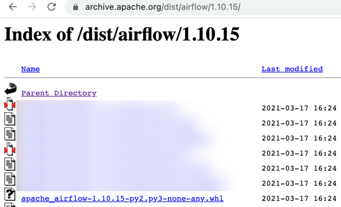

## Airflow package catalog connector

This catalog connector enables Elyra to load pipeline components from [Apache Airflow packages](https://airflow.apache.org/docs/apache-airflow/stable/_api/airflow/operators/index.html).

### Install the connector

You can install this catalog connector from PyPI or source code. Note that a **rebuild of JupyterLab is not required**.

**Prerequisites**

- [Elyra](https://elyra.readthedocs.io/en/stable/getting_started/installation.html) (version 3.3 and above).
- Apache Airflow 2.x

**Install from PyPI**

  ```
  $ pip install airflow-package-catalog-connector
  ```

**Install from source code**

   ```
   $ git clone https://github.com/elyra-ai/elyra.git
   $ cd catalog-connectors/airflow/airflow-package-catalog-connector/
   $ make source-install
   ```

### Use the connector

1. Launch JupyterLab.
1. [Open the '`Manage Components`' panel](
https://elyra.readthedocs.io/en/stable/user_guide/pipeline-components.html#managing-custom-components-using-the-jupyterlab-ui).
1. Add a new Airflow package component catalog ('`+`' > '`New Apache Airflow package operator catalog`').
1. Specify a catalog name, e.g. '`Airflow 1.10.15 package`'.
1. (Optional) Specify a category under which the catalog's components will be organized in the palette.
1. Configure the `Airflow package download URL`. The URL must reference a location that Elyra can access using an HTTP GET request, without the need to authenticate. If the Airflow package is stored on PyPI:
   1. Search for the desired package version on PyPI.
   1. In the package's `Navigation` section open the `Download files` link.
   1. Copy the download link for the package's wheel.
   
1. Save the catalog entry.
1. Open the Visual Pipeline Editor and expand the palette. The catalog components are displayed.

### Uninstall the connector

1. Remove all 'Apache Airflow package component catalog' catalog entries from the '`Manage Components`' panel.
1. Stop JupyterLab.
1. Uninstall the `airflow-package-catalog-connector` package.
   ```
   $ pip uninstall -y airflow-package-catalog-connector
   ```

### Troubleshooting

**Problem: The palette does not display any components from the configured catalog.**

**Solution:** If the the Elyra GUI does not display any error message indicating that a problem was encountered, inspect the JupyterLab log file.
