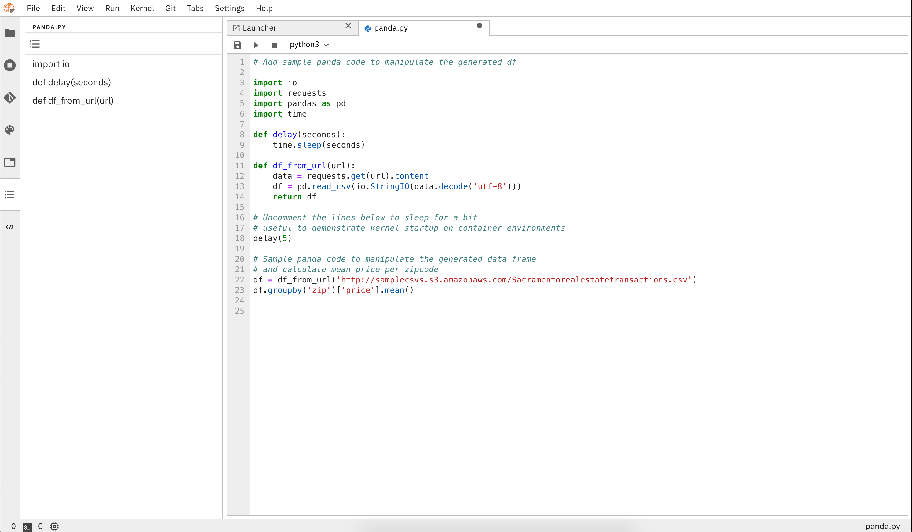
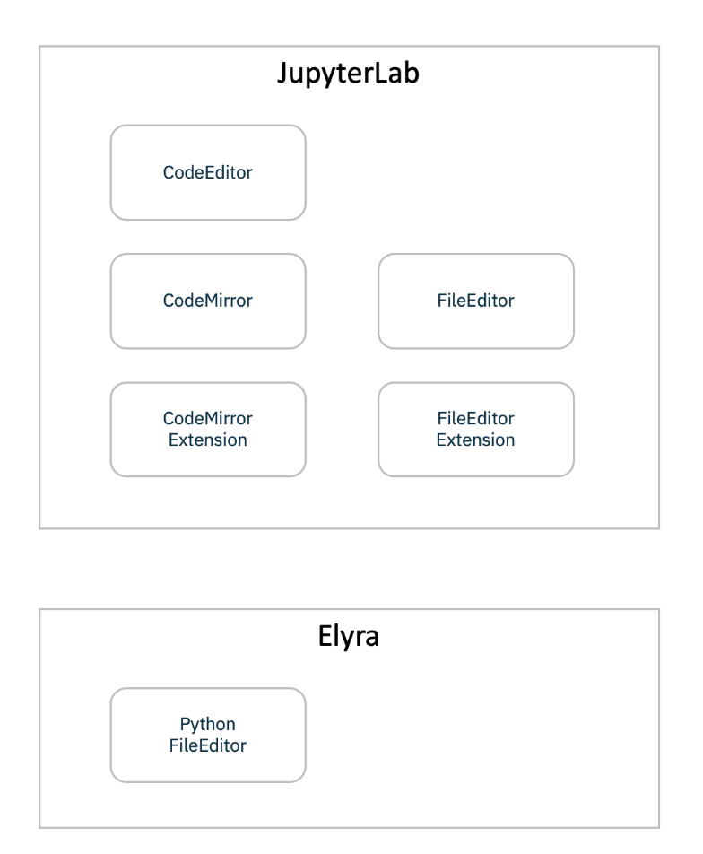

<!--

Copyright 2018-2019 IBM Corporation

Licensed under the Apache License, Version 2.0 (the "License");
you may not use this file except in compliance with the License.
You may obtain a copy of the License at

http://www.apache.org/licenses/LICENSE-2.0

Unless required by applicable law or agreed to in writing, software
distributed under the License is distributed on an "AS IS" BASIS,
WITHOUT WARRANTIES OR CONDITIONS OF ANY KIND, either express or implied.
See the License for the specific language governing permissions and
limitations under the License.

-->
# AI Workspace - Enhanced Python Support

AI Workspace provides **Enhanced Python Support** where Python scripts can be developed and
executed. It also leverages the **Distributed Runtime Support** to enable running
these scripts in remote environments.

The execution of the python script leverages the available `Python based Kernerls`. It enables
users to select from the available `Python Kernels` and run.

## Python Editor related components

AI Workspace python editor is based on the JupyterLab editor which is currently based on CodeMirror. 

