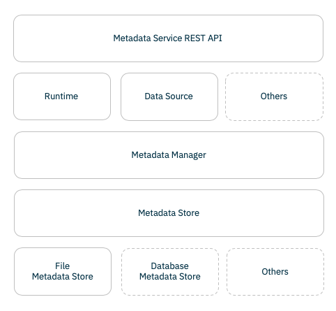

<!--

Copyright 2018-2019 IBM Corporation

Licensed under the Apache License, Version 2.0 (the "License");
you may not use this file except in compliance with the License.
You may obtain a copy of the License at

http://www.apache.org/licenses/LICENSE-2.0

Unless required by applicable law or agreed to in writing, software
distributed under the License is distributed on an "AS IS" BASIS,
WITHOUT WARRANTIES OR CONDITIONS OF ANY KIND, either express or implied.
See the License for the specific language governing permissions and
limitations under the License.

-->

# Elyra Metadata Services

While building Enterprise extensions for the Elyra project we identified that there
is very often a requirement to integrate with external runtimes, data sources, and other 
components hosted in remote locations or that need additional metadata in order to connect
to these external components. 

The **Metadata Service** provides a generic service that can be used to store metadata
that can be easily integrated with Elyra backend and/or frontend components.



## Metadata Services structure using the default file system store

The default implementation for the metadata services store metadata files in file system, grouped
by directories based on the type of metadata. 

The root directory for metadata is relative to the 'Jupyter Data directory' (e.g. jupyter --data-dir)

```
/Users/xxx/Library/Jupyter/metadata/
```

And each type of metadata is then stored in a child directory, which internally is
called `namespace`. 

As an example `runtime` is the namespace for the following metadata type:

```
/Users/xxx/Library/Jupyter/metadata/runtime
```

And the contents of this folder includes:

* One schema file per type, that defines the schema used to validate the metadata
* Multiple metadata files associated with a type

For example, the following contains runtime metadata for two runtimes, airflow and kfp, 
where each runtime type has 1 or 2 runtimes defined, respectively.

```
/Users/xxx/Library/Jupyter/metadata/runtime/airflow.schema
/Users/xxx/Library/Jupyter/metadata/runtime/kfp.schema
/Users/xxx/Library/Jupyter/metadata/runtime/airflow-cloud.json
/Users/xxx/Library/Jupyter/metadata/runtime/kfp-fyre.json
/Users/xxx/Library/Jupyter/metadata/runtime/kfp-qa.json
```

And each metadata file looks like:

```
{
  "display_name": "Kubeflow Pipeline - Fyre",
  "type": "kfp",
  "metadata": {
    "api_endpoint": "http://weakish1.fyre.ibm.com:32488/pipeline",
    "cos_endpoint": "http://weakish1.fyre.ibm.com:30427",
    "cos_username": "minio",
    "cos_password": "minio123",
    "cos_bucket": "lresende"
  }
}
```


### Metadata Client API

Users can easily manipulate metadata via the Client API

```
jupyter runtime list
```

```
Available metadata for external runtimes:
  kfp-fyre       /Users/lresende/Library/Jupyter/metadata/runtime/kfp-fyre.json
  kfp-qa         /Users/lresende/Library/Jupyter/metadata/runtime/kfp-qa.json
  airflow-cloud  /Users/lresende/Library/Jupyter/metadata/runtime/airflow-cloud.json
```

### Metadata Service REST API

A REST Api is available for easy integration with frontend components:

Retrieve all metadata for a given type:

```
GET /metadata/<type>
```

Retrieve a given metadata document:

```
GET /metadata/<type>/<name>
```


### Metadata APIs

```
metadata_manager = MetadataManager(namespace="runtime",
                                   store=FileMetadataStore(namespace='runtime'))

runtime_configuration = self.metadata_manager.get('kfp')

if not runtime_configuration:
    raise RuntimeError("Runtime metadata not available.")

api_endpoint = runtime_configuration.metadata['api_endpoint']
cos_endpoint = runtime_configuration.metadata['cos_endpoint']
cos_username = runtime_configuration.metadata['cos_username']
cos_password = runtime_configuration.metadata['cos_password']
bucket_name = runtime_configuration.metadata['cos_bucket']

```


