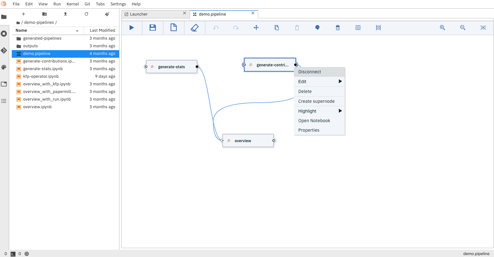
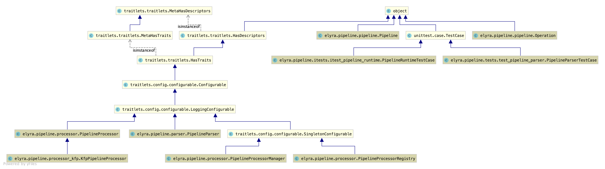

<!--

Copyright 2018-2020 IBM Corporation

Licensed under the Apache License, Version 2.0 (the "License");
you may not use this file except in compliance with the License.
You may obtain a copy of the License at

http://www.apache.org/licenses/LICENSE-2.0

Unless required by applicable law or agreed to in writing, software
distributed under the License is distributed on an "AS IS" BASIS,
WITHOUT WARRANTIES OR CONDITIONS OF ANY KIND, either express or implied.
See the License for the specific language governing permissions and
limitations under the License.

-->

# Elyra Notebook Pipelines

Elyra utilizes its [canvas component](https://github.com/elyra-ai/canvas) to enable assembling
multiple notebooks as a workflow.
Elyra provides a visual editor for building Notebook-based AI pipelines, simplifying the conversion
of multiple notebooks into batch jobs or workflows.  By leveraging cloud-based resources to run their
experiments faster, data scientists, machine learning engineers and AI developers are then more productive,
allowing them to spend time utilizing their technical skills.


Each pipeline node, which in this case represents a Notebook, provides a menu that provides access to
opening the notebook file directly in the **Notebook Editor** 



The properties menu also enables users to set additional properties related to running this notebook
 (e.g. Environment Variables, File Dependencies, etc)


## Pipeline definition

Below is a json representation of the pipeline that is generated by the **Pipeline Editor** and referred to as the _pipeline definition_. 

The pipeline is then submitted to the **Elyra Scheduler** which parses, properly packages and 
submits the pipeline definition to the chosen target runtime (e.g. Kubeflow Pipelines).

For more details on the **pipeline json definition** see it's [json schema](https://github.com/elyra-ai/pipeline-schemas/blob/master/common-pipeline/pipeline-flow/pipeline-flow-v3-schema.json)
 
### Pipeline definition json example 

```json
{
	"doc_type": "pipeline",
	"version": "3.0",
	"json_schema": "http://api.dataplatform.ibm.com/schemas/common-pipeline/pipeline-flow/pipeline-flow-v3-schema.json",
	"id": "582f2dd2-b329-4bfd-8326-3e0dc8c69744",
	"primary_pipeline": "f757f14a-4494-46b5-bb27-aeaa8a065477",
	"pipelines": [{
		"id": "f757f14a-4494-46b5-bb27-aeaa8a065477",
		"nodes": [{
			"id": "db9f3f5b-b2e3-4824-aadd-c1c6bf652534",
			"type": "execution_node",
			"app_data": {
				"artifact": "demo-pipelines/generate-contributions.ipynb",
				"image": "tensorflow/tensorflow:2.0.0-py3",
				"outputs": ["community_contributions.csv"],
				"vars": ["GITHUB_TOKEN=xxxx"],
				"dependencies": ["contributors.csv"],
				"ui_data": {
					"label": "generate-contributions",
					"x_pos": 387,
					"y_pos": 73,
					"description": "Notebook file"
				}
			},
			"inputs": [{
				"id": "inPort",
				"app_data": {
					"ui_data": {
						"cardinality": {
							"min": 0,
							"max": 1
						},
						"label": "Input Port"
					}
				}
			}],
			"outputs": [{
				"id": "outPort",
				"app_data": {
					"ui_data": {
						"cardinality": {
							"min": 0,
							"max": -1
						},
						"label": "Output Port"
					}
				}
			}]
		}, {
			"id": "f6584209-6f22-434f-9820-41327b6c749d",
			"type": "execution_node",
			"app_data": {
				"artifact": "demo-pipelines/generate-stats.ipynb",
				"image": "tensorflow/tensorflow:2.0.0-py3",
				"outputs": ["community_stats.csv"],
				"vars": ["GITHUB_TOKEN=xxxx"],
				"dependencies": ["contributors.csv"],
				"ui_data": {
					"label": "generate-stats",
					"x_pos": 77,
					"y_pos": 79,
					"description": "Notebook file"
				}
			},
			"inputs": [{
				"id": "inPort",
				"app_data": {
					"ui_data": {
						"label": ""
					}
				}
			}],
			"outputs": [{
				"id": "outPort",
				"app_data": {
					"ui_data": {
						"label": ""
					}
				}
			}]
		}, {
			"id": "079c0e12-eb5f-4fcc-983b-09e011869fee",
			"type": "execution_node",
			"app_data": {
				"artifact": "demo-pipelines/overview.ipynb",
				"image": "tensorflow/tensorflow:1.15.2-py3",
				"ui_data": {
					"label": "overview",
					"x_pos": 318,
					"y_pos": 312,
					"description": "Notebook file"
				}
			},
			"inputs": [{
				"id": "inPort",
				"app_data": {
					"ui_data": {
						"label": ""
					}
				},
				"links": [{
					"node_id_ref": "db9f3f5b-b2e3-4824-aadd-c1c6bf652534",
					"port_id_ref": "outPort"
				}, {
					"node_id_ref": "f6584209-6f22-434f-9820-41327b6c749d",
					"port_id_ref": "outPort"
				}]
			}],
			"outputs": [{
				"id": "outPort",
				"app_data": {
					"ui_data": {
						"label": ""
					}
				}
			}]
		}],
		"app_data": {
			"ui_data": {
				"comments": []
			},
			"title": "pipeline-title",
			"runtime": "kfp",
			"runtime-config": "kfp-yukked1"
		},
		"runtime_ref": ""
	}],
	"schemas": []
}
```

## Pipeline processor design

Elyra implements an extensible **pipeline processor engine**, which enables the addition of new processors utilizing
a service discovery mechanism.




### Registering new pipeline processor

New processors that properly implement the **Pipeline Processor** service definition can be discovered
by the runtime using **entry_points** defined in the **setup.py** file (either from Elyra or in the package
where the processor is located):

```python
    entry_points={
        'elyra.pipeline.processors': [
            'kfp = elyra.pipeline.processor_kfp:KfpPipelineProcessor'
        ]
    },
```
