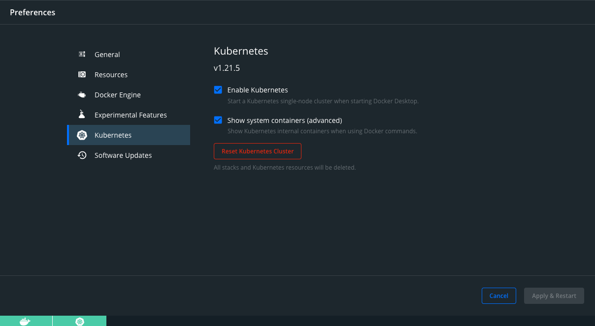
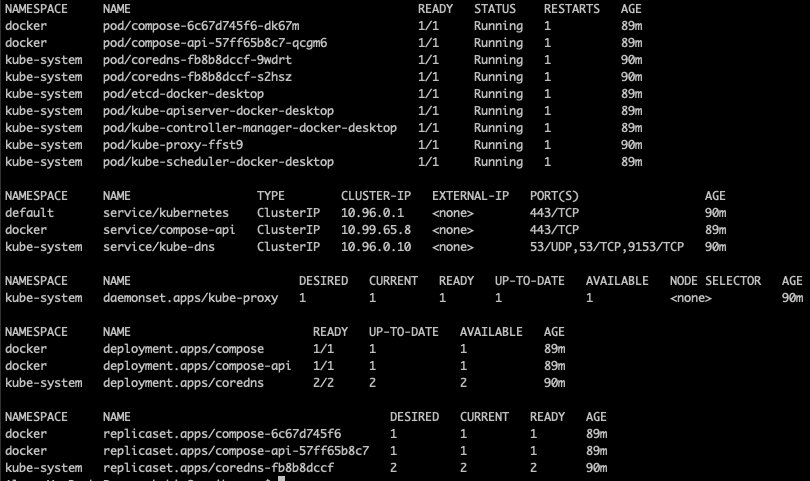

<!--

Copyright 2018-2020 IBM Corporation

Licensed under the Apache License, Version 2.0 (the "License");
you may not use this file except in compliance with the License.
You may obtain a copy of the License at

http://www.apache.org/licenses/LICENSE-2.0

Unless required by applicable law or agreed to in writing, software
distributed under the License is distributed on an "AS IS" BASIS,
WITHOUT WARRANTIES OR CONDITIONS OF ANY KIND, either express or implied.
See the License for the specific language governing permissions and
limitations under the License.

-->

# Deploying Kubeflow Locally for Elyra

Elyra's pipeline editor depends on runtimes like Kubeflow to properly execute its pipelines. In the example, 
we will be deploying Kubeflow on Kubernetes using Docker Desktop

## Requirements
- Docker Desktop
    - Available for [MacOS](https://hub.docker.com/editions/community/docker-ce-desktop-mac) and 
                    [Windows](https://hub.docker.com/editions/community/docker-ce-desktop-windows)
- kubectl
    - Available for [MacOS](https://kubernetes.io/docs/tasks/tools/install-kubectl/#install-kubectl-on-macos)
    - Note: Windows users should skip this step since Docker Desktop adds its own version of `kubectl` to `PATH`
- kfctl
    - Available for [MacOS and Linux](https://github.com/kubeflow/kfctl/releases)
    - Note: Support for Windows is still ongoing. Suggest using WSL(Windows Subsystem for Linux) and using the  
    Linux binary as a workaround [here](https://github.com/kubeflow/kubeflow/issues/3735#issuecomment-519800064)      
    
    
### Enabling Kubernetes on Docker Desktop

After installing our requirements, we want to enable `kubernetes` in `Docker Desktop`.

In this example, we will be performing the steps on a MacOS system

1. In the upper right corner locate the Docker Desktop Icon, Click and go to `Preferences`   
  
  
2. Navigate to the `Advanced` Tab and ensure that Docker Desktop has at least   
4 CPUs, 8 GB of Memory and 1 GB of Swap. If not, increase as necessary and restart   
the Docker Desktop Engine.  
  
  
3. Navigate to the `Kubernetes` Tab and Click `Enable Kubernetes` and hit `Apply`  
  
  
4. `Docker Desktop` should now install a single node deployment of Kubernetes  
 on your system and configure your `kubectl` to the correct local kubernetes cluster  
  
  
  
5. Verify that your cluster is up and running and configured correctly by running  
`kubectl get all --all-namespaces` and verifying that the Docker Desktop pods are present and in `Running` state   
  
  
## Install KubeFlow

- Add the `kfctl` binary to your `PATH`. Downloading `kfctl` was part of the [Requirements](#Requirements) setup.
```bash
export PATH=$PATH:"<location of where you extracted kfctl>"
```
- Create a name for your Kubeflow deployment
```bash
export KF_NAME=<pick a name>
```
- Add a location to where you want to store your deployment files on your local system  
NOTE: These are just configuration files about the deployment itself, not the running applications.
```bash
export BASE_DIR=<local place to store deployment files>
export KF_DIR=${BASE_DIR}/${KF_NAME}
```
- Set the configuration file used to deploy Kubeflow, in this example we are using v1.0.2
```bash
export CONFIG_URI="https://raw.githubusercontent.com/kubeflow/manifests/v1.0-branch/kfdef/kfctl_k8s_istio.v1.0.2.yaml"
```
- Deploy Kubeflow  
```bash
mkdir -p ${KF_DIR}
cd ${KF_DIR}
kfctl apply -V -f ${CONFIG_URI}
```
- Get status of the Kubeflow deployment and ensure all pods are running before proceeding.  
Deployment times vary from system to system so please be patient when the pods are starting up.
```bash
kubectl get all -n kubeflow
```
- Add minio-service to your local hosts file
```bash
echo '127.0.0.1  minio-service' | sudo tee -a /etc/hosts
```
- Setup port forwarding to use the Minio Object Service with Kubeflow
```bash
kubectl port-forward $(kubectl get pods -n kubeflow | grep minio | cut -d' ' -f1) 9000:9000 -n kubeflow
```
- Your Kubeflow Pipelines API and Minio Object Store endpoints should be respectively
```bash
UI Endpoint: http://localhost:31380
API Endpoint: http://localhost:31380/pipeline
Object Storage Endpoint: http://minio-service:9000
```

These endpoints will be used to configure your Elyra metadata runtime with the
command below:

```bash
elyra-metadata install runtimes --replace=true \
       --schema_name=kfp \
       --name=kfp-local \
       --display_name="Kubeflow Pipeline (local)" \
       --api_endpoint=http://localhost:31380/pipeline \
       --cos_endpoint=http://minio-service:9000 \
       --cos_username=minio \
       --cos_password=minio123 \
       --cos_bucket=covid
```
## Additional Resources and Documentation
[Docker Desktop Installation Docs](https://docs.docker.com/get-started/)  
[KubeFlow Installation Docs](https://www.kubeflow.org/docs/started/k8s/kfctl-k8s-istio/)
