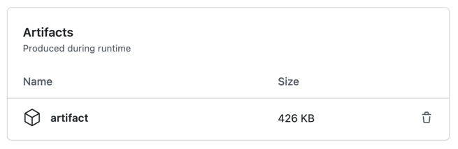

<!--

Copyright 2018-2022 Elyra Authors

Licensed under the Apache License, Version 2.0 (the "License");
you may not use this file except in compliance with the License.
You may obtain a copy of the License at

http://www.apache.org/licenses/LICENSE-2.0

Unless required by applicable law or agreed to in writing, software
distributed under the License is distributed on an "AS IS" BASIS,
WITHOUT WARRANTIES OR CONDITIONS OF ANY KIND, either express or implied.
See the License for the specific language governing permissions and
limitations under the License.

-->
## Development Workflow
This section describes the steps necessary to build Elyra in a development environment. 

#### Requirements

* [Python 3 Miniconda](https://docs.conda.io/en/latest/miniconda.html)
* [Node.js 18+](https://nodejs.org/en/)
* [Yarn](https://yarnpkg.com/lang/en/docs/install)
* [GNU Make](https://www.gnu.org/software/make/)

### Setting up your development environment

* Install Miniconda
Download and install a [Python 3 version of Miniconda](https://docs.conda.io/en/latest/miniconda.html) according to your Operating System

* Create a new Python environment using a version that is [supported by Elyra](../getting_started/installation.html#prerequisites).

    ```
    conda create -n <env-name> python
    ```

    The Python version of your environment will match the miniconda version you installed. You can override the default by explicitly setting `python=3.10`, for example.

* Activate the new environment

    ```
    conda activate <env-name>
    ```

* Verify your miniconda environment

    ```
    python --version # should yield a version that is supported by Elyra
    which python     # displays current `python` path
    pip3 --version   # should be a recent version to avoid build issues
    which pip3       # displays current `pip` path
    ```
    Python path must be under miniconda envs folder.
    Confirm pip3 location matches where miniconda is installed.

* Install a version of Node.js that is [supported by Elyra](../getting_started/installation.html#prerequisites).

    ```
    conda install -y -c conda-forge/label/main nodejs
    ```
* Verify node is installed correctly 

    ```
    node --version 
    ```

* Install Yarn

    ```
    conda install -y -c conda-forge/label/main yarn
    ```
* Verify yarn is installed correctly 

    ```
    yarn --version 
    ```

* Install GNU Make 

    Refer to the following link for installation instructions: 
    [GNU Make](https://www.gnu.org/software/make/)

    To verify the installation, run `make`. 
    If you have yet to [set up the repository](#setting-up-your-development-environment), you should see a message like the following:
    ```
    make: *** No targets specified and no makefile found.  Stop.
    ```
    Once the repository is set up, running `make` from that location should display the available tasks that are listed in the [Build & Installation](#build-installation) section below.

### Setting up your Elyra Github repository

* Fork the [Elyra Github repository](https://github.com/elyra-ai/elyra) (if you haven't already)

* Make a local copy of Elyra fork
    ```
    git clone https://github.com/<your-github-id>/elyra.git
    cd elyra
    ```
* Set `upstream` as described in the [GitHub documentation](https://docs.github.com/en/github/collaborating-with-issues-and-pull-requests/configuring-a-remote-for-a-fork)

### Building
Elyra is divided in two parts, a collection of Jupyter Notebook backend extensions,
and their respective JupyterLab UI extensions. Our JupyterLab extensions are located in our `packages`
directory. 

#### Build & Installation

Elyra uses `make` to automate some of the development workflow tasks.

Issuing a `make` command with no task specified will provide a list of the currently supported tasks.

```bash
$ make

clean                          Make a clean source tree and uninstall extensions
container-images               Build all container images
docs                           Build docs
install-all                    Build and install, including examples
install-examples               Install example pipeline components
install-server                 Build and install backend
install                        Build and install
lint                           Run linters
publish-container-images       Publish all container images
release                        Build wheel file for release
test                           Run all tests (backend, frontend and cypress integration tests)
watch                          Watch packages. For use alongside jupyter lab --watch
```

You can build and install all Elyra packages with:

```bash
make clean install
```

You can check that the notebook server extension was successfully installed with:
```bash
jupyter serverextension list
```

You can check that the JupyterLab extension was successfully installed with:
```bash
jupyter labextension list
```

> NOTE: 
When switching between Elyra major versions, it is recommended to clean your JupyterLab environment before a build.
The `clean-jupyterlab` removes your JupyterLab packages and completely deletes your Jupyter workspace.
Make sure to backup any important data in your environment before running the script.
To clean your environment and install the latest JupyterLab:
`etc/scripts/clean-jupyterlab.sh`
To specify a JupyterLab version `x.y.z` to be installed:
`etc/scripts/clean-jupyterlab.sh --version x.y.z`

#### Parallel Development with @elyra/pipeline-editor

You can install Elyra using a local build of @elyra/pipeline-editor with:
```bash
make clean install-dev
```

### Back-end Development
After making code changes to the back-end, you can re-build Elyra's Python package with:

```bash
make install-server
```

This command builds and installs the updated  Python package independently, skipping any UI component build.

Restart JupyterLab to pick up the new code changes.

### Front-end Incremental Development

Elyra supports incremental development using `--watch`. This allows you to make code changes to
front-end packages and see them without running `make install` again.

After installation run the following to watch for code changes and rebuild automatically:
```bash
make watch
```

Then in a separate terminal, using the same Python environment, start JupyterLab in watch mode:
```bash
jupyter lab --watch
```

When in watch mode JupyterLab will watch for changes in the build of each package and rebuild.
To see your changes just refresh JupyterLab in your browser.

> NOTE: JupyterLab watch mode will not pick up changes in package dependencies like `services`.
So when making changes to services you will need to stop and restart `jupyter lab --watch` and
not just refresh your browser.

### Building the Elyra Container Image

Elyra's container image can be built in two ways (production and development):

Development:
```bash
make elyra-image
```
By default, the command above will build a container image (development) with the changes that exist in your local branch.


Production:  
From main branch:
```bash
make elyra-image TAG=3.7.0
```
or after checking out a git tag e.g. `git checkout tags/v3.7.0`
```bash
make elyra-image 
```
In order to build from a particular release (production), you can pass a `TAG` parameter to the make command
or you can checkout the respective tagged release and omit the `TAG` parameter.

Official container images are published on [Docker Hub](https://hub.docker.com/r/elyra/elyra/tags)
and [quay.io](https://quay.io/repository/elyra/elyra?tab=tags).

### Developing Elyra against the Jupyterlab source repo

Sometimes it is useful to develop Elyra against a local build of Jupyterlab. To use a local build of Jupyterlab use the
following steps in the same python environment.

1. Uninstall any pip installations of Jupyterlab. You can use `etc/scripts/clean-jupyterlab.sh --version dev` as
   mentioned above with `--version dev` to not reinstall Jupyterlab at the end of the script.

2. Build your local repo of Jupyterlab, step-by-step instructions can be found in the
   [Jupyterlab documentation](https://jupyterlab.readthedocs.io/en/latest/developer/contributing.html#installing-jupyterlab).
   Uninstalling in the previous step will also wipe any previous installations of a local build.

3. `cd` to the `builder/` directory in your Jupyterlab repo and run `yarn link`. The Elyra `Makefile` will use this yarn
   link in step 6.

4. In your Elyra repo, uncomment the following line in `tsconfig.base.json` to tell Typescript to use the local
   Jupyterlab packages when building:

    ```"paths": { "@jupyterlab/*": ["../jupyterlab/packages/*"] },```

5. Comment out `jupyterlab` and `jupyterlab-lsp` in the `install_requires` section of `setup.py` in your Elyra repo.
   This will prevent Jupyterlab from being pip installed during the Elyra build.
   Note: `jupyterlab-lsp` also pip installs Jupyterlab when installed

6. Run `make install-dev` to install Elyra using the linked `@jupyterlab/builder` from step 3.

7. You can now start Jupyterlab by running `jupyter lab --dev-mode --extensions-in-dev-mode`, this will automatically
   watch for changes in the Jupyterlab repo. To also watch for changes in Elyra run `make watch` in a separate terminal
   in the same Python environment.

When you want to switch back to developing Elyra against a Jupyterlab release, you just have to undo the comments in
steps 4 and 5 and rebuild with `make clean install`

## Analyzing automated test failures

The Elyra GitHub repository is configured to run automated tests whenever a pull request is opened. These tests include static [code quality analysis](https://github.com/elyra-ai/elyra/blob/main/.github/workflows/codeql-analysis.yml) and [UI, server, and integration tests](https://github.com/elyra-ai/elyra/blob/main/.github/workflows/build.yml).

The test results can be accessed from the pull request or the _actions_ tab. If the test log does not include enough details to diagnose failures, download and review test artifacts that might have been generated.

### Accessing test artifacts

1. Open the [Elyra repository actions panel](https://github.com/elyra-ai/elyra/actions) (`https://github.com/elyra-ai/elyra/actions`).
1. Locate the failing workflow.
  
1. Open the workflow.
1. Click the 'home' (summary) button.
  
1. Locate the 'Artifacts' section. If present, it should contain a download link.
  
1. Download the archive, extract it, and review the artifacts. 