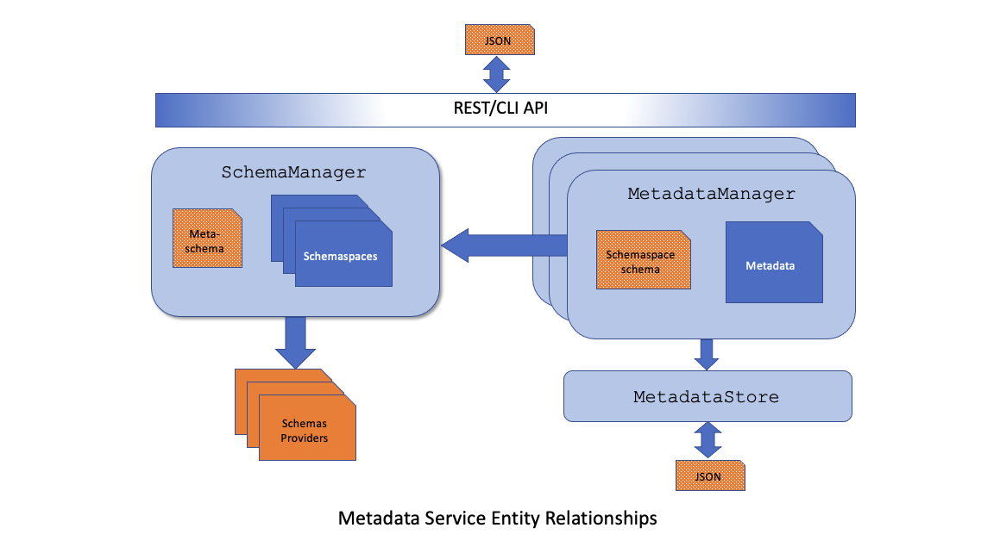

<!--

Copyright 2018-2022 Elyra Authors

Licensed under the Apache License, Version 2.0 (the "License");
you may not use this file except in compliance with the License.
You may obtain a copy of the License at

http://www.apache.org/licenses/LICENSE-2.0

Unless required by applicable law or agreed to in writing, software
distributed under the License is distributed on an "AS IS" BASIS,
WITHOUT WARRANTIES OR CONDITIONS OF ANY KIND, either express or implied.
See the License for the specific language governing permissions and
limitations under the License.

-->

# Metadata Services
While building enterprise extensions for the Elyra project we identified a requirement to integrate with external runtimes, data sources, and other
components that require additional metadata in order to connect
to these external components.

The **Metadata Service** provides a generic service that can be used to store metadata
that can be easily integrated with Elyra backend and/or frontend components.

## Metadata Service Overview
The core design of the metadata service is that it be primarily driven by _schema_.  That is, all metadata _instances_ must adhere to a schema.  Metadata schema are organized, both logically and physically, into _schemaspaces_ where a given schemaspace _contains_ a set of schemas and each instance of a schemaspace's schemas are co-located relative to the configured storage mechanism.

Externally, both in its persisted and serialized forms, a metadata instance is represented as a JSON structure.   Within the metadata service, however, this JSON structure is represented as a `Metadata` class instance.  The `Metadata` class can be extended via subclassing to enable custom behaviors that are triggered following load operations and/or before and after create, update and delete operations on a _per schema_ level.  That is, it is the respective schema that identifies the name of the class to use as the internal representation.

As previously mentioned, the metadata service has a pluggable storage mechanism.  By default, metadata instances are stored within the file system.  However, alternative storage mechanisms can be configured for, say, NoSQL DB or traditional, table-oriented, databases.

Schemaspaces and their schemas can be dynamically introduced via entrypoints.  When the system starts, it will identify applicable entrypoints and load their corresponding objects to seed the list of _configured_ schemaspaces and schemas.

### Metadata Components
The Elyra metadata service is composed of several components, many of which were previously referenced, and each responsible for a different task.  


The following briefly describes each of those components.

- **[Schemaspace](https://github.com/elyra-ai/elyra/blob/1536495fb61a0f4b19f658360718346e9cb4f110/elyra/metadata/schema.py#L213)**: This is the top-most component and represents a _container_ of schemas.  It has `id` (UUID), `name` (symbolic name), `display_name` (descriptive name), and `description` properties, along with a set of schemas.  Instances of a schemaspace's schemas are logically grouped together in whatever storage model is in use.  Schemaspaces are discovered and loaded via entrypoints.
- **[SchemasProvider](https://github.com/elyra-ai/elyra/blob/1536495fb61a0f4b19f658360718346e9cb4f110/elyra/metadata/schema.py#L299)**: A schemas provider is a class that is also discovered and loaded via entrypoints.  Its purpose is to provide schemas.  Since a schemaspace is always referenced within the schema, a given `SchemasProvider` instance _could_ provide schemas corresponding to different schemaspaces although a schemas provider will typically correspond to a single schemaspace.
- **[Metadata](https://github.com/elyra-ai/elyra/blob/1536495fb61a0f4b19f658360718346e9cb4f110/elyra/metadata/metadata.py#L31)**:  This class is used internally to house the JSON instance data.  It can be subclassed to enable applications to hook persistence and retrieval operations.
- **[SchemaManager](https://github.com/elyra-ai/elyra/blob/1536495fb61a0f4b19f658360718346e9cb4f110/elyra/metadata/schema.py#L41)**: This class is a singleton instance that loads and houses all schemas organized by their respective `Schemaspace`.  All schemas provided by a `SchemasProvider` must adhere to the _meta-schema_ and the `SchemaManager` is responsible for validating provided schemas.
- **[MetadataManager](https://github.com/elyra-ai/elyra/blob/1536495fb61a0f4b19f658360718346e9cb4f110/elyra/metadata/manager.py#L34)**: This class operates on `Metadata` instances. Prior to each persistence operation, and following each load, the `MetadataManager` is responsible for validating the instance against its corresponding schema, which it obtains from the `SchemaManager`.  It is also responsible for driving the persistence and retrieval of instances against the configured `MetadataStore`.
- **[MetadataStore](https://github.com/elyra-ai/elyra/blob/1536495fb61a0f4b19f658360718346e9cb4f110/elyra/metadata/storage.py#L42)**: This class is an abstract base class that defines methods relative to the persistence and retrieval of metadata instances.  It can be subclassed such that each subclass typically represents an alternative storage mechanism.  The system provides a [`FileMetadataStore`](https://github.com/elyra-ai/elyra/blob/a31afee97c716feacec1b43feee66b119de71397/elyra/metadata/storage.py#L174) instance - which is configured as the default storage mechanism.
- **REST/CLI API**: The metadata service entities can be manipulated via a REST API consisting of `/elyra/metadata`, `/elyra/schema` and `/elyra/schemaspace` endpoints.  Similar capabilities can also be performed using the command-line tool (CLI) `elyra-metadata`.

#### Metadata Services structure using the default file system store

The default implementation is for the metadata services to store metadata files in the file system, grouped
by directories according to the metadata instance's _schemaspace_.

The root directory for metadata is relative to the 'Jupyter Data directory' (e.g. `jupyter --data-dir`)

```
/Users/jovyan/Library/Jupyter/metadata/
```

Each instance of metadata is then stored in a child directory representing the instance's schemaspace.

As an example, `runtimes` is the schemaspace for runtime metadata instances that reside in the following directory:

```
/Users/jovyan/Library/Jupyter/metadata/runtimes
```

The contents of this folder would then include multiple JSON files, each associated with a schema corresponding to the desired runtime platform.

For example, the following contains runtime metadata instances for two runtime platforms, airflow and kfp,
where each runtime has 1 and 2 runtime instances defined, each of which adheres to their respective schemas.

```
/Users/jovyan/Library/Jupyter/metadata/runtimes/airflow-cloud.json
/Users/jovyan/Library/Jupyter/metadata/runtimes/kfp-fyre.json
/Users/jovyan/Library/Jupyter/metadata/runtimes/kfp-qa.json
```

And each metadata file contains information similar to the following (note the reference to its schema_name):

```json
{
  "display_name": "Kubeflow Pipeline - Fyre",
  "schema_name": "kfp",
  "metadata": {
    "api_endpoint": "http://weakish1.fyre.ibm.com:32488/pipeline",
    "api_username": "username@email.com",
    "api_password": "mypassword",
    "cos_endpoint": "http://weakish1.fyre.ibm.com:30427",
    "cos_username": "minio",
    "cos_password": "minio123",
    "cos_bucket": "test-bucket",
    "tags": [
      "kfp", "v1.1"
    ]
  }
}
```

#### Metadata Service REST API

A REST API is available for easy integration with frontend components:

Retrieve all metadata for a given schemaspace:

```REST
GET /elyra/metadata/<schemaspace>
```

Retrieve a given metadata resource from a given schemaspace:

```REST
GET /elyra/metadata/<schemaspace>/<resource>
```

#### Metadata Client Tool

Users can easily manipulate metadata via the Client Tool

```bash
elyra-metadata list runtimes
```

```
Available metadata instances for runtimes (includes invalid):

Schema   Instance       Resource  
------   --------       -------- 
kfp      kfp-fyre       /Users/jovyan/Library/Jupyter/metadata/runtimes/kfp-fyre.json
kfp      kfp-qa         /Users/jovyan/Library/Jupyter/metadata/runtimes/kfp-qa.json
airflow  airflow-cloud  /Users/jovyan/Library/Jupyter/metadata/runtimes/airflow-cloud.json
```


#### Metadata APIs
A Python API is also available for accessing and manipulating metadata.  This is accomplished using the `MetadataManager` along with a corresponding storage class.  The default storage class is `FileMetadataStore`.

```Python
from elyra.metadata import MetadataManager, FileMetadataStore

metadata_manager = MetadataManager(schemaspace="runtimes",
                                   store=FileMetadataStore(schemaspace='runtimes'))

runtime_configuration = metadata_manager.get('kfp')

if not runtime_configuration:
    raise RuntimeError("Runtime metadata not available.")

api_endpoint = runtime_configuration.metadata['api_endpoint']
api_username = runtime_configuration.metadata['api_username']
api_password = runtime_configuration.metadata['api_password']
cos_endpoint = runtime_configuration.metadata['cos_endpoint']
cos_username = runtime_configuration.metadata['cos_username']
cos_password = runtime_configuration.metadata['cos_password']
bucket_name = runtime_configuration.metadata['cos_bucket']
tags = runtime_configuration.metadata['tags']

```

## Bring Your Own Schemas
The metadata service enables the ability to introduce your own schemaspaces and bring custom schemas to existing schemaspaces via [entrypoints](https://entrypoints.readthedocs.io/en/latest/).  It is necessary to introduce Schemaspaces when developing a new extension or adding functionality in which it makes sense to group instances of the functionality together.  For example, Code Snippets consist of their own Schemaspace and, currently, are based on a single schema.
Applications extending _existing_ functionality do not need to introduce a new Schemaspace, since one will already exist, but must be able to introduce their custom schema.  [Introducing your own _runtime_](../developer_guide/pipelines.html#pipeline-processor-customization) would be an example where a Schemaspace is not required.  In this case, only a _`SchemasProvider`_ would be necessary.

### Schemaspace
A Schemaspace instance is used to represent a set of schemas.  Custom schemaspace classes must derive from the `Schemaspace` base class and are responsible for providing basic information like `id` (UUID), `name` (used as a symbolic name for lookups), `display_name` (a human-readible, descriptive name) and `description`.  They also contain a dictionary of JSON schemas, indexed by schema name.  However, the dictionary is empty at construction and filled during system initialization via the `SchemasProvider` mechanism.  By convention, schemaspace names are plural, while schema names are singular.

#### Registration
Schemaspaces are discovered via the entrypoints functionality.  When the `SchemaManager` starts, it fetches all entrypoint instances named by the group `'metadata.schemaspaces'`, and uses the entrypoint data to load each found instance.
Entrypoints are registered in the package's setup configuration.  

Here is an example of the schemaspace entrypoints defined in Elyra:
```
entry_points={
  'metadata.schemaspaces': [
    'runtimes = elyra.metadata.schemaspaces:Runtimes',
    'runtimes-images = elyra.metadata.schemaspaces:RuntimeImages',
    'code-snippets = elyra.metadata.schemaspaces:CodeSnippets',
    'component-registries = elyra.metadata.schemaspaces:ComponentRegistries'
  ]
}
```
As you can see, each entry has a _name_ that equates to a module and object/class.

### SchemasProvider
As mentioned above, `Schemaspace` instances do not know their set of schemas at the time of their construction.  Instead, the `SchemaManager` loads a different entrypoints group following the loading of schemaspaces named `'metadata.schemas_providers'`.  These entrypoints identify a `SchemasProvider` object and this object is responsible for returning schemas when called upon by the `SchemaManager`.
`SchemasProvider` instances are concrete instances of the abstract base class `SchemasProvider`, which requires an implementation of the `get_schemas()` method:
```python
class SchemasProvider(ABC):
    """Abstract base class used to obtain schema definitions from registered schema providers."""

    @abstractmethod
    def get_schemas(self) -> List[Dict]:
        """Returns a list of schemas"""
        pass
```
When called, the `SchemasProvider` instance is responsible for producing a list of schemas.  These schemas must conform to the metadata service's _meta-schema_ and, as a result, will include the schemaspace name and schemaspace id to which they correspond, in addition to a `name` property representing that schema's name.  The `SchemaManager` uses this meta-information to confirm the schemaspace has been loaded and register that schema with the schemaspace following its successful validation against the meta-schema.

Some `SchemasProvider` instances may have schema information which is dynamic, based on the active configuration of the system.  In such cases, they are responsible for returning information pertinent to the current configuration.  For example, a schema may use an `enum` that holds a set of values pertinent to the system's configuration.  In this case, the `SchemasProvider` may alter its static schema to dynamically update its enumerated property corresponding to the current runtime environment.  Note however, that care should be taken when dynamically altering schema since it could lead to instances that will no longer load because they (now) fail schema validation if the contents of the enum no longer satisfy previous instance values.  Of course, this may very well be proper behavior, depending on the intention.

#### Validators
A [_validator_](https://python-jsonschema.readthedocs.io/en/stable/creating/) is used
to validate instances of a given schema.  Within the metadata service, instances
are validated whenever they are retrieved, and immediately prior to their persistence.

The `SchemasProvider` base class provides an instance of the `Draft7Validator` which should
be sufficient for most schemas.  Implementations requiring their own validator, or that wish to
extend the `Draft7Validator`, must override the `get_validator()` method in their
 subclass of `SchemasProvider`:
```python
    def get_validator(self, schema: dict) -> Any:
        """Returns an instance of a validator used to validate instances of the given schema.

        The default implementation uses the `Draft7Validator`.  SchemasProviders requiring
        the use of a different validator must override this method.
        """
        return Draft7Validator(schema, format_checker=draft7_format_checker)
```

#### Registration
Like `Schemaspaces`, `SchemasProvider` implementations are discovered via the entrypoints functionality.  When the `SchemaManager` starts, and after it loads all `Schemaspaces`, it fetches all entrypoint instances named by the group `'metadata.schemas_providers'`, and uses the entrypoint data to load each found instance.

Here is an example of the schemas_providers entrypoints defined in Elyra:
```
entry_points={
  'metadata.schemas_providers': [
    'runtimes = elyra.metadata.schemasproviders:RuntimesSchemas',
    'runtimes-images = elyra.metadata.schemasproviders:RuntimeImagesSchemas',
    'code-snippets = elyra.metadata.schemasproviders:CodeSnippetsSchemas',
    'component-registries = elyra.metadata.schemasproviders:ComponentRegistriesSchemas'  ]
}
```
## Implementing Custom Metadata Classes
Applications can also influence behavior by introducing their own sublcass of `Metadata` to wrap instance data.  When this is done, those implementations will be called prior to and after any create, update and delete operations, in addition to following any load (get) operations.  As a result, applications can influence what is persisted and what is retrieved.

It should be noted that any exceptions raised from the method overrides will affect the overall operation.  This may be warranted in some cases in which the application finds some invariant condition violations, perhaps those that can't be expressed in the schema, in which the operation should be terminated.  If the exceptions are raised in either `post_save()` or `post_delete()`, the `MetadataManager` will also apply a _compensating transaction_ corresponding to the current operation.  For example, if an instance is being created and the `post_save()` method raises an exception, the `MetadataManager` will apply a compensating transaction that _deletes_ the newly-created instance.

#### Registration
Unlike `Schemaspaces` and `SchemasProvider` registrations, metadata class overrides are registered within their respective schema file via the `metadata_class_name` property.  The value of this property denotes the dotted notation corresponding to the location of the implementation, the hosting package of which must be installed and locatable.  (Note that someday, we may choose to change this value to be an entrypoint name of a well-documented entrypoint group.  In such cases, the value would not be "dotted" and, therefore, backwards compatible with the current approach.)

Here's an example of what the component-registry schema provides:
```python
"metadata_class_name": "elyra.pipeline.component_metadata.ComponentRegistryMetadata"
```
In this case, the `ComponentRegistry` module overrides the `post_save()` and `post_delete()` methods to update its component's cache.

### Migration Strategies
It's inevitable that schemas will change over time.  When such changes occur, the existing instances may be impacted such that they no longer conform to the schema or should belong to a different schema entirely.  That is, the instances need to be migrated to adhere to the updated schema.  This section covers two migration strategies, _Implicit Migration_ and _Explicit Migration_.

#### Implicit Migration
Implicit migration occurs _on the fly_, requiring no user intervention.  This form of migration typically occurs when the schema is altered to include a new required property or a schema within the schemaspace has been deprecated and existing instances should be associated with a different schema.  With implicit migrations, the instances will typically remain in their current schemaspace.

The recommended approach in these scenarios is to leverage the `Metadata` subclass that can be associated with each instance.  By introducing a subclass via the `metadata_class_name` _meta-property_, applications can then use the `on_load()` method to hook the loading of instances, apply the necessary alterations, persist the updates, and return.

For example, let's say that schema `foo` has been deprecated in favor of schema `bar` and that all instances of `foo` should be updated to instances of `bar`.  One could perform the following steps to ensure instances are migrated from `foo` to `bar`:
1. Introduce a `metadata_class_name` to schema `foo`(if one doesn't exist already).
2. Implement (or alter) the `on_load()` method.  This method needs to detect pre-migrated instances.  In this case, we're changing the instance's schema, so _any_ instance triggering this method is considered _pre-migrated_.  However, if the instance will remain under the schema, this is probably a good time to introduce an application-level _version_ indicator to determine if the instance is current or requires migration.
3. Make the necessary changes, including the update of the `schema_name` field, and persist the changes using an appropriate `MetadataManager` instance (tied to the schemaspace), being sure to include the `for_migration=True` property in the `update()` method.

```python
    def on_load(self, **kwargs: Any) -> None:
        """Perform implicit migration and update schema from 'foo' to 'bar' """

        prev_schema = self.schema_name
        self.schema_name = "bar"

        getLogger('ServerApp').info(f"Migrating '{prev_schema}' instance '{self.name}' "
                                    f"to schema '{self.schema_name}'...")
        MetadataManager(schemaspace="my_schemaspace").update(self.name, self, for_migration=True)
```
With implicit migration, the application migrates the instance on load, so you should ensure the instances are "touched".  If that is an issue, you could use the `elyra-metadata` CLI to list the instances - triggering their migration.  For example: `elyra-metadata list my_schemaspace`

#### Explicit Migration
Explicit migration is typically necessary when the changes are more widespread.  Examples of such migration will be when instances need to _move_ from one schemaspace to another.  In such cases, implicit migration is not practical.

An example of an explicit migration occurred in the Elyra 3.3 release when instances of the `component-registry` schema in schemaspace `component-registries` were migrated to different schemas (depending on a field's value) in a new schemaspace named `component-catalogs`.  In this case, we chose to use an explicit migration because there was no _application-level_ trigger to "touch" existing instances because the `component-registries` schemaspace was considered deprecated.

Explicit migration centers around the schemaspace from which instances are being migrated.  This is because it is the only entity that knows it has instances.  This migration is accomplished via the base `Schemaspace` `migrate()` method.  This method is marked as `final` meaning that it cannot be overridden by `Schemaspace` subclasses, and it merely enumerates the schemas (and their providers) calling the `migrate()` method on the corresponding `SchemasProvider` subclass.

When called `SchemasProvider.migrate()` enumerates instances of the given schema, updates those instances, persisting changes as necessary, and returns the list of migrated instances to the caller (i.e., the `migrate()` method on `Schemaspace`). (The code for the migration of `component-registry` instances to the `component-catalogs` schemaspace can be found [here](https://github.com/elyra-ai/elyra/blob/05bbdf22fa25b0a65f72c9054337f32fe5fde460/elyra/metadata/schemasproviders.py#L144-L212).)

To drive explicit migration, the `elyra-metadata` CLI tool has been updated with a `migrate` command - which acts on the _pre-migration_ schemaspace.  This option essentially calls the `migrate()` method on the given `Schemaspace` instance - which then invokes the appropriate `SchemasProvider` to migrate its schema instances.  See [Migrating user-defined component registries to 3.3](../user_guide/pipeline-components.html#migrating-user-defined-component-registries-to-3-3) for details.