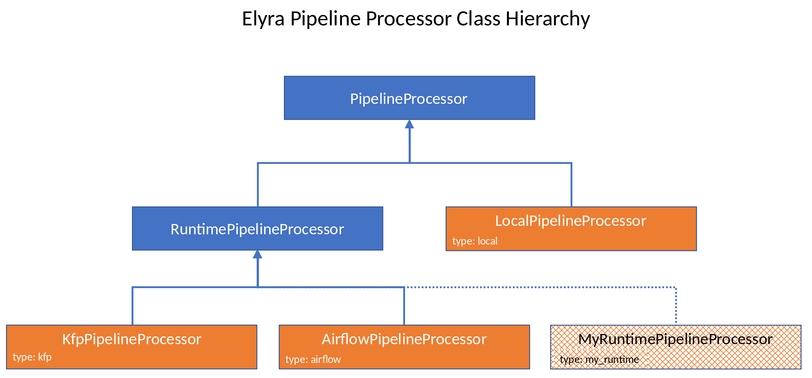

<!--

Copyright 2018-2022 Elyra Authors

Licensed under the Apache License, Version 2.0 (the "License");
you may not use this file except in compliance with the License.
You may obtain a copy of the License at

http://www.apache.org/licenses/LICENSE-2.0

Unless required by applicable law or agreed to in writing, software
distributed under the License is distributed on an "AS IS" BASIS,
WITHOUT WARRANTIES OR CONDITIONS OF ANY KIND, either express or implied.
See the License for the specific language governing permissions and
limitations under the License.

-->
# Pipelines
The following sections cover the details relative to working with pipelines in a development capacity.

## Pipeline definition

Below is a json representation of the pipeline that is generated by the **Pipeline Editor** and referred to as the _pipeline definition_. 

The pipeline is then submitted to the **Elyra Scheduler** which parses, properly packages and 
submits the pipeline definition to the chosen target runtime (e.g. Kubeflow Pipelines).

For more details on the **pipeline json definition** see it's [json schema](https://github.com/elyra-ai/pipeline-schemas/blob/master/common-pipeline/pipeline-flow/pipeline-flow-v3-schema.json)
 
### Pipeline definition json example 

```json
{
	"doc_type": "pipeline",
	"version": "3.0",
	"json_schema": "http://api.dataplatform.ibm.com/schemas/common-pipeline/pipeline-flow/pipeline-flow-v3-schema.json",
	"id": "582f2dd2-b329-4bfd-8326-3e0dc8c69744",
	"primary_pipeline": "f757f14a-4494-46b5-bb27-aeaa8a065477",
	"pipelines": [{
		"id": "f757f14a-4494-46b5-bb27-aeaa8a065477",
		"nodes": [{
			"id": "db9f3f5b-b2e3-4824-aadd-c1c6bf652534",
			"type": "execution_node",
			"app_data": {
				"label": "generate-contributions",
				"component_parameters": {
					"filename": "demo-pipelines/generate-contributions.ipynb",
					"runtime_image": "tensorflow/tensorflow@sha256:7c01f75d58fadc2cd1109d5baac1925ed131e05925d840b1b49363c794d1c4db",
					"outputs": ["community_contributions.csv"],
					"env_vars": ["GITHUB_TOKEN=xxxx"],
					"dependencies": ["contributors.csv"],
					"include_subdirectories": false
				},
				"ui_data": {
					"label": "generate-contributions",
					"x_pos": 387,
					"y_pos": 73,
					"description": "Notebook file"
				}
			},
			"inputs": [{
				"id": "inPort",
				"app_data": {
					"ui_data": {
						"cardinality": {
							"min": 0,
							"max": 1
						},
						"label": "Input Port"
					}
				}
			}],
			"outputs": [{
				"id": "outPort",
				"app_data": {
					"ui_data": {
						"cardinality": {
							"min": 0,
							"max": -1
						},
						"label": "Output Port"
					}
				}
			}]
		}, {
			"id": "f6584209-6f22-434f-9820-41327b6c749d",
			"type": "execution_node",
			"app_data": {
				"label": "generate-stats",
				"component_parameters": {
					"filename": "demo-pipelines/generate-stats.ipynb",
					"runtime_image": "tensorflow/tensorflow@sha256:7c01f75d58fadc2cd1109d5baac1925ed131e05925d840b1b49363c794d1c4db",
					"outputs": ["community_stats.csv"],
					"env_vars": ["GITHUB_TOKEN=xxxx"],
					"dependencies": ["contributors.csv"],
					"include_subdirectories": false
				},
				"ui_data": {
					"label": "generate-stats",
					"x_pos": 77,
					"y_pos": 79,
					"description": "Notebook file"
				}
			},
			"inputs": [{
				"id": "inPort",
				"app_data": {
					"ui_data": {
						"label": ""
					}
				}
			}],
			"outputs": [{
				"id": "outPort",
				"app_data": {
					"ui_data": {
						"label": ""
					}
				}
			}]
		}, {
			"id": "079c0e12-eb5f-4fcc-983b-09e011869fee",
			"type": "execution_node",
			"app_data": {
				"label": "overview",
				"component_parameters": {
					"filename": "demo-pipelines/overview.ipynb",
					"runtime_image": "tensorflow/tensorflow@sha256:7c01f75d58fadc2cd1109d5baac1925ed131e05925d840b1b49363c794d1c4db",
					"include_subdirectories": false
				},
				"ui_data": {
					"label": "overview",
					"x_pos": 318,
					"y_pos": 312,
					"description": "Notebook file"
				}
			},
			"inputs": [{
				"id": "inPort",
				"app_data": {
					"ui_data": {
						"label": ""
					}
				},
				"links": [{
					"node_id_ref": "db9f3f5b-b2e3-4824-aadd-c1c6bf652534",
					"port_id_ref": "outPort"
				}, {
					"node_id_ref": "f6584209-6f22-434f-9820-41327b6c749d",
					"port_id_ref": "outPort"
				}]
			}],
			"outputs": [{
				"id": "outPort",
				"app_data": {
					"ui_data": {
						"label": ""
					}
				}
			}]
		}],
		"app_data": {
			"ui_data": {
				"comments": []
			},
			"title": "pipeline-title",
			"runtime": "kfp",
			"runtime-config": "kfp-yukked1",
                        "version": 1
		},
		"runtime_ref": ""
	}],
	"schemas": []
}
```


## Pipeline Processor Customization
Elyra implements an extensible **pipeline processor engine**, which enables the addition of new pipeline processors utilizing
a service discovery mechanism.  The pipeline processor class hierarchy is depicted here:

This section outlines what is needed to introduce your own runtime for integration with Elyra.  In essence, two criteria must be fulfilled to introduce a new runtime: 
1. A schema describing the necessary runtime metadata
1. A pipeline processor implementation appropriately associated to the runtime

### Custom Runtime Schema
The first requirement for introducing a new runtime for use in Elyra is to define the necessary metadata corresponding to the runtime.  This is accomplished via a JSON schema file describing the necessary metadata used to integrate with the targeted runtime platform.

The schema will be made available to the application via a `SchemasProvider` (See [_Bring Your Own Schema_](../developer_guide/metadata.html#bring-your-own-schemas) in [_Metadata Services_](../developer_guide/metadata.html#metadata-services)) which implements a single method `get_schemas()`.

The schema name, represented by the value of the top-level `name` property is what the pipeline engine uses to locate the appropriate pipeline processor implementation.  This value is also set into the pipeline definition's `runtime` property in Elyra's UI, thereby tying the pipeline to the appropriate processor.

The schema should minimally include property definitions for the Cloud Object Storage (cos) properties found in the built-in schema definitions for [Kubeflow Pipelines](https://github.com/elyra-ai/elyra/blob/62e1964244ec8ada3e63c9c6d39befd7c046df08/elyra/metadata/schemas/kfp.json#L83-L129) and [Apache Airflow](https://github.com/elyra-ai/elyra/blob/62e1964244ec8ada3e63c9c6d39befd7c046df08/elyra/metadata/schemas/airflow.json#L93-L139).
    
### Custom Runtime Pipeline Processor Implementation
The pipeline processor implementation that corresponds to the targeted runtime platform must be a subclass of `elyra.pipeline.processor.RuntimePipelineProcessor` - which, itself, derives from `elyra.pipeline.processor.PipelineProcessor`.

To facilitate discovery by the pipeline engine, this implementation must use a value for its [`type` property](https://github.com/elyra-ai/elyra/blob/62e1964244ec8ada3e63c9c6d39befd7c046df08/elyra/pipeline/processor.py#L156) identical to its schema name.

#### Processor Registration
The pipeline processor should be registered using **entry_points** with a _name_ that matches both the schema name corresponding to the new runtime and the pipeline processor's `type` property value.  Although this is not technically required, we would like to possibly utilize this during discovery in the future (and is true relative to the built-in processors).

Entrypoint definitions are typically found in the package's **setup.py** or **setup.cfg** files similar to the following example:

```python
    entry_points = {
        'elyra.pipeline.processors': [
            'my_runtime = acme.my_runtime:MyRuntimePipelineProcessor'
        ]
    },
```
In this example, and corresponding to the criteria above, pipeline processor `acme.my_runtime.MyRuntimePipelineProcessor` will:
- derive from `elyra.pipeline.processor.RuntimePipelineProcessor`
  
- use a value of `my_runtime` for its `type` property value
  
- implement a `SchemasProvider` that will return the JSON schema for `my_runtime` via its `get_schemas()` method.
