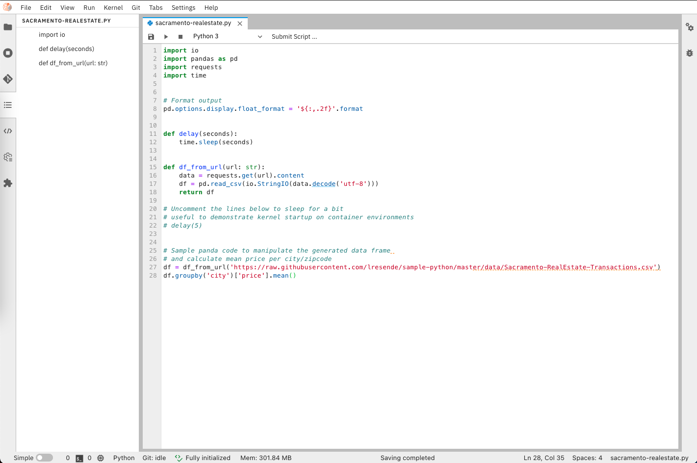

<!--

Copyright 2018-2020 Elyra Authors

Licensed under the Apache License, Version 2.0 (the "License");
you may not use this file except in compliance with the License.
You may obtain a copy of the License at

http://www.apache.org/licenses/LICENSE-2.0

Unless required by applicable law or agreed to in writing, software
distributed under the License is distributed on an "AS IS" BASIS,
WITHOUT WARRANTIES OR CONDITIONS OF ANY KIND, either express or implied.
See the License for the specific language governing permissions and
limitations under the License.

-->
## Overview

Elyra is a set of AI-centric extensions to JupyterLab Notebooks.

The main features include:

* [AI Pipelines visual editor](#ai-pipelines-visual-editor)
* [Ability to run a notebook as a batch job](#ability-to-run-a-notebook-as-a-batch-job)
* [Reusable Code Snippets](#reusable-code-snippets)
* [Hybrid runtime support](#hybrid-runtime-support)
* [Python script execution support](#python-script-execution-support)
* [Version control using git integration](#version-control-using-git-integration)
* [Notebook navigation using auto-generated Table of Contents](#notebook-navigation-using-auto-generated-table-of-contents)
* [Language Server Protocol integration](#language-server-protocol-integration)

You can try out some of these features using the getting started tour [on Binder](https://github.com/elyra-ai/elyra#using-binder) without having to install anything.

#### AI Pipelines visual editor

Building an AI pipeline for a model is hard, breaking down and modularizing a pipeline is harder.
A typical machine/deep learning pipeline begins as a series of preprocessing steps followed by
experimentation/optimization and finally deployment. Each of these steps represent a challenge in
the model development lifecycle.

Elyra provides a **Pipeline Visual Editor** for building AI pipelines from notebooks and Python scripts,
simplifying the conversion of multiple notebooks or Python scripts into batch jobs or workflows.

Currently, pipelines can be executed locally in JupyterLab or on 
[**Kubeflow Pipelines**](https://www.kubeflow.org/docs/pipelines/overview/pipelines-overview/).


Learn more about the Pipeline Visual Editor in the [AI Pipelines topic](/user_guide/pipelines.md) in the User Guide,  explore the [tutorials](/getting_started/tutorials.md), or [example pipelines](https://github.com/elyra-ai/examples#aiml-pipelines).

The pipeline editor feature can optionally be [installed as a stand-alone extension](installation).

#### Ability to run a notebook as a batch job

Elyra extends the Jupyter Notebook UI to to allow for execution of a notebook as a batch job in local or remote cloud environments. This feature leverages the AI pipelines feature and requires access to a Kubeflow Pipelines deployment via a [runtime configuration](../user_guide/runtime-conf).

To run a notebook as a batch job open the notebook and select "Submit Notebook ..." from the menu bar.


#### Reusable Code Snippets

The Code Snippet editor introduces support for reusable code fragments, making programming in JupyterLab more efficient by reducing repetitive work.


For information on how to manage and use code snippets refer to the [_Code Snippets_ topic](../user_guide/code-snippets) in the User Guide.

The code snippet feature can optionally be [installed as a stand-alone extension](installation).

#### Hybrid runtime support

Elyra leverages Jupyter Enterprise Gateway to enable Jupyter Notebooks
to share resources across distributed clusters such as Apache Spark, Kubernetes, OpenShift, and the like.

It simplifies the task of running notebooks interactively on cloud machines,
seamlessly leveraging the power of cloud-based resources such as GPUs and TPUs.

#### Python script execution support

Elyra contributes a Python script editor, which can take advantage of the
**Hybrid Runtime Support** enabling users to locally edit scripts and execute
them against local or cloud-based resources seamlessly.



For information on how to use the Python editor refer to the [_Enhanced Python Support_ topic](../user_guide/enhanced-python-support) in the User Guide.

The Python editor feature can optionally be [installed as a stand-alone extension](installation).

#### Version control using git integration

With the integrated Git version control support users can clone Git repositories, track and manage changes (e.g. by comparing, committing, or discarding them) and share among team members - fostering productivity by enabling a collaborative working environment.


To learn more about the git extension or how to install it individually refer to the [jupyterlab-git repository](https://github.com/jupyterlab/jupyterlab-git).

#### Notebook navigation using auto-generated Table of Contents

The enhanced notebook navigation recognizes markdown headings and auto-generates
a Table of Contents providing enhanced navigation capabilities.

To access the Table of Contents, open a notebook and select the _Table of Contents_ tab from the sidebar.


#### Language Server Protocol integration

The integration with Language Server Protocol (LSP) provides a high level support for programming languages in JupyterLab. It enhances the development experience, bringing features common in IDEs such as autocopletion, code navigation, hover suggestions, linters and rename. It works for notebooks and file editors without a running kernel.


By default, Elyra provides access to the python server package, levaraging the tools in the Python Editor extension.
User can also expand the support to other programming languages of their choice to boost their File Editor. 

To manually install other LSP servers (eg. R server - first make sure you have R language installed in your system or environment, then) :
``` bash
R -e 'install.packages("languageserver")'
``` 

Refer to the [jupyterlab-lsp documentation](https://jupyterlab-lsp.readthedocs.io/en/latest/Language%20Servers.html) for a full list of other language servers supported by the extension and how to install them.

To learn more about the extension and its features check out the [jupyterlab-lsp repository](https://github.com/krassowski/jupyterlab-lsp).