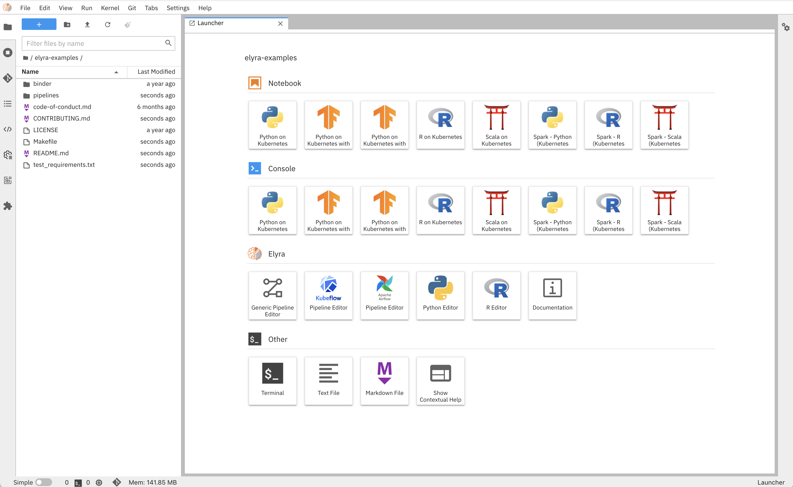
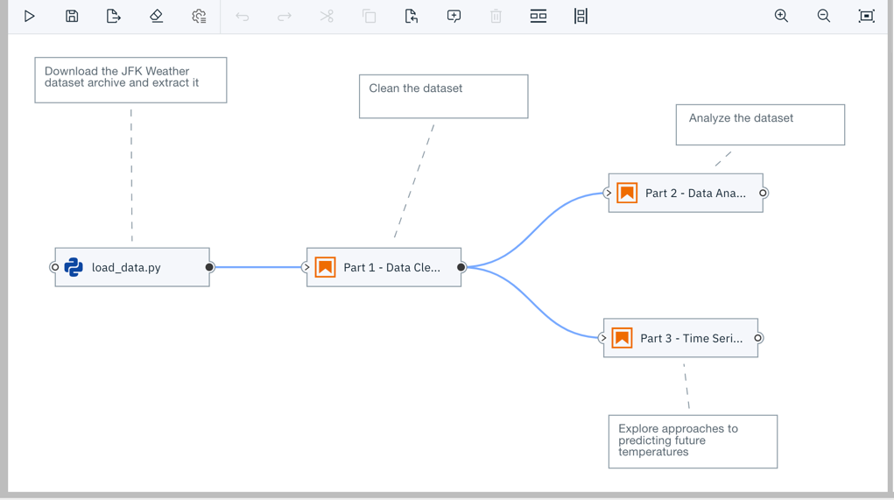

<!--

Copyright 2018-2020 Elyra Authors

Licensed under the Apache License, Version 2.0 (the "License");
you may not use this file except in compliance with the License.
You may obtain a copy of the License at

http://www.apache.org/licenses/LICENSE-2.0

Unless required by applicable law or agreed to in writing, software
distributed under the License is distributed on an "AS IS" BASIS,
WITHOUT WARRANTIES OR CONDITIONS OF ANY KIND, either express or implied.
See the License for the specific language governing permissions and
limitations under the License.

-->
## Overview

Elyra is a set of AI-centric extensions to JupyterLab Notebooks.

Elyra currently includes:
* [AI Pipelines visual editor](#ai-pipelines-visual-editor)
* [Ability to run a notebook as a batch job](#ability-to-run-a-notebook-as-a-batch-job)
* [Reusable Code Snippets](#reusable-code-snippets)
* [Hybrid runtime support](#hybrid-runtime-support)
* [Python script execution support](#python-script-execution-support)
* [Notebook versioning based on git integration](#notebook-versioning-based-on-git-integration)
* [Notebook navigation using auto-generated Table of Contents](#notebook-navigation-using-auto-generated-table-of-contents)
* [Reusable configuration for runtimes](#reusable-configuration-for-runtimes)

#### AI Pipelines visual editor

Building an AI pipeline for a model is hard, breaking down and modularizing a pipeline is harder.
A typical machine/deep learning pipeline begins as a series of preprocessing steps followed by
experimentation/optimization and finally deployment. Each of these steps represent a challenge in
the model development lifecycle.

Elyra provides a **Pipeline Visual Editor** for building AI pipelines from notebooks and Python scripts,
simplifying the conversion of multiple notebooks or Python scripts into batch jobs or workflow.

Currently, pipelines can be executed locally or on 
[**Kubeflow Pipelines**](https://www.kubeflow.org/docs/pipelines/overview/pipelines-overview/).

Learn more about the Pipeline Visual Editor in the [user guide](/user_guide/pipelines.md) or explore the [tutorials](/getting_started/tutorials.md).

#### Ability to run a notebook as a batch job

Elyra also extends the notebook UI to simplify the submission of a single notebook as a batch job

#### Reusable Code Snippets

Elyra supports the **Code Snippet** feature. This allows users to manipulate reusable pieces of code, making programming in JupyterLab more efficient by reducing repetitive work.

For more information on how to configure code snippets metadata see [Elyra Code Snippets](../user_guide/code-snippets)

#### Hybrid runtime support

Elyra leverages Jupyter Enterprise Gateway to enable Jupyter Notebooks
to share resources across distributed clusters such as Apache Spark, Kubernetes, OpenShift, and the like.

It simplifies the task of running notebooks interactively on cloud machines,
seamlessly leveraging the power of cloud-based resources such as GPUs and TPUs.

#### Python script execution support

Elyra exposes **Python Scripts** as first-class citizens, introducing the ability to
create python scripts directly from the workspace launcher, and leveraging the
**Hybrid Runtime Support** to allow users to locally edit their scripts and execute
them against local or cloud-based resources seamlessly.

#### Notebook versioning based on git integration

The integrated support for git repositories simplify tracking changes, allowing rollback to working versions
of the code, backups and, most importantly, sharing among team members - fostering productivity by
enabling a collaborative working environment.

#### Notebook navigation using auto-generated **Table of Contents**

The enhanced notebook navigation recognizes **markdown** titles, subtitles, etc to auto-generate
a Notebook **Table of Contents** providing enhanced navigation capabilities.

#### Reusable configuration for runtimes

Elyra introduces a 'shared configuration service' that simplifies workspace configuration management,
enabling things like external runtime access details to be configured once and shared
across multiple components.  
