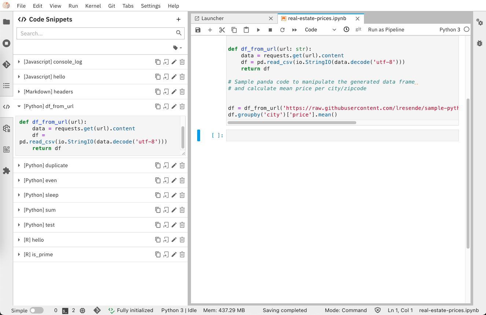
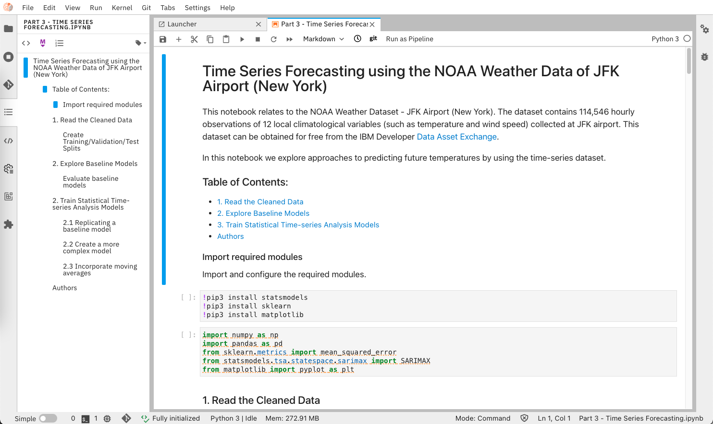

<!--

Copyright 2018-2021 Elyra Authors

Licensed under the Apache License, Version 2.0 (the "License");
you may not use this file except in compliance with the License.
You may obtain a copy of the License at

http://www.apache.org/licenses/LICENSE-2.0

Unless required by applicable law or agreed to in writing, software
distributed under the License is distributed on an "AS IS" BASIS,
WITHOUT WARRANTIES OR CONDITIONS OF ANY KIND, either express or implied.
See the License for the specific language governing permissions and
limitations under the License.

-->
## Overview

Elyra is a set of AI-centric extensions to JupyterLab Notebooks.

The main features include:

* [AI Pipelines visual editor](#ai-pipelines-visual-editor)
* [Ability to run a notebook or Python script as a batch job](#ability-to-run-a-notebook-or-python-script-as-a-batch-job)
* [Reusable Code Snippets](#reusable-code-snippets)
* [Hybrid runtime support](#hybrid-runtime-support)
* [Python script execution support](#python-script-execution-support)
* [Version control using git integration](#version-control-using-git-integration)
* [Notebook navigation using auto-generated Table of Contents](#notebook-navigation-using-auto-generated-table-of-contents)
* [Language Server Protocol integration](#language-server-protocol-integration)

You can try out some of these features using the getting started tour [on Binder](https://github.com/elyra-ai/elyra#using-binder) without having to install anything.

#### AI Pipelines visual editor

Building an AI pipeline for a model is hard, breaking down and modularizing a pipeline is harder.
A typical machine/deep learning pipeline begins as a series of preprocessing steps followed by
experimentation/optimization and finally deployment. Each of these steps represent a challenge in
the model development lifecycle.

Elyra provides a **Pipeline Visual Editor** for building AI pipelines from notebooks, Python scripts
and R scripts, simplifying the conversion of multiple notebooks or scripts files into batch jobs or workflows.

Currently, pipelines can be executed locally in JupyterLab or on 
[**Kubeflow Pipelines**](https://www.kubeflow.org/docs/pipelines/overview/pipelines-overview/).

Learn more about the Pipeline Visual Editor in the [AI Pipelines topic](/user_guide/pipelines.md) in the User Guide,  explore the [tutorials](/getting_started/tutorials.md), or [example pipelines](https://github.com/elyra-ai/examples#aiml-pipelines).

The pipeline editor feature can optionally be [installed as a stand-alone extension](installation).

#### Ability to run a notebook or Python script as a batch job

Elyra extends the Jupyter Notebook UI to to allow for execution of a notebook as a batch job in local or remote cloud environments. This feature leverages the AI pipelines feature and requires either a Kubeflow Pipelines or Apache Airflow deployment via a [runtime configuration](../user_guide/runtime-conf).

To run a notebook as a batch job open the notebook and select `Run as Pipeline` button from the menu bar.

Similarly, to submit a Python  or R script as a batch job, open a the script file and select `Run as Pipeline` button from the editor toolbar.

#### Reusable Code Snippets

The Code Snippet editor introduces support for reusable code fragments, making programming in JupyterLab more efficient by reducing repetitive work.

For information on how to manage and use code snippets refer to the [_Code Snippets_ topic](../user_guide/code-snippets) in the User Guide.

The code snippet feature can optionally be [installed as a stand-alone extension](installation).

#### Hybrid runtime support

Elyra leverages Jupyter Enterprise Gateway to enable Jupyter Notebooks
to share resources across distributed clusters such as Apache Spark, Kubernetes, OpenShift, and the like.

It simplifies the task of running notebooks interactively on cloud machines,
seamlessly leveraging the power of cloud-based resources such as GPUs and TPUs.

#### Python and R scripts execution support

Elyra contributes a Script editor with support for Python and R files, which can take advantage of the
**Hybrid Runtime Support** enabling users to locally edit scripts and execute
them against local or cloud-based resources seamlessly.

For information on how to use the Script editor refer to the [_Enhanced Script Support_ topic](../user_guide/enhanced-script-support) in the User Guide.

The Script editor feature can optionally be [installed as a stand-alone extension](installation).

#### Version control using git integration

With the integrated Git version control support users can clone Git repositories, track and manage changes (e.g. by comparing, committing, or discarding them) and share among team members - fostering productivity by enabling a collaborative working environment.

To learn more about the git extension or how to install it individually refer to the [jupyterlab-git repository](https://github.com/jupyterlab/jupyterlab-git).

#### Notebook navigation using auto-generated Table of Contents

The enhanced notebook navigation recognizes markdown headings and auto-generates
a Table of Contents providing enhanced navigation capabilities.

To access the Table of Contents, open a notebook and select the _Table of Contents_ tab from the sidebar.

#### Language Server Protocol integration

The [JupyterLab Language Server Protocol (LSP) integration](https://github.com/krassowski/jupyterlab-lsp) enhances the development experience in the notebook editor and file editors, delivering features common in IDEs such as autocompletion, code navigation, hover suggestions, code linting, and renaming. 

By default, Elyra installs the [Python Language Server package](https://pypi.org/project/python-language-server/), enabling the productivity features in the notebook editor and the Python editor. Support for other languages can be added by manually installing additional Language Server packages and their prerequisites.

Refer to the [`jupyterlab-lsp` extension documentation](https://jupyterlab-lsp.readthedocs.io/en/latest/Language%20Servers.html) for a full list of supported Language Servers and installation instructions.

To learn more about the `jupyterlab-lsp` extension and its features check out the [repository](https://github.com/krassowski/jupyterlab-lsp).
