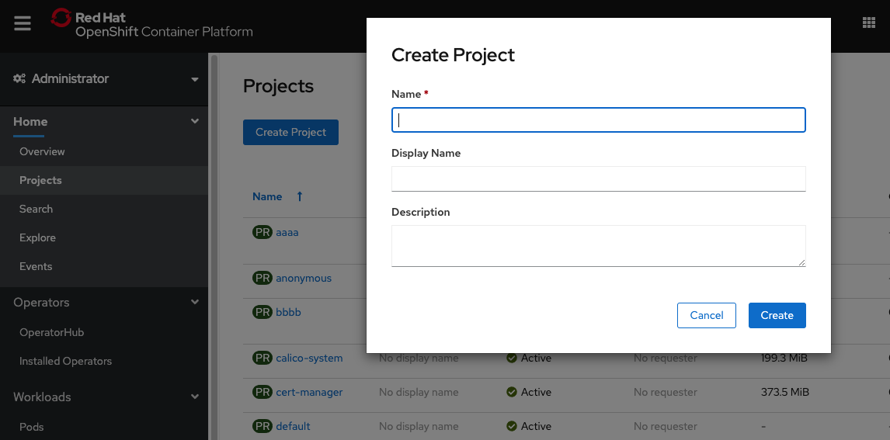
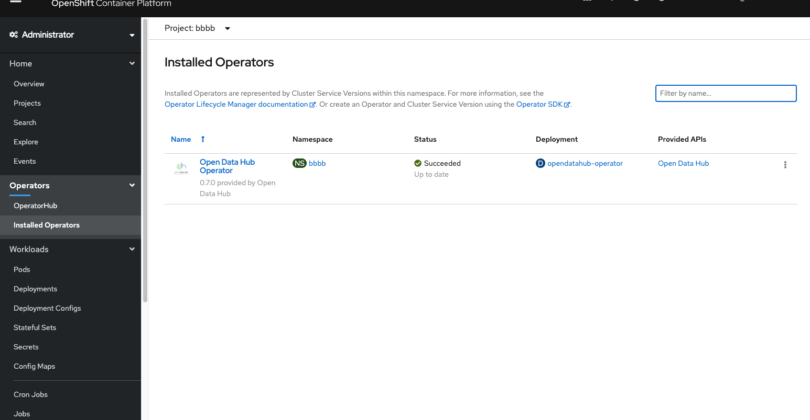
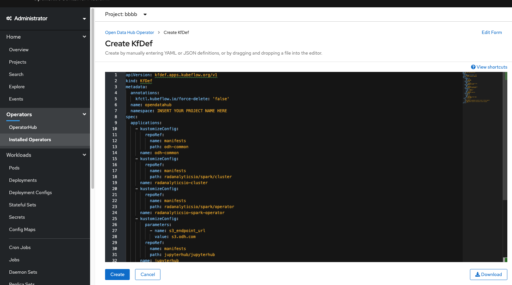
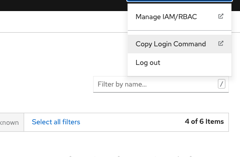

<!--

Copyright 2018-2021 Elyra Authors

Licensed under the Apache License, Version 2.0 (the "License");
you may not use this file except in compliance with the License.
You may obtain a copy of the License at

http://www.apache.org/licenses/LICENSE-2.0

Unless required by applicable law or agreed to in writing, software
distributed under the License is distributed on an "AS IS" BASIS,
WITHOUT WARRANTIES OR CONDITIONS OF ANY KIND, either express or implied.
See the License for the specific language governing permissions and
limitations under the License.

-->

# Deploying Open Data Hub with Elyra

In this example we will show how to deploy the Elyra Image to be used with Open Data Hub.  
An installation will consist of the deploying both the ODH Operator and Kubeflow in the same cluster.

## Requirements
- An OpenShift Cluster 
    - Since we will be installing both ODH and Kubeflow our preferred resource requirements will be:
    - 16 GB memory, 6 CPUs, and 45G of Disk Space 
- oc (OpenShift Command Line Interface) 
    - [Installation instructions](https://docs.openshift.com/container-platform/4.4/cli_reference/openshift_cli/getting-started-cli.html) for  Windows and MacOS     
- kfctl (Kubeflow Deployment Tool)
    - Latest releases can be found in the [kfctl Github Repository](https://github.com/kubeflow/kfctl/releases)
    - Extract the kfctl binary from the tar into a directory on your `PATH`
    
## Install KubeFlow on OpenShift

- Installation Instructions for Kubeflow can be found in the [OpenDataHub Documentation](https://opendatahub.io/docs/kubeflow/installation.html) 

Accessing the Kubeflow Pipelines Main Dashboard

- After deploying Kubeflow to your OpenShift cluster, setup port forwarding to your `Kubeflow` installation
- In your workstation, run `oc port-forward svc/istio-ingressgateway -n istio-system 8080:80 &`
- You should be able to reach the Kubeflow Pipelines Dashboard by navigating to: `http://localhost:8080/pipeline/#/pipelines`
    
## Installing the Open Data Hub Operator on OpenShift

After installing our requirements on our local workstation, we want to install the ODH Operator in our 
OpenShift Cluster.
- Open your web browser to the OpenShift Dashboard and navigate to the `Projects` page under the `Home` Dropdown on the left side menu
- Click on `Create Project` and create give it a name e.g. elyra or odh  
  
- After creating the Project navigate to the `OperatorHub` page and search for `opendatahub`
- Open the Open Data Hub tile and click `Install`, keeping all default settings.
- Once the Operator has finished installing, navigate to the `Installed Operators` page under  the `Operators` dropdown
 and click on 'Open Data Hub'
 
- Click on `Create KfDef`, then select `YAML View`. You should now see a default configuration. Replace the default with the following, replacing `INSERT_YOUR_PROJECT_NAME_HERE` with your OpenShift project name. 

```yaml
apiVersion: kfdef.apps.kubeflow.org/v1
kind: KfDef
metadata:
  annotations:
    kfctl.kubeflow.io/force-delete: 'false'
  name: opendatahub
  namespace: INSERT_YOUR_PROJECT_NAME_HERE
spec:
  applications:
    # REQUIRED: This contains all of the common options used by all ODH components
    - kustomizeConfig:
        repoRef:
          name: manifests
          path: odh-common
      name: odh-common
    # Deploy Jupyter Hub 
    - kustomizeConfig:
        parameters:
          - name: s3_endpoint_url
            value: s3.odh.com
        repoRef:
          name: manifests
          path: jupyterhub/jupyterhub
      name: jupyterhub
    # Deploy Jupyter notebook container images
    - kustomizeConfig:
        overlays:
          - additional
        repoRef:
          name: manifests
          path: jupyterhub/notebook-images
      name: notebook-images
  repos:
    - name: manifests
      uri: 'https://github.com/opendatahub-io/odh-manifests/tarball/v1.0.9'
  version: v1.0.9
status: {} 
```
This minimal kfdef configuration installs common ODH options, JupyterHub, and container images that serve Jupyter notebooks. The notebook images include an image named `s2i-lab-elyra:vX.Y.Z`, which has JupyterLab with Elyra pre-installed.



- Click `Create` and wait until the Open Data Hub operator completd the installation.

Accessing the ODH JupyterHub Landing/Spawner Page
- There are many ways to access the Landing Page, in this example we assume the user is using the default installation
and not making any modifications to the network services for the application e.g. Using Istio or opening up NodePorts 
- In your `OpenShift Dashboard`, in the upper right corner click on your username, and then `Copy Login Command`
a new page should pop up and then click on `Display Token`. Copy the `oc login` command.

- On your local workstation, paste the `oc login` command, this will allow you to control your cluster 
your workstation.
- Open a proxy to your cluster `oc proxy &`, this will run in the background.
- Navigate to the `Landing Page` in your browser. NOTE: Replace the`Project` name in the URL with your own 
http://localhost:8001/api/v1/namespaces/INSERT_PROJECT_NAME/services/http:jupyterhub:8080/proxy

## Accessing Default Object Storage 
- When using the default metadata runtime created, pipeline artifacts will be sent to the `Minio` S3 object storage instance
installed when Kubeflow Pipelines is installed

- Setup port forwarding to `Minio` with the following :
```bash
oc port-forward svc/minio-service -n kubeflow 9000:9000 &
```
- You should be able to reach the `Minio` dashboard in your web browser by navigating to`localhost:9000`

## Additional Resources and Documentation
[ODH Installation Docs](https://opendatahub.io/docs/getting-started/quick-installation.html)  
[ODH KubeFlow Installation Docs](https://opendatahub.io/docs/kubeflow/installation.html)
