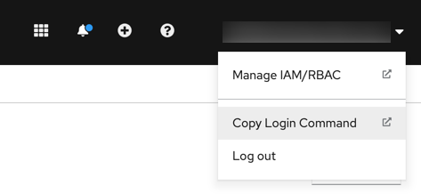
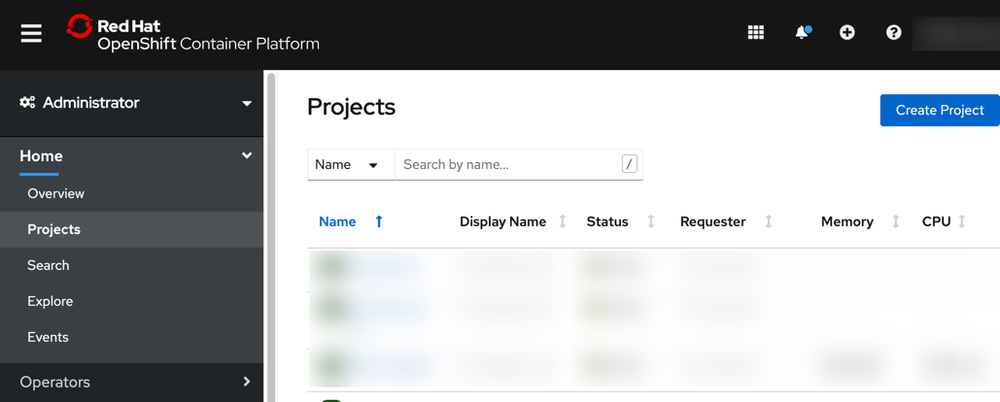
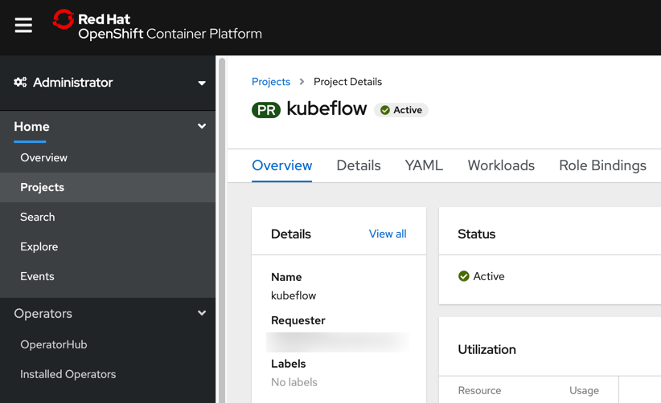
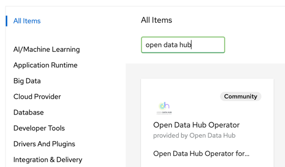
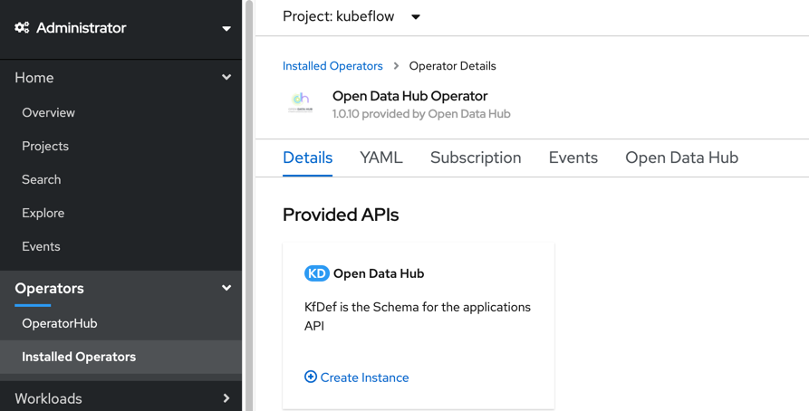
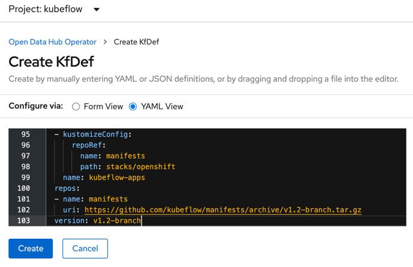
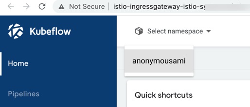
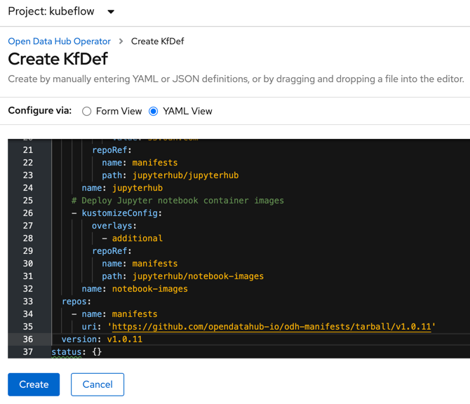

<!--

Copyright 2018-2021 Elyra Authors

Licensed under the Apache License, Version 2.0 (the "License");
you may not use this file except in compliance with the License.
You may obtain a copy of the License at

http://www.apache.org/licenses/LICENSE-2.0

Unless required by applicable law or agreed to in writing, software
distributed under the License is distributed on an "AS IS" BASIS,
WITHOUT WARRANTIES OR CONDITIONS OF ANY KIND, either express or implied.
See the License for the specific language governing permissions and
limitations under the License.

-->

# Deploying Open Data Hub with Elyra

This document outlines how to deploy JupyterHub, Elyra, and Kubeflow on Open Data Hub (ODH) using the Open Data Hub Operator.

## Requirements

- An OpenShift Cluster 
    - Since we will be installing both ODH and Kubeflow our preferred resource requirements will be:
    - 16 GB memory, 6 CPUs, and 45G of disk space 
- OpenShift CLI (`oc`) is installed locally 
    - [Installation instructions](https://docs.openshift.com/container-platform/4.7/cli_reference/openshift_cli/getting-started-cli.html) for  Windows and MacOS     
- Kubernetes CLI (`kfctl`) is installed locally
    - Latest releases can be found in the [kfctl Github Repository](https://github.com/kubeflow/kfctl/releases)

## Prepare for deployment

1. Open the OpenShift web console in a browser and log in.
1. Copy the login command.

   
1. Open a terminal window and run the copied command.
   ```
   oc login --token=TOKEN_VAL --server=https://SERVER:PORT
   ```

1. Keep the terminal window open.

## Install the Open Data Hub Project Operator on OpenShift

The Open Data Hub Project Operator manages installation, configuration, and the lifecycle of Open Data Hub projects. The operator is available on OpenShift OperatorHub as a community operator.

To install the operator:

1. Open the OpenShift web console and log in.
1. Switch to the `Administrator` view.
1. Open the projects list (`Home` > `Projects`).
   
1. Create a new project named `kubeflow`.
1. Switch to the new project.
     
1. Open the Operator Hub page (`Operators` > `OperatorHub`).
1. Search for the `Open Data Hub` operator.
      
1. Install the operator, keeping the default values.
1. Navigate to `Operators` > `Installed Operators` and wait for the operator installation to complete. 

Next, you'll install Kubeflow using the operator.

## Deploy Kubeflow on OpenShift

To deploy Kubeflow using the Open Data Hub operator:

1. Select the `Open Data Hub` operator from the list of installed operators.
1. On the operator details page select the `Details` tab, if it is not opened by default.
   
1. Create a new deployment by clicking `Create instance`.
1. Select `Configure via YAML view`.
1. Remove the default deployment configuration in the editor.
1. Open [this Kubeflow v1.2 deployment file for OpenShift](https://raw.githubusercontent.com/kubeflow/manifests/master/distributions/kfdef/kfctl_openshift.v1.2.0.yaml) in a new browser tab/window.
1. Copy and paste the content of this file into the editor.
   
1. Click `Create` to deploy Kubeflow on the cluster.
1. In the terminal window monitor the deployment progress by periodically listing pods in the `kubeflow` namespace. Wait until all pods are running. This might take a couple minutes.
   ```
   oc get pods --namespace kubeflow
   ```

   Upon successful deployment you can access the Kubeflow Central dashboard using a public route.
1. In the terminal window and run the following command to retrieve the public Central dashboard URL:
   ```
   oc get routes -n istio-system istio-ingressgateway -o jsonpath='http://{.spec.host}/'
   ```
1. Open the displayed URL in a web browser to access the Kubeflow central dashboard.
1. Select the namespace entry.

   

Next, you'll install JupyterHub with Elyra support.

## Deploy JupyterHub (with Elyra) on OpenShift

In Open Data Hub, notebooks are served using [JupyterHub](https://jupyter.org/hub). The default deployment includes a notebook server image that has JupyterLab with the Elyra extensions pre-installed. 

1. Open the OpenShift web console.
1. Navigate to `Operators` > `Installed Operators`.
1. Select the `Open Data Hub` operator from the list of installed operators.
1. On the operator details page select the `Details` tab, if it is not opened by default.
1. Create a new deployment by clicking `Create instance`.
1. Select `Configure via YAML view`.
1. Remove the default deployment configuration in the editor.
1. Copy and paste the following deployment configuration into the editor. This minimal configuration installs common ODH options, JupyterHub, and container images that serve Jupyter notebooks. One of these images, which is named `s2i-lab-elyra:vX.Y.Z`, has JupyterLab with Elyra pre-installed.
    ```yaml
    apiVersion: kfdef.apps.kubeflow.org/v1
    kind: KfDef
    metadata:
      annotations:
        kfctl.kubeflow.io/force-delete: 'false'
      name: opendatahub
      namespace: kubeflow
    spec:
      applications:
        # REQUIRED: This contains all of the common options used by all ODH components
        - kustomizeConfig:
            repoRef:
              name: manifests
              path: odh-common
          name: odh-common
        # Deploy Jupyter Hub 
        - kustomizeConfig:
            parameters:
              - name: s3_endpoint_url
                value: s3.odh.com
            repoRef:
              name: manifests
              path: jupyterhub/jupyterhub
          name: jupyterhub
        # Deploy Jupyter notebook container images
        - kustomizeConfig:
            overlays:
              - additional
            repoRef:
              name: manifests
              path: jupyterhub/notebook-images
          name: notebook-images
      repos:
        - name: manifests
          uri: 'https://github.com/opendatahub-io/odh-manifests/tarball/v1.0.11'
      version: v1.0.11
    status: {} 
    ```

   Note: Above deployment configuration utilizes version 1.0.11 of the [Open Data Hub manifests](https://github.com/opendatahub-io/odh-manifests/tree/master), which includes Elyra v2.2.4.

   

1. Click `Create` and wait for the deployment to complete.

## Access Elyra using the JupyterHub Spawner page

1. In the terminal window run this command to retrieve the exposed JupyterHub URL:
   ```
   oc get routes -n kubeflow jupyterhub -o jsonpath='http://{.spec.host}/'
   ```

1. Open the displayed URL in a browser.


## Accessing Default Object Storage 
- When using the default metadata runtime created, pipeline artifacts will be sent to the `Minio` S3 object storage instance
installed when Kubeflow Pipelines is installed

- Setup port forwarding to `Minio` with the following :
```bash
oc port-forward svc/minio-service -n kubeflow 9000:9000 &
```
- You should be able to reach the `Minio` dashboard in your web browser by navigating to`localhost:9000`

## Additional Resources and Documentation
[ODH Installation Docs](https://opendatahub.io/docs/getting-started/quick-installation.html)  
[ODH KubeFlow Installation Docs](https://opendatahub.io/docs/kubeflow/installation.html)
