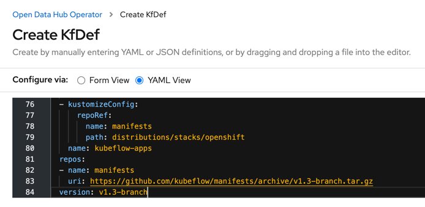

<!--

Copyright 2018-2022 Elyra Authors

Licensed under the Apache License, Version 2.0 (the "License");
you may not use this file except in compliance with the License.
You may obtain a copy of the License at

http://www.apache.org/licenses/LICENSE-2.0

Unless required by applicable law or agreed to in writing, software
distributed under the License is distributed on an "AS IS" BASIS,
WITHOUT WARRANTIES OR CONDITIONS OF ANY KIND, either express or implied.
See the License for the specific language governing permissions and
limitations under the License.

-->

# Deploying Open Data Hub with Elyra

This document outlines how to perform a quick deployment of [Kubeflow](https://kubeflow.org), [JupyterHub](https://jupyter.org/hub) and [Elyra](https://github.com/elyra-ai/elyra) on [Open Data Hub (ODH)](https://opendatahub.io/) using the Open Data Hub Operator.

Note the following:
- The instructions in this document utilize default configurations, which are unlikely to meet the requirements of a production deployment.
- By completing the steps in this document Kubeflow 1.3, JupyterHub v1.4, and Elyra v2.2.4 are deployed in the `kubeflow` project/namespace.
- The Kubeflow Central dashboard is unsecured.
- The JupyterHub GUI is secured by OpenShift. 
 
## Requirements

Verify that the following requirements are met.

- Access to a v4.x Red Hat OpenShift Cluster (16 GB RAM, 6 CPUs, and 45G of disk space) with internet connectivity. 
- The OpenShift CLI (`oc`) is installed locally. 
    - [Installation instructions](https://docs.openshift.com/container-platform/4.7/cli_reference/openshift_cli/getting-started-cli.html) for  Windows and MacOS    

## Prepare for deployment

1. Open the OpenShift web console in a browser and log in.
1. Copy the login command.

   
1. Open a terminal window and run the copied command.
   ```
   $ oc login --token=TOKEN_VAL --server=https://SERVER:PORT
   ```

1. Create a new project named `kubeflow`. 
   ```
   $ oc new-project kubeflow
   ```

1. Verify that the CLI is using the new `kubeflow` project.
   ```
   $ oc project kubeflow
   ```
1. Keep the terminal window open.

## Install the Open Data Hub Project Operator on OpenShift

The Open Data Hub Project Operator manages installation, configuration, and the lifecycle of Open Data Hub projects. The operator is available on OpenShift OperatorHub as a community operator.

To install the operator:

1. Open the OpenShift web console and log in.
1. Switch to the `Administrator` view.
1. Open the projects list (`Home` > `Projects`).
   
1. Switch to the `kubeflow` project.
     
1. Open the Operator Hub page (`Operators` > `OperatorHub`).
1. Search for the `Open Data Hub` operator.
      
1. Install the operator, keeping the default values.
1. Navigate to `Operators` > `Installed Operators` and wait for the operator installation to complete. 

Next, you'll install Kubeflow using the operator.

## Deploy Kubeflow on OpenShift

To deploy Kubeflow using the Open Data Hub operator:

1. Select the `Open Data Hub` operator from the list of installed operators.
1. On the operator details page select the `Details` tab, if it is not opened by default.
   
1. Create a new deployment by clicking `Create instance`.
1. Select `Configure via YAML view`.
1. Remove the default deployment configuration in the editor.
1. Open [this Kubeflow v1.3 deployment file for OpenShift](https://raw.githubusercontent.com/kubeflow/manifests/master/distributions/kfdef/kfctl_openshift_v1.3.0.yaml) in a new browser tab/window.
1. Copy and paste the content of this file into the editor.
   
1. Click `Create` to deploy Kubeflow on the cluster.
1. In the terminal window monitor the deployment progress by periodically listing pods in the `kubeflow` namespace. Wait until all pods are running. This might take a couple minutes.
   ```
   $ oc get pods --namespace kubeflow
   ```
   Upon successful deployment you can access the Kubeflow Central dashboard using a public route.
1. In the terminal window run the following command to retrieve the public Kubeflow Central dashboard URL:
   ```
   $ oc get routes -n istio-system istio-ingressgateway -o jsonpath='http://{.spec.host}'
   ```
1. Open the displayed URL in a web browser to access the Kubeflow Central dashboard.
1. Do not select a namespace entry, if you've deployed Kubeflow using the defaults.

The Kubeflow deployment is complete. As part of this deployment an instance of the MinIO object storage was provisioned. 

Next, you'll create a public endpoint for this service that provides you access to the MinIO GUI.

## Expose the MinIO object storage service

Elyra utilizes object storage to persist artifacts during pipeline processing. The MinIO GUI provides a basic GUI that is not exposed publicly by default.

To make the GUI available:

1. In the terminal window create a public endpoint for the MinIO service that was deployed alongside Kubeflow.
 
   ```
   $ oc create route edge --service=minio-service --namespace=kubeflow --port=9000 --insecure-policy=Redirect
   ```

1. Retrieve the public MinIO URL.

   ```
   $ oc get routes -n kubeflow minio-service -o jsonpath='https://{.spec.host}'
   ```

1. Open the displayed URL in a web browser to access the MinIO GUI. Log in using the default credentials (`minio`/`minio123`).

   


   Note the `mlpipeline` bucket. This bucket is used by Kubeflow and should not be deleted!

1. Take note of the following information. You'll need it later when you create a runtime configuration in Elyra, so that you can run pipelines in this Kubeflow deployment.
   - The MinIO GUI URL (`http://minio-service-kubeflow...`).
   - The MinIO access key (`minio`).
   - The MinIO secret key (`minio123`).

Next, you'll install JupyterHub with Elyra support.

## Deploy JupyterHub (with Elyra) on OpenShift

In Open Data Hub, notebooks are served using [JupyterHub](https://jupyter.org/hub). The default deployment includes a container image that has JupyterLab with the Elyra extensions pre-installed.

To deploy JupyterHub and its dependencies:

1. Open the OpenShift web console.
1. Navigate to `Operators` > `Installed Operators`.
1. Select the `Open Data Hub` operator from the list of installed operators.
1. On the operator details page select the `Details` tab, if it is not opened by default.
1. Create a new deployment by clicking `Create instance`.
1. Select `Configure via YAML view`.
1. Remove the default deployment configuration in the editor.
1. Copy and paste the following deployment configuration into the editor. This minimal configuration installs common ODH options, JupyterHub, and container images that serve Jupyter notebooks. One of these images, which is named `s2i-lab-elyra:vX.Y.Z`, has JupyterLab with Elyra pre-installed.
    ```yaml
    apiVersion: kfdef.apps.kubeflow.org/v1
    kind: KfDef
    metadata:
      annotations:
        kfctl.kubeflow.io/force-delete: 'false'
      name: opendatahub
      namespace: kubeflow
    spec:
      applications:
        # REQUIRED: This contains all of the common options used by all ODH components
        - kustomizeConfig:
            repoRef:
              name: manifests
              path: odh-common
          name: odh-common
        # Deploy Jupyter Hub 
        - kustomizeConfig:
            parameters:
              - name: s3_endpoint_url
                value: s3.odh.com
            repoRef:
              name: manifests
              path: jupyterhub/jupyterhub
          name: jupyterhub
        # Deploy Jupyter notebook container images
        - kustomizeConfig:
            overlays:
              - additional
            repoRef:
              name: manifests
              path: jupyterhub/notebook-images
          name: notebook-images
      repos:
        - name: manifests
          uri: 'https://github.com/opendatahub-io/odh-manifests/tarball/v1.0.11'
      version: v1.0.11
    status: {} 
    ```

   Note: Above deployment configuration utilizes version 1.0.11 of the [Open Data Hub manifests](https://github.com/opendatahub-io/odh-manifests/tree/master), which includes Elyra v2.2.4.

   

1. Click `Create` and wait for the deployment to complete.

   

Next, you'll use the JupyterHub spawner to launch Elyra.

## Access Elyra using the JupyterHub Spawner page

The JupyterHub instance you've deployed includes a [container image that has JupyterLab with the Elyra extensions installed](https://github.com/opendatahub-io/s2i-lab-elyra).

To run this image:

1. In the terminal window run this command to retrieve the exposed JupyterHub URL:
   ```
   $ oc get routes -n kubeflow jupyterhub -o jsonpath='http://{.spec.host}/'
   ```

1. Open the displayed URL in a browser, and, if required, log in.
1. On the JupyterHub Spawner page select `s2i-lab-elyra:vX.Y.Z` as notebook image.

   

   Note: The image tag version does not represent the Elyra version.

1. Once the container image was pulled and the container is running the JupyterLab GUI with the Elyra extensions opens in the browser window.

1. In the JupyterLab Launcher window navigate to the `Other` category and open a terminal.

   

1. Enter `elyra-pipeline --version` to display the Elyra version:

   

Next, you'll create a runtime configuration if you already have Kubeflow deployed in this cluster. If you don't have Kubeflow installed skip the next section.  

## Create a Kubeflow Pipelines runtime configuration

In Elyra [runtime configurations](/user_guide/runtime-conf.md) are used to provide the tooling access to external resources where pipelines can be executed.

To create a runtime configuration that allows for running of pipelines on the Kubeflow instance you've deployed:

1. Select the `Runtimes` tab from the JupyterLab side bar.

   

1. Click `+` and `New Kubeflow Pipelines runtime`.

1. Enter the following Kubeflow and MinIO configuration information, assuming you've performed a Kubeflow quick install using the linked manifest:
   - Name: `Local Kubeflow Pipelines`
   - Kubeflow Pipelines API Endpoint: the output from command 
     ```
     $ oc get routes -n istio-system istio-ingressgateway -o jsonpath='http://{.spec.host}/pipeline'
     ```
   - Kubeflow Pipelines User Namespace: leave empty, if Kubeflow deployment defaults were used
   - Kubeflow Pipelines API Endpoint Username: leave empty, if Kubeflow deployment defaults were used
   - Kubeflow Pipelines API  Endpoint Password: leave empty, if Kubeflow deployment defaults were used
   - Kubeflow Pipelines Engine: `Tekton`, if Kubeflow deployment defaults were used
   - Cloud Object Storage Endpoint: the output from command 
     ```
     $ oc get routes -n kubeflow minio-service -o jsonpath='https://{.spec.host}'
     ```

   - Cloud Object Storage Credentials Secret: leave empty
   - Cloud Object Storage Username: `minio` if Kubeflow deployment defaults were used, otherwise the appropriate id
   - Cloud Object Storage Password: `minio123` if Kubeflow deployment defaults were used, otherwise the appropriate password
   - Cloud Object Storage Bucket Name: `elyra-pipeline-storage`
1. Save the runtime configuration.

This concludes the quick deployment and configuration tasks.

## Next steps

- [Verify the deployment by running a basic pipeline](https://elyra.readthedocs.io/en/latest/user_guide/runtime-conf.html#verifying-runtime-configurations)
- [Learn more about pipelines](../getting_started/tutorials.html#tutorials)
- [Explore example pipelines](../getting_started/tutorials.html#examples)

## Additional resources

- [OpenShift CLI documentation](https://docs.openshift.com/container-platform/latest/cli_reference/openshift_cli/getting-started-cli.html)
- [Open Data Hub installation documentation](https://opendatahub.io/docs/getting-started/quick-installation.html)  
- [KubeFlow installation documentation for Open Data Hub](https://opendatahub.io/docs/kubeflow/installation.html)

