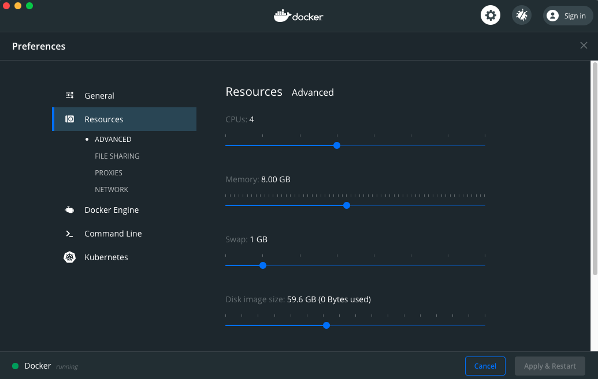
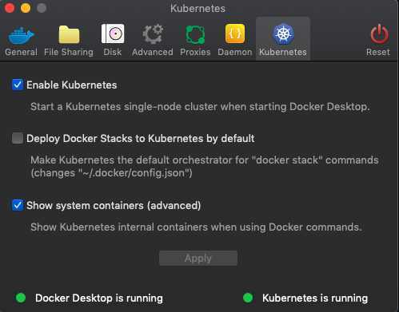
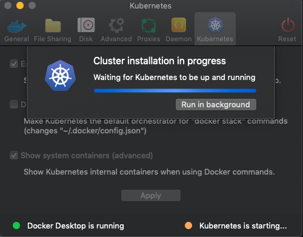
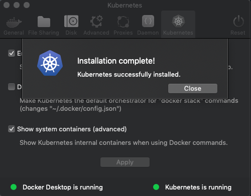
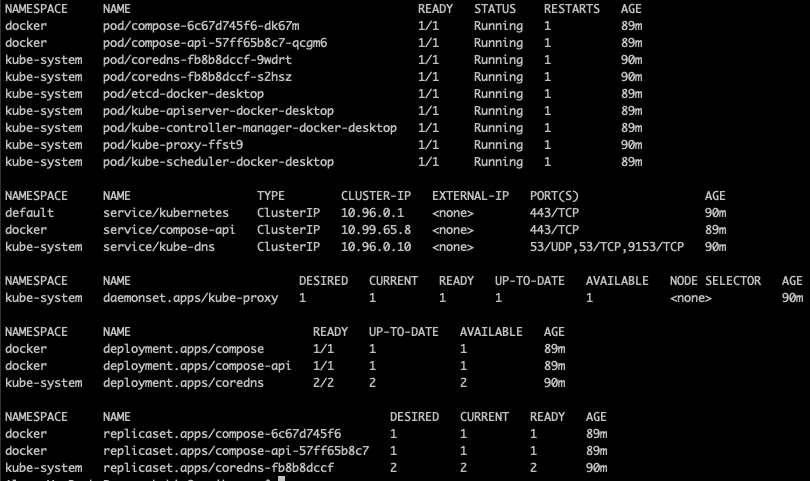
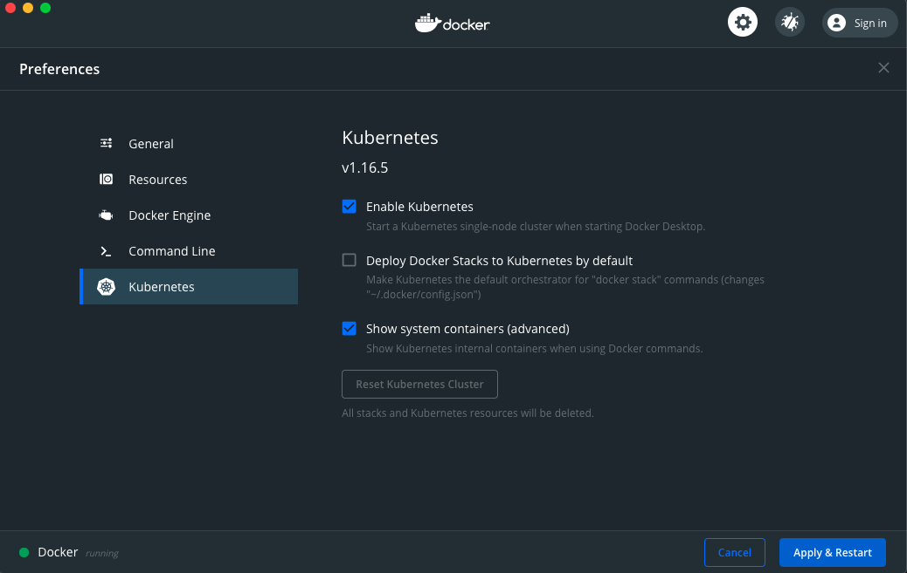
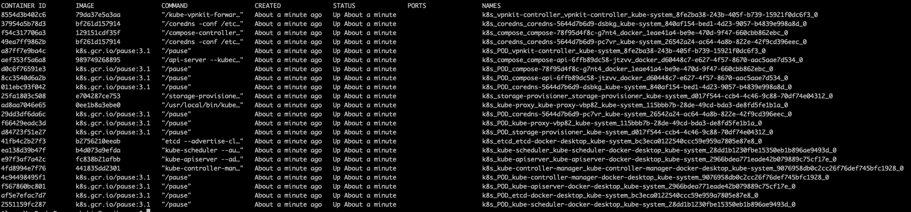

<!--

Copyright 2018-2021 Elyra Authors

Licensed under the Apache License, Version 2.0 (the "License");
you may not use this file except in compliance with the License.
You may obtain a copy of the License at

http://www.apache.org/licenses/LICENSE-2.0

Unless required by applicable law or agreed to in writing, software
distributed under the License is distributed on an "AS IS" BASIS,
WITHOUT WARRANTIES OR CONDITIONS OF ANY KIND, either express or implied.
See the License for the specific language governing permissions and
limitations under the License.

-->

# Deploying Kubeflow Pipelines Locally for Elyra

Elyra's pipeline editor depends on runtimes like Kubeflow to properly execute its pipelines. In the example,
we will be deploying Kubeflow Pipelines on Kubernetes using Docker Desktop. Note that these instructions will
ONLY install the Kubeflow Pipelines component.

## Requirements
- Docker Desktop
    - Available for [MacOS](https://hub.docker.com/editions/community/docker-ce-desktop-mac) and 
                    [Windows](https://hub.docker.com/editions/community/docker-ce-desktop-windows)
- kubectl
    - Available for [MacOS](https://kubernetes.io/docs/tasks/tools/install-kubectl/#install-kubectl-on-macos)
    - Note: Windows users should skip this step since Docker Desktop adds its own version of `kubectl` to `PATH`
    
    
### Enabling Kubernetes on Docker Desktop

After installing our requirements, we want to enable `kubernetes` in `Docker Desktop`.

In this example, we will be performing the steps on a MacOS system

1. In the upper right corner locate the Docker Desktop Icon, Click and go to `Preferences`   
  
  
2. Navigate to the `Resources` sub-menu and ensure that Docker Desktop has at least   
4 CPUs, 8 GB of Memory and 1 GB of Swap. If not, increase as necessary and click `Apply & Restart`.  
  
  
3. Navigate to the `Kubernetes` sub-menu and click `Enable Kubernetes` and hit `Apply & Restart`  
  
  
4. `Docker Desktop` should now install a single node deployment of Kubernetes  
 on your system and configure your `kubectl` to the correct local kubernetes cluster  
  
  
  
5. Verify that your cluster is up and running and configured correctly by running  
`kubectl get all --all-namespaces` and verifying that the Docker Desktop pods are present and in `Running` state   
  
  
## Install KubeFlow Pipelines 

- Deploy Kubeflow  

```bash
export PIPELINE_VERSION=1.4.0
kubectl apply -k "github.com/kubeflow/pipelines/manifests/kustomize/cluster-scoped-resources?ref=$PIPELINE_VERSION"
kubectl wait --for condition=established --timeout=60s crd/applications.app.k8s.io
kubectl apply -k "github.com/elyra-ai/elyra/etc/kubernetes/kubeflow-pipelines?ref=master"
```
- Get status of the Kubeflow deployment and ensure all pods are running before proceeding.  
Deployment times vary from system to system so please be patient when the pods are starting up.
```bash
kubectl get all -n kubeflow
```
- Setup port forwarding to use the Kubeflow Pipelines UI / API
```bash
kubectl port-forward $(kubectl get pods -n kubeflow | grep ml-pipeline-ui | cut -d' ' -f1) 31380:3000 -n kubeflow &
```
- Add minio-service to your local hosts file
```bash
echo '127.0.0.1  minio-service' | sudo tee -a /etc/hosts
```
- Setup port forwarding to use the Minio Object Service with Kubeflow
```bash
kubectl port-forward $(kubectl get pods -n kubeflow | grep minio | cut -d' ' -f1) 9000:9000 -n kubeflow &
```
- Your Kubeflow Pipelines API and Minio Object Store endpoints should be respectively
```bash
UI Endpoint: http://localhost:31380
API Endpoint: http://localhost:31380/pipeline
Object Storage Endpoint: http://minio-service:9000
```

These endpoints will be used to configure your Elyra metadata runtime with the
command below:

```bash
elyra-metadata install runtimes --replace=true \
       --schema_name=kfp \
       --name=kfp-local \
       --display_name="Kubeflow Pipeline (local)" \
       --api_endpoint=http://localhost:31380/pipeline \
       --cos_endpoint=http://minio-service:9000 \
       --cos_username=minio \
       --cos_password=minio123 \
       --cos_bucket=covid
```

## Troubleshooting
If the kubernetes cluster fails to start you may need to analyze the container logs to figure out which 
component is failing. 
1. To do this, go back to your `Kubernetes` sub-menu under `Preferences`
2. Check the box for `Show System Containers (Advanced)` and click `Apply and Restart`
  
3. Open a terminal window and run `docker ps`. This should show a list of containers currently running in 
Docker as well as the containers that are part of your kubernetes cluster.
  
4. To view the logs of a container, use
```bash
docker logs <CONTAINER ID>
```
The output of these logs should hopefully assist with any issues you may encounter.

## Additional Resources and Documentation
[Docker Desktop Installation Docs](https://docs.docker.com/get-started/)  
[KubeFlow Installation Docs](https://www.kubeflow.org/docs/started/installing-kubeflow/)
