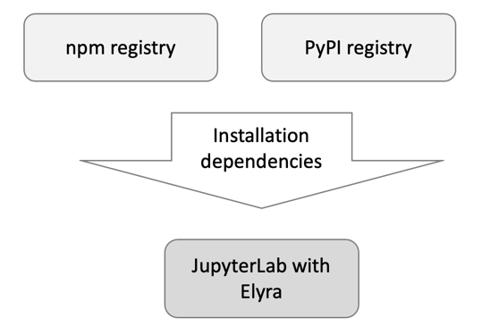
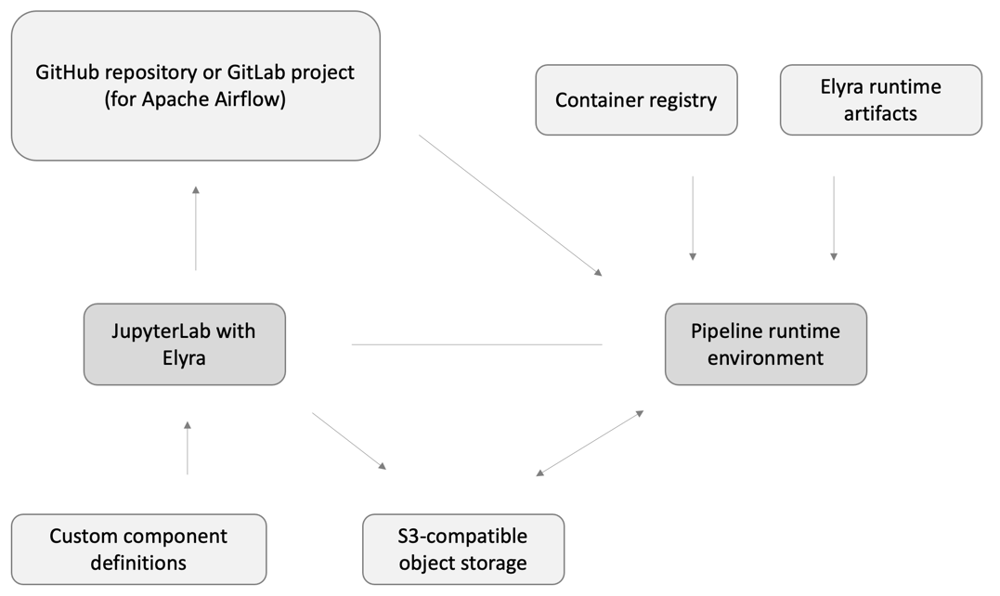

<!--

Copyright 2018-2022 Elyra Authors

Licensed under the Apache License, Version 2.0 (the "License");
you may not use this file except in compliance with the License.
You may obtain a copy of the License at

http://www.apache.org/licenses/LICENSE-2.0

Unless required by applicable law or agreed to in writing, software
distributed under the License is distributed on an "AS IS" BASIS,
WITHOUT WARRANTIES OR CONDITIONS OF ANY KIND, either express or implied.
See the License for the specific language governing permissions and
limitations under the License.

-->

# Running Elyra in an air-gapped environment

 Elyra requires access to resources that are commonly located in remote environments. Deployment of Elyra in an [air-gapped environment](https://en.wikipedia.org/wiki/Air_gap_(networking)) (a network environment that is physically separated from other environments, public or private) therefore requires additional considerations. This document identifies resources that must be made available to successfully install and run Elyra in such an environment.

## Installation dependencies

An Elyra installation requires access to Python and Javascript packages, which must be accessible in the environment when the installation is performed.



These dependencies are in addition to any dependencies you wish to include in the installation, such as JupyterLab extensions that are not distributed with Elyra.

## Runtime dependencies

When using Elyra's features to [build, export, or run pipelines](../user_guide/pipelines.md), additional runtime dependencies must be accessible in the environment where JupyterLab is installed and the Kubernetes cluster where the pipeline runtime environment (Kubeflow Pipelines or Apache Airflow) is installed. 



In the chart above the arrows indicate whether read access, write access, or both is required.

### JupyterLab environment dependencies

Elyra requires access to the following dependencies when you build, export, or submit a pipeline:
- **Runtime environment**: Elyra requires access to the Kubernetes cluster where Kubeflow Pipelines or Apache Airflow is running. 
- **GitHub repository or GitLab project:** For Apache Airflow Elyra requires access to the GitHub repository or GitLab project that is configured in the [runtime configuration](../user_guide/runtime-conf.html#git-type-git-type).
- **Component definitions for [custom components](../user_guide/pipeline-components.html#custom-components)**: Elyra utilizes [catalog connectors](../user_guide/pipeline-components.html#component-catalogs) to locate and load component definitions. The connectors must be able to communicate with the configured catalog, or you will not be able to submit or export pipelines. For example, if a pipeline utilizes a component that is stored in a URL component catalog, the component's URL must be accessible via an anonymous HTTP request.  
- **S3-compatible cloud storage for [generic components](../user_guide/pipeline-components.html#generic-components)**: During pipeline [export](../user_guide/pipelines.html#exporting-pipelines) or [submission](../user_guide/pipelines.html#running-pipelines) Elyra uploads pipeline artifacts to an S3 bucket. These artifacts are downloaded to the pipeline runtime environment when the pipeline is executed.

### Runtime environment dependencies

During pipeline execution in the Kubeflow Pipelines or Apache Airflow environment access to the following dependencies is required:
- **Container registry**: All pipeline nodes are executed in containers. The runtime environment must be configured to have read access to the registries (e.g. Docker Hub) where the container images are stored that the generic and custom components are referencing.
- **Elyra runtime artifacts**: When processing pipeline nodes that are implemented using [generic components](../user_guide/pipeline-components.html#generic-components), Elyra downloads a few dependencies to the container. By default these dependencies are located in a _release-specific branch_ in the [Elyra GitHub repository](https://github.com/elyra-ai/elyra):
  ```
    https://raw.githubusercontent.com/elyra-ai/elyra/v3.14.1/etc/kfp/pip.conf
    https://raw.githubusercontent.com/elyra-ai/elyra/v3.14.1/elyra/kfp/bootstrapper.py
    https://raw.githubusercontent.com/elyra-ai/elyra/v3.14.1/elyra/airflow/bootstrapper.py
    https://raw.githubusercontent.com/elyra-ai/elyra/v3.14.1/etc/generic/requirements-elyra-py37.txt
    https://raw.githubusercontent.com/elyra-ai/elyra/v3.14.1/etc/generic/requirements-elyra.txt
  ```
  In air-gapped environments you must store a copy of these files in a location that is accessible via an anonymous HTTP `GET` request and configure the following environment variables _in the environment where JupyterLab is running_:
    - For Kubeflow Pipelines:
        - `ELYRA_PIP_CONFIG_URL` (URL of `.../etc/kfp/pip.conf`)
        - `ELYRA_BOOTSTRAP_SCRIPT_URL` (URL of `.../elyra/kfp/bootstrapper.py`)
        - `ELYRA_REQUIREMENTS_URL_PY37` (URL of `.../etc/generic/requirements-elyra-py37.txt`)
        - `ELYRA_REQUIREMENTS_URL` (URL of `.../etc/generic/requirements-elyra.txt`)
    - For Apache Airflow:
        - `ELYRA_BOOTSTRAP_SCRIPT_URL` (URL of `.../elyra/airflow/bootstrapper.py`)
        - `ELYRA_REQUIREMENTS_URL_PY37` (URL of `.../etc/generic/requirements-elyra-py37.txt`)
        - `ELYRA_REQUIREMENTS_URL` (URL of `.../etc/generic/requirements-elyra.txt`)     
- **S3-compatible cloud storage for [generic components](../user_guide/pipeline-components.html#generic-components)**: When processing pipeline nodes that are implemented using [generic components](../user_guide/pipeline-components.html#generic-components), Elyra downloads the pipeline artifacts that were uploaded when the pipeline was exported or submitted.
