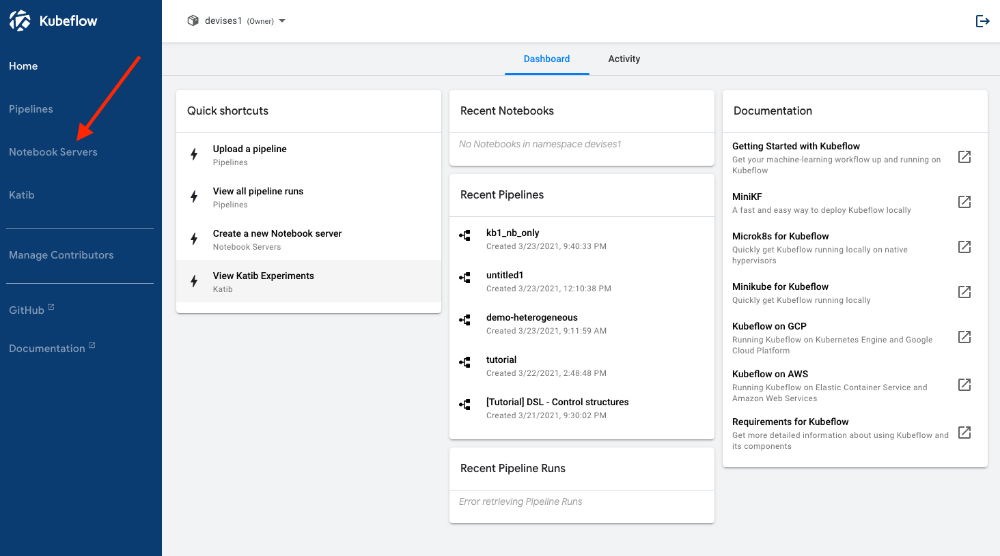
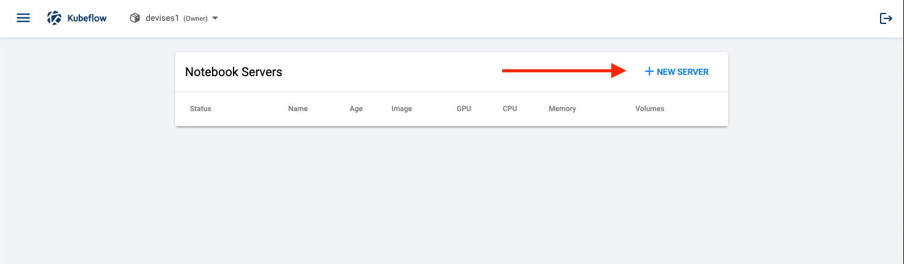
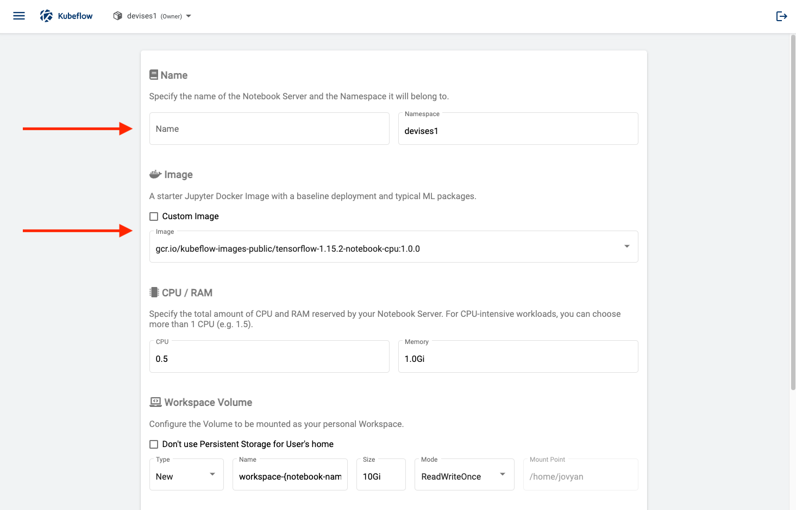
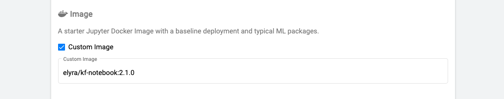
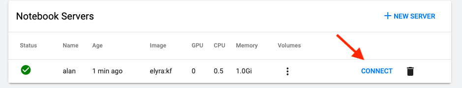

<!--

Copyright 2018-2021 Elyra Authors

Licensed under the Apache License, Version 2.0 (the "License");
you may not use this file except in compliance with the License.
You may obtain a copy of the License at

http://www.apache.org/licenses/LICENSE-2.0

Unless required by applicable law or agreed to in writing, software
distributed under the License is distributed on an "AS IS" BASIS,
WITHOUT WARRANTIES OR CONDITIONS OF ANY KIND, either express or implied.
See the License for the specific language governing permissions and
limitations under the License.

-->

# Using Elyra with the Kubeflow Notebook Server

In this example we will show how to launch Elyra using Kubeflow's Notebook Server.

## Requirements
- A Kubeflow Cluster
    - A standard installation of Kubeflow will include the Notebook Server as part of the application stack
    - [Installation Documentation](https://www.kubeflow.org/docs/started/getting-started/)
    
## Launching Elyra in the Kubeflow Notebook Server
1. In the default Kubeflow welcome page, in the left side menu, click on `Notebook Servers`

  

2. Click on `NEW SERVER`

  

3. Choose a `name` for your notebook server, and under `Image` check the box labeled `Custom Image`

  

4. Under `Custom Image`, add `elyra/kf-notebook:<ELYRA_VERSION>`, in this example we are using Elyra 2.1.0

  

5. Increase or decrease any memory resources as required. We recommend at least 1 CPU and 1Gi of memory.
   
6. Your notebook server with Elyra should begin the provisioning process now. When complete, you'll notice a green light and arrow to the left of your notebook. Click on `Connect` to launch Elyra.

  
   
### Next step:
[Creating a runtime metadata configuration](https://elyra.readthedocs.io/en/latest/user_guide/runtime-conf.html)

## Additional Resources and Documentation
[Official Kubeflow Notebook Server Documentation - Creating a Jupyter Notebook Server](https://www.kubeflow.org/docs/components/notebooks/setup/)