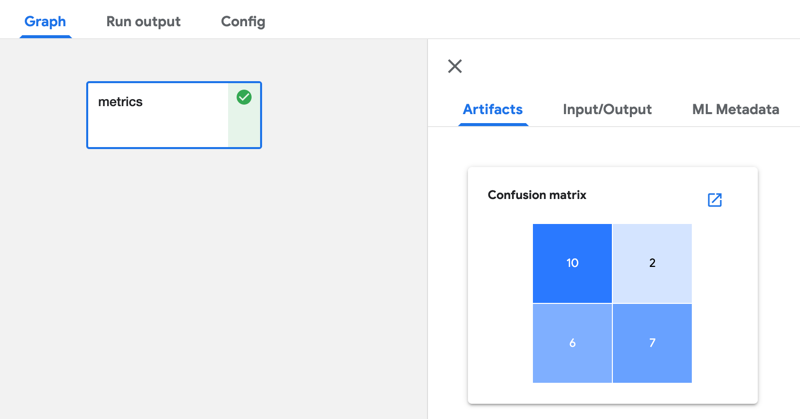

<!--

Copyright 2018-2022 Elyra Authors

Licensed under the Apache License, Version 2.0 (the "License");
you may not use this file except in compliance with the License.
You may obtain a copy of the License at

http://www.apache.org/licenses/LICENSE-2.0

Unless required by applicable law or agreed to in writing, software
distributed under the License is distributed on an "AS IS" BASIS,
WITHOUT WARRANTIES OR CONDITIONS OF ANY KIND, either express or implied.
See the License for the specific language governing permissions and
limitations under the License.

-->

# Visualizing output from your notebooks or Python scripts in the Kubeflow Pipelines UI

Pipelines that you run on Kubeflow Pipelines can optionally produce output that is rendered in the Kubeflow Pipelines UI. For example, a model training script might expose quality metrics.

You can try the visualizations shown in this document using [this pipeline in the Elyra examples repository](https://github.com/elyra-ai/examples/tree/master/pipelines/visualize_output_in_kubeflow_pipelines_ui).

## Visualizing output using the Kubeflow Pipelines output viewer

The output viewer in the Kubeflow Pipelines UI can render output such as a confusion matrix, ROC curve, or markdown, that is displayed in the Kubeflow Pipelines UI.



To produce this output add code to your notebook or Python script that creates a file named `mlpipeline-ui-metadata.json` in the current working directory. Refer to [_Visualize Results in the Pipelines UI_ in the Kubeflow Pipelines documentation](https://www.kubeflow.org/docs/pipelines/sdk/output-viewer/#introduction) to learn about supported visualizations and the format of the `mlpipeline-ui-metadata.json` file. 

The following code snippet produces a confusion matrix that is rendered in the output viewer as shown above: 

```
import json
import pandas as pd 

matrix = [
    ['yummy', 'yummy', 10],
    ['yummy', 'not yummy', 2],
    ['not yummy', 'yummy', 6],
    ['not yummy', 'not yummy', 7]
]

df = pd.DataFrame(matrix,columns=['target','predicted','count'])

metadata = {
    "outputs": [
        {
            "type": "confusion_matrix",
            "format": "csv",
            "schema": [
                {
                    "name": "target",
                    "type": "CATEGORY"
                },
                {
                    "name": "predicted",
                    "type": "CATEGORY"
                },
                {
                    "name": "count",
                    "type": "NUMBER"
                }
            ],
            "source": df.to_csv(header=False, index=False),
            "storage": "inline",
            "labels": [
                "yummy",
                "not yummy"
            ]
        }
    ]
}

with open('mlpipeline-ui-metadata.json', 'w') as f:
    json.dump(metadata, f)
```


Note that the output is displayed only after notebook or Python script processing has completed.

## Visualizing scalar performance metrics in the Kubeflow Pipelines UI

If your notebooks or Python scripts calculate scalar performance metrics they can be displayed as part of the run output in the Kubeflow Pipelines UI.


To expose the metrics, add code to the notebook or Python script that stores them in a file named `mlpipeline-metrics.json` in the current working directory. Refer to [_Pipeline Metrics_ in the Kubeflow Pipelines documentation](https://www.kubeflow.org/docs/pipelines/sdk/pipelines-metrics/) to learn more about the content of this file.

The following code snippet produces this file and records two metrics: 

```
  import json
   
  # ...
  # calculate Accuracy classification score
  accuracy_score = 0.6
  # calculate Area Under the Receiver Operating Characteristic Curve (ROC AUC)
  roc_auc_score = 0.75
 
  metrics = {
    'metrics': [
        {
            'name': 'accuracy-score',
            'numberValue':  accuracy_score,
            'format': 'PERCENTAGE'
        },
        {
            'name': 'roc-auc-score',
            'numberValue':  roc_auc_score,
            'format': 'RAW'       
        }
    ]
  }

  with open('mlpipeline-metrics.json', 'w') as f:
    json.dump(metrics, f)
```

Note that the metrics are displayed after notebook or Python script processing has completed.
