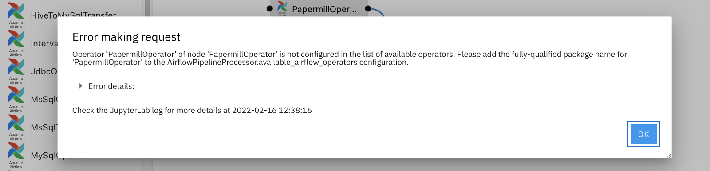

<!--

Copyright 2018-2022 Elyra Authors

Licensed under the Apache License, Version 2.0 (the "License");
you may not use this file except in compliance with the License.
You may obtain a copy of the License at

http://www.apache.org/licenses/LICENSE-2.0

Unless required by applicable law or agreed to in writing, software
distributed under the License is distributed on an "AS IS" BASIS,
WITHOUT WARRANTIES OR CONDITIONS OF ANY KIND, either express or implied.
See the License for the specific language governing permissions and
limitations under the License.

-->
## Requirements and best practices for custom pipeline components

[Components](pipeline-components.md) are the fundamental building blocks of pipelines in Elyra. This document outlines requirements that user-provided custom components must meet to be compatible with the Visual Pipeline Editor. Best practices for generic components are documented in the [Best practices for file-based pipeline nodes](best-practices-file-based-nodes.md) topic.

### Kubeflow Pipelines components

#### Requirements

- The component is implemented as described [here](https://www.kubeflow.org/docs/components/pipelines/sdk/component-development/).
- [Python function-based components](https://www.kubeflow.org/docs/components/pipelines/sdk/python-function-components/) are not supported.
- The [component specification](https://www.kubeflow.org/docs/components/pipelines/sdk/v2/component-development/#creating-a-component-specification) must be accessible to the Visual Pipeline Editor and can be stored locally or remotely. Refer to the 
[Managing pipeline components topic](pipeline-components.html#managing-pipeline-components) for details.
- If Kubeflow Pipelines is [configured with Argo as workflow engine and emissary executor as workflow executor](https://www.kubeflow.org/docs/components/pipelines/installation/choose-executor/#emissary-executor), the component specifiction must [meet the stated requirement](https://www.kubeflow.org/docs/components/pipelines/installation/choose-executor/#migrate-pipeline-components-to-run-on-emissary-executor). If Elyra detects a component that does not meet the requirement, a warning is logged.

#### Best practices

> This documentation content is currently under development.

### Apache Airflow components

#### Requirements

##### Configure fully qualified package names for custom operator classes

For Apache Airflow operators imported into Elyra using URL, filesystem, or directory-based component catalogs, Elyra 
must be configured to include information on the fully qualified package names for each custom operator class. This 
configuration is what makes it possible for Elyra to correctly render the import statements for each operator node 
in a given DAG.

If you do not correctly configure an operator package name and try to export or submit a pipeline with custom 
components, Elyra will give you an error message similar to the following:



As seen above, the operators' fully qualified package names must be added to the `available_airflow_operators` 
variable. This variable has a list value and is a 
[configurable trait](https://traitlets.readthedocs.io/en/stable/config.html) 
in Elyra. To configure `available_airflow_operators`, first create a configuration file from the command line (if 
you do not already have one):

```bash
$ jupyter elyra --generate-config
```

Open the configuration file (a Python file) and find the `PipelineProcessor(LoggingConfigurable)` header. Using 
`c.AirflowPipelineProcessor.available_airflow_operators` as the variable name, modify the variable as needed 
using Python list manipulation methods such as `append`, `extend`, or overwrite all existing values using an 
assignment.

For example, if you want to use the `SlackAPIPostOperator` from the Slack provider package and the `PapermillOperator` 
from the core package in your pipelines, your configuration will look like this:

```python
...
#------------------------------------------------------------------------------
# PipelineProcessor(LoggingConfigurable) configuration
#------------------------------------------------------------------------------

c.AirflowPipelineProcessor.available_airflow_operators.extend(
    [
        "airflow.providers.slack.operators.SlackAPIPostOperator",
        "airflow.operators.papermill_operator.PapermillOperator"
    ]
)
...
```

There is no need to restart JupyterLab in order for these changes to be picked up. You can now successfully 
export or submit a pipeline with these custom components. 

#### Best practices

> This documentation content is currently under development.


### Troubleshooting missing pipeline components

Pipeline files include references to components, but not the component definitions. If you open a pipeline in the Visual Pipeline Editor, Elyra tries to match these component references with it's local component inventory. If a component reference cannot be resolved, an error message is displayed providing information you can use to locate the component.

The error message includes a key that identifies the catalog type that made the component available in the environment where the pipeline was created. Each catalog type has its own set of keys that are used to resolve a component reference. 

#### Filesystem catalog (type: `local-file-catalog`)

The [filesystem component catalog](pipeline-components.html#filesystem-component-catalog) provides access to components that are stored in the local filesystem. In this context local refers to the environment where JupyterLab is running.

1. Take note of the displayed `base_dir` and `path`. (`base_dir` might be empty)
In the environment where the pipeline was created the file (`path`'s value) was stored in the `base_dir` directory.
1. Obtain a copy of the file and store it in the local file system, following the [best practices recommendation](pipeline-components.html#filesystem-component-catalog).
1. [Add a new filesystem component catalog](pipeline-components.html#adding-a-component-catalog), providing the appropriate values as input.

#### Directory catalog (type: `local-directory-catalog`)

The [directory component catalog](pipeline-components.html#directory-component-catalog) provides access to components that are stored in the local filesystem. In this context local refers to the environment where JupyterLab is running.

1. Take note of the displayed `base_dir` and `path`. In the environment where the pipeline was created the file (`path`'s value) was stored in the `base_dir` directory.
1. Obtain a copy of the file and store it in _any_ directory in the local file system that JupyterLab has access to. 
1. [Add a new directory component catalog](pipeline-components.html#adding-a-component-catalog), providing the local directory name as input.

#### URL catalog (type: `url-catalog`)

The [URL component catalog](pipeline-components.html#pipeline-components.html#url-component-catalog) provides access to components that are stored on the web.

1. Take note of the displayed `url`.
1. [Add a new URL component catalog](pipeline-components.html#adding-a-component-catalog), providing the URL as input.

#### Apache Airflow package catalog (type: `airflow-package-catalog`)

The [Apache Airflow package catalog](pipeline-components.html#apache-airflow-package-catalog) provides access to Apache Airflow operators that are stored in built distributions. 

1. Take note of the displayed `airflow_package`, which identifies the Apache Airflow built distribution that includes the missing operator.
1. [Add a new Apache Airflow package catalog](pipeline-components.html#adding-a-component-catalog), providing the _download URL_ for the listed distribution as input. For example, if the value of `airflow_package` is `apache_airflow-1.10.15-py2.py3-none-any.whl`, specify as URL
   ```
   https://files.pythonhosted.org/packages/f0/3a/f5ce74b2bdbbe59c925bb3398ec0781b66a64b8a23e2f6adc7ab9f1005d9/apache_airflow-1.10.15-py2.py3-none-any.whl
   ```

#### Apache Airflow provider package catalog (type: `airflow-provider-package-catalog`)

The [Apache Airflow provider package catalog](pipeline-components.html#apache-airflow-provider-package-catalog) provides access to Apache Airflow operators that are stored in Apache Airflow provider packages.

1. Take note of the displayed `provider_package`, which identifies the Apache Airflow provider package that includes the missing operator.
1. [Add a new Apache Airflow provider package catalog](pipeline-components.html#adding-a-component-catalog), providing the _download URL_ for the listed package as input. For example, if the value of `provider_package` is `apache_airflow_providers_http-2.0.2-py3-none-any.whl`, specify as URL
   ```
   https://files.pythonhosted.org/packages/a1/08/91653e9f394cbefe356ac07db809be7e69cc89b094379ad91d6cef3d2bc9/apache_airflow_providers_http-2.0.2-py3-none-any.whl
   ```

#### Kubeflow Pipelines example components catalog (type: `elyra-kfp-examples-catalog`)

The missing component definition is stored in the Kubeflow Pipelines example components catalog. Refer to the [documentation](https://github.com/elyra-ai/examples/tree/main/component-catalog-connectors/kfp-example-components-connector) for details on how to install and enable connector.

#### Apache Airflow example components catalog (type: `elyra-airflow-examples-catalog`)

The missing component definition is stored in the Apache Airflow example components catalog. Refer to the [documentation](https://github.com/elyra-ai/examples/tree/main/component-catalog-connectors/airflow-example-components-connector) for details on how to install and enable connector.

#### Machine Learning Exchange catalog (type: `mlx-catalog`)

The missing component definition is stored in a [Machine Learning Exchange](https://github.com/machine-learning-exchange) deployment. 

1. Contact the user who created the pipeline to request deployment connectivity details.
1. Install and configure the connector as outlined in the [connector documentation](https://github.com/elyra-ai/examples/tree/main/component-catalog-connectors/mlx-connector).

#### Component catalogs not listed here

Check the [component catalog connector directory](https://github.com/elyra-ai/examples/blob/main/component-catalog-connectors/connector-directory.md) if the referenced catalog type is not listed here.