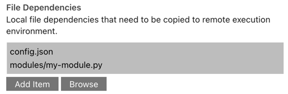
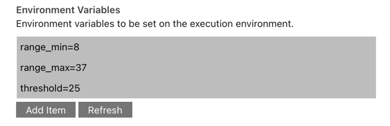

<!--

Copyright 2018-2021 Elyra Authors

Licensed under the Apache License, Version 2.0 (the "License");
you may not use this file except in compliance with the License.
You may obtain a copy of the License at

http://www.apache.org/licenses/LICENSE-2.0

Unless required by applicable law or agreed to in writing, software
distributed under the License is distributed on an "AS IS" BASIS,
WITHOUT WARRANTIES OR CONDITIONS OF ANY KIND, either express or implied.
See the License for the specific language governing permissions and
limitations under the License.

-->
## Best practices for file-based pipeline nodes

### File I/O 

In runtime environments (like Kubeflow Pipelines and Apache Airflow) where containers are used to run notebooks/scripts special consideration must be given to file input and output operations. 

#### File input

If a notebook/script requires access to files that are stored on you local system, those files must be declared as input dependencies. Elyra collects declared files and uploads them to cloud storage and makes them available to the notebook/script at runtime.

#### File output

All changes to the file system (e.g. new files or modified files) are discarded after processing of the notebook/script has completed. To retain these files you must store those files on cloud storage, or declare those files as output files in the notebook/script node properties. 

### Environment variables

You can customize notebooks/scripts by setting environment variables in the pipeline node. Environment variable values are not shared across nodes belonging to the same pipeline.

The Visual Pipeline Editor can detect which environment variables notebooks/scripts are accessing and automatically adds those variables to the runtime properties if the following approaches are used to read variable values:

- Python
  - `os.getenv(key[,...])`
  - `os.environ[key]`
  - `os.environ.get(key[,...])`

- R script
  - `Sys.getenv(...)`

Refer to the next section for a list of proprietary environment variables that cannot be modified using the node properties settings.

### Proprietary environment variables

Elyra makes a set of proprietary environment variables available to notebooks and scripts during execution. Unless indicated otherwise, these variables are defined in all runtime environments.
#### ELYRA_RUNTIME_ENV

`ELYRA_RUNTIME_ENV` identifies the runtime environment that the 
notebook or script is executed in:
- `local` - JupyterLab
- `kfp` - Kubeflow Pipelines
- `airflow` - Apache Airflow

#### ELYRA_RUN_NAME

`ELYRA_RUN_NAME` is an identifier that is unique for each pipeline run. You can use this identifier to generate predictable file names.

Example value: `unicorn-0617153527`