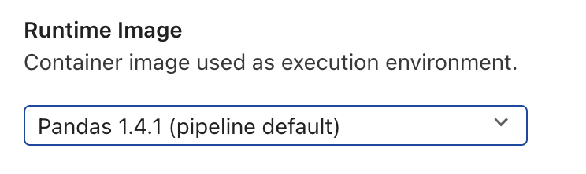

<!--

Copyright 2018-2022 Elyra Authors

Licensed under the Apache License, Version 2.0 (the "License");
you may not use this file except in compliance with the License.
You may obtain a copy of the License at

http://www.apache.org/licenses/LICENSE-2.0

Unless required by applicable law or agreed to in writing, software
distributed under the License is distributed on an "AS IS" BASIS,
WITHOUT WARRANTIES OR CONDITIONS OF ANY KIND, either express or implied.
See the License for the specific language governing permissions and
limitations under the License.

-->
## Best practices for file-based pipeline nodes

[Generic pipelines and typed pipelines](pipelines.md) support natively file-based nodes for  Jupyter notebooks, Python scripts, and R scripts. In order to support heterogeneous execution - that is making them runnable in any runtime environment (JupyterLab, Kubeflow Pipelines, and Apache Airflow) - follow the guidelines listed below.

### Runtime image

On Kubeflow Pipelines and Apache Airflow, notebooks and scripts are executed in containers. Elyra provides [example runtime images](runtime-image-conf.md) to get you started, but you should consider utilizing [purpose-built images](../recipes/creating-a-custom-runtime-image.md) instead. If possible, pre-install all software prerequisites in the runtime image you are using instead of installing them on the fly (e.g. by running `pip install my-package==1.2.3` in a notebook cell).

If desired, a default runtime image can be set in the pipeline properties tab. If a default is set, this runtime image will apply to all nodes in the pipeline unless explicitly overridden from its own node properties tab.



### File I/O 

In runtime environments (like Kubeflow Pipelines and Apache Airflow) where containers are used to run notebooks/scripts special consideration must be given to file input and output operations.

#### File input

If a notebook/script requires access to files that are stored on you local system, those files must be declared as _File dependencies_. Elyra collects declared files and uploads them to cloud storage and makes them available to the notebook/script at runtime.


File dependencies must be located in the notebook/script file directory or a subdirectory of that location. Symlinks can be used to avoid the need to maintain multiple copies if files are shared among pipelines.

Valid directory layout examples:

```
./my-pipeline.pipeline
./my-notebook.ipynb
./a-notebook-symlink.ipynb      # can reference a notebook in any local directory
./a-dependency-file               
./a-symlink                     # can reference any file or directory
./a-subdir/a-dependency-file
./a-subdir/a-symlink            # can reference any file or directory
./a-subdir/a-script-symlink.py  # can reference a script in any local directory
```

Invalid directory layout examples:
```
./my-pipeline.pipeline
./my-script.py
../my-other-notebook.ipynb     # must be symlinked
../a-dependency-in-parent-dir  # must be symlinked 
/some/dir/some-dependency      # must be symlinked
```

#### File output

All changes to the file system (e.g. new files or modified files) are discarded after processing of the notebook/script has completed. To retain these files you must store those files on cloud storage, or declare those files as output files in the notebook/script node properties.  
NOTE: If you need to output a large number of files, instead of using a wildcard expression e.g. `directory/*`, compress them into an archive (e.g. tar, zip) as a step in your notebook/workflow and then add the archive here.


### Environment variables

You can customize notebooks/scripts by setting environment variables in the pipeline node. Environment variable values can be set on an individual node and/or defined as pipeline default values and shared across nodes belonging to the same pipeline. The example below shows the environment variables for a particular pipeline node as shown in that node's properties tab. The first three entries are environment variable/value pairs that only apply to this node. The fourth and fifth entries are pipeline default environment variable/value pairs and cannot be edited from the node properties tab. A default value can be overridden for a particular node by redefining its variable/value pair in the node properties, as shown here with the `threshold` variable.


The Visual Pipeline Editor can detect which environment variables notebooks/scripts are accessing and automatically adds those variables to the runtime properties if the following approaches are used to read variable values:

- Python
  - `os.getenv(key[,...])`
  - `os.environ[key]`
  - `os.environ.get(key[,...])`

- R script
  - `Sys.getenv(...)`

Refer to the next section for a list of proprietary environment variables that cannot be modified using the node properties settings.

If using environment variables containing sensitive information, refer to the [Handling sensitive information topic](#handling-sensitive-information) for details.

### Proprietary environment variables

Elyra makes a set of proprietary environment variables available to notebooks and scripts during execution. Unless indicated otherwise, these variables are defined in all runtime environments.


#### ELYRA_RUN_NAME

`ELYRA_RUN_NAME` is an identifier that is unique for each pipeline run but the same for all nodes in the pipeline. You can use this identifier to generate predictable file names.

Example value: `unicorn-0617153527`

#### ELYRA_RUNTIME_ENV

`ELYRA_RUNTIME_ENV` identifies the runtime environment that the 
notebook or script is executed in:
- `local` - JupyterLab
- `kfp` - Kubeflow Pipelines
- `airflow` - Apache Airflow

### Handling sensitive information
The Kubernetes Secrets property can be used to associate environment variable names with secrets, preventing sensitive information from being exposed in the pipeline file, the pipeline editor, and the runtime environment. As with static environment variables, secret-based environment variable values can be set on an individual node and/or defined as pipeline default values and shared across nodes belonging to the same pipeline. A default value can also be overridden for a particular node by redefining the secret for a given variable name in the node properties.

Secrets are ignored when the pipeline is executed locally. For remote execution, if an environment variable was assigned both a static value (via the 'Environment Variables' property) and a Kubernetes secret value, the secret's value is used.
