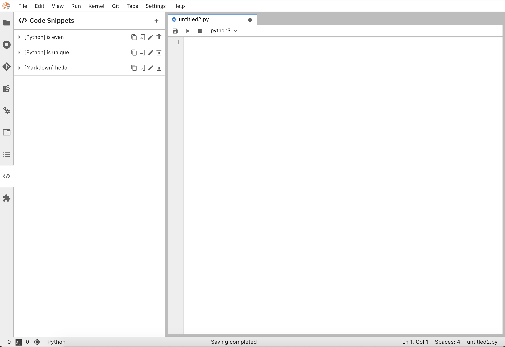
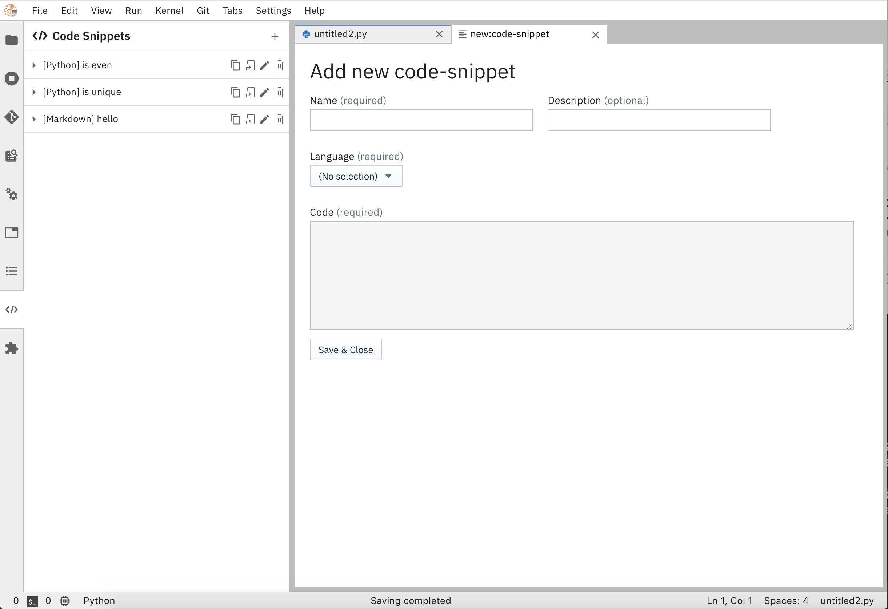
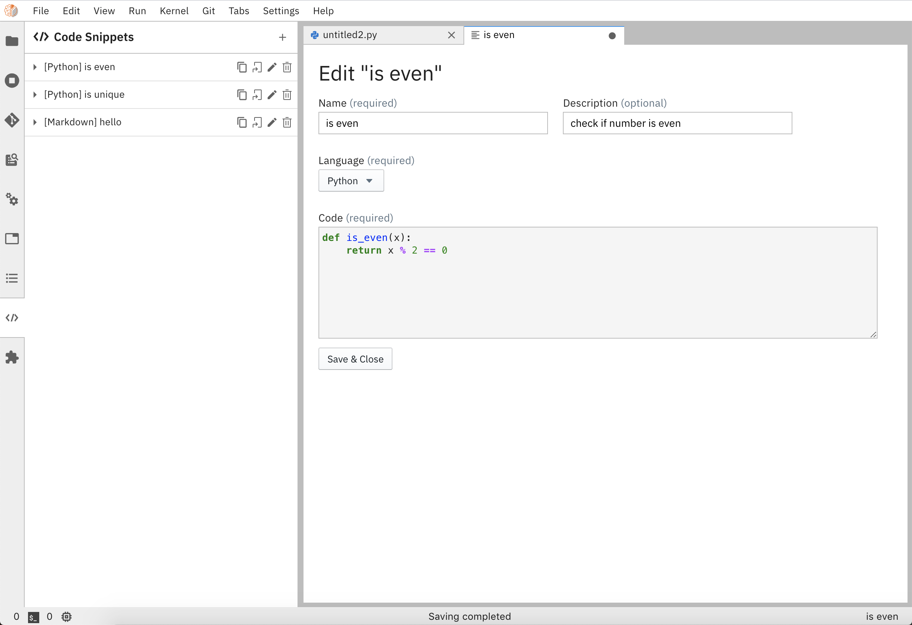
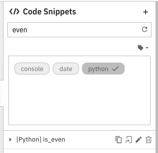

<!--

Copyright 2018-2020 Elyra Authors

Licensed under the Apache License, Version 2.0 (the "License");
you may not use this file except in compliance with the License.
You may obtain a copy of the License at

http://www.apache.org/licenses/LICENSE-2.0

Unless required by applicable law or agreed to in writing, software
distributed under the License is distributed on an "AS IS" BASIS,
WITHOUT WARRANTIES OR CONDITIONS OF ANY KIND, either express or implied.
See the License for the specific language governing permissions and
limitations under the License.

-->
## Code Snippets

The ability to reuse pieces of code allows users to avoid doing repetitive work,
making the programming workflow much more simple and productive.
Elyra supports custom code snippets that can be added to the file editor.



### Adding and Editing Code Snippets

To add a code snippet, simply click the `+` button in the top right corner of the code snippets side pane, and an editor will appear in the main area of JupyterLab.



To edit a code snippet, click the edit button to open an editor in the main area of JupyterLab.



Click "Save and Close" to see your edits in the code snippets side pane.

### Finding Code Snippets

To search for a code snippet, type a keyword in the search bar. Code snippets can also be filtered by selecting tags when clicking on the tag icon.



#### Code Snippet data
This extension uses [Elyra Metadata Service](../developer_guide/metadata) and in addition to the frontend editor detailed above, this can also be configured on the backend.
To configure metadata for code snippets through the backend, locate `[JUPYTER DATA DIR]/metadata/` folder and create the subdirectory `code-snippets/`.
This is where code snippet json files are stored, following a schema defined in
[code snippets metadata](https://github.com/elyra-ai/elyra/blob/master/elyra/metadata/schemas/code-snippet.json)

This is a sample json file:
```json
{
	"schema_name": "code-snippet",
	"display_name": "is_even",
	"metadata": {
		"description": "Check if number is even",
		"language": "python",
		"code": [
			"def is_even(num):",
			"   return num % 2 == 0"
		],
        "tags": [
		  "python"
        ]
	}
}
```
NOTE: `code` field content must be a string array split by line.

Once code snippet extension is in use, the application component retrieves the metadata from the server
through a REST API, and displays each snippet by `display_name` in the extension UI.
Each snippet item can then be expanded on click, also displaying the `code` content.


By clicking on the **copy** button, the content of the code snippet is copied into the system clipboard.

The **insert** button inserts the code snippet content into the editor tab in focus. If the widget in focus is not an editor, an error is displayed.
Code snippets are automatically added as code blocks in markdown files and notebook markdown cells.
When inserting snippets into executable editors (ie. a notebook code cell or a python file editor), the extension will verify kernel language compatibility, warning the user when a mismatch is detected.

Code Snippets can also be dragged and dropped from the display list into notebooks and file editors.
