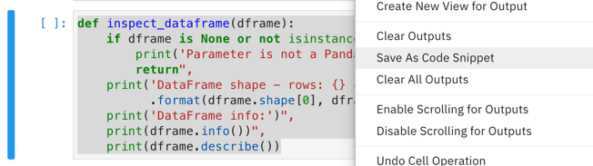
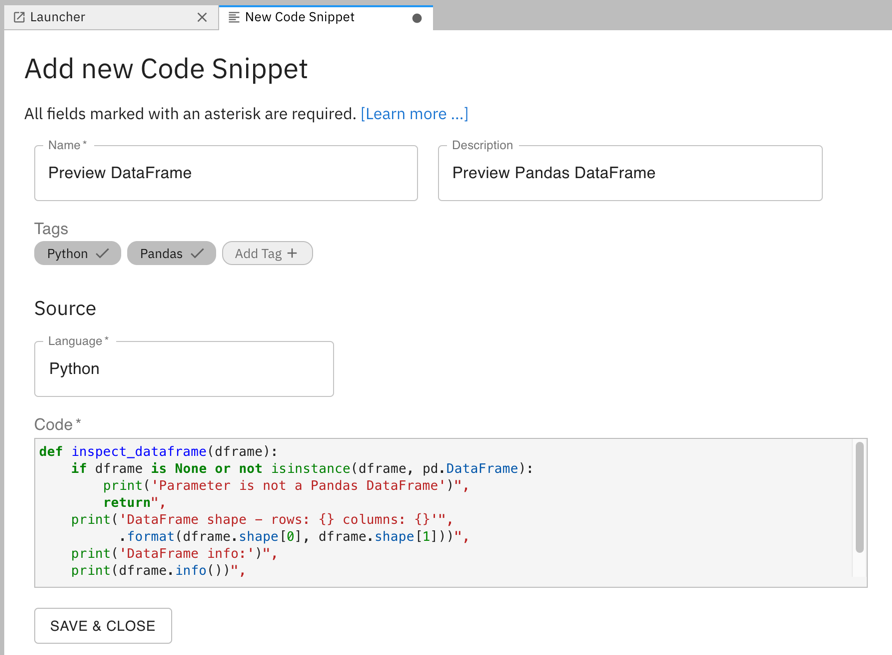

<!--

Copyright 2018-2021 Elyra Authors

Licensed under the Apache License, Version 2.0 (the "License");
you may not use this file except in compliance with the License.
You may obtain a copy of the License at

http://www.apache.org/licenses/LICENSE-2.0

Unless required by applicable law or agreed to in writing, software
distributed under the License is distributed on an "AS IS" BASIS,
WITHOUT WARRANTIES OR CONDITIONS OF ANY KIND, either express or implied.
See the License for the specific language governing permissions and
limitations under the License.

-->
## Code Snippets

The ability to reuse pieces of code allows users to avoid doing repetitive work,
making the programming workflow more simple and productive.
Elyra supports custom code snippets that can be added to the file editor.

You can manage code snippets using the [JupyterLab UI](#managing-code-snippets-using-the-jupyterlab-ui) or the [Elyra CLI](#managing-code-snippets-using-the-elyra-cli).

### Managing code snippets using the JupyterLab UI

To list, create, edit, delete, or insert code snippets using the UI select the `Code Snippets` tab from the JupyterLab sidebar.


#### Creating a code snippet

To create a code snippet:
1. Select the `Code Snippets` tab from the JupyterLab sidebar and click `+`. You can also highlight the desired text in the editor, right click, and choose `Save As Code Snippet` from the context menu.
   

1. Enter a code snippet display name, an optional description, and tag the code snippet to make it more easily discoverable.
1. Define the code snippet. Refer to the [Code snippet properties](#code-snippet-properties) for details.
   
1. Save the code snippet. The new code snippet entry is displayed in the list. 
1. Expand the entry to preview the snippet content

#### Modifying a code snippet

To edit a code snippet:
1. Select the `Code Snippets` tab from the JupyterLab sidebar.
1. Click the pencil next to the code snippet entry.

#### Deleting a code snippet

To delete a code snippet:
1. Select the `Code Snippets` tab from the JupyterLab sidebar.
1. Click the trash can next to the code snippet entry.

#### Using code snippets

To search for a code snippet, type a keyword in the search bar or select one or more tags.

  

To insert the code snippet content into an open editor, click the insert button or use drag and drop. 

  

Code snippets are automatically added as code blocks in markdown files and notebook markdown cells.
When inserting snippets into executable editors (e.g. a notebook code cell or a Python/R file editor), the extension will verify kernel language compatibility, warning the user when a mismatch is detected.

### Managing code snippets using the Elyra CLI

You can list, create, edit, or delete code snippets using the `elyra-metadata` CLI.

#### Listing code snippets

To list code snippets run

```
elyra-metadata list code-snippets
```

The output lists for each code snippet the name and the name of the associated JSON formatted metadata file, which is stored in the JupyterLab data directory in the `metadata/code-snippets` subdirectory.

```
Available metadata instances for code-snippets (includes invalid):

Schema   	Instance		Resource  
---------   	--------		--------
code-snippet   	preview_dataframe	/.../metadata/code-snippets/preview_dataframe.json 
```

To format the output as JSON run `elyra-metadata list code-snippets --json`. Note that the JSON export includes the content of the metadata files, not just their names.

#### Creating a code snippet

To create a code snippet:

```bash
elyra-metadata install code-snippets \
	--display_name="Preview DataFrame" \
	--description="Preview Pandas DataFrame" \
	--tags="['Python', 'Pandas']" \
	--language="Python" \
	--code="['df.head(5)']"
```

Refer to the [Code snippet properties](#code-snippet-properties) section for an explanation of the parameters.

#### Modifying a code snippet

To modify a code snippet:

```bash
elyra-metadata install code-snippets \
	--replace \
	--name="preview_dataframe" \
	--display_name="Preview DataFrame" \
	--description="Preview Pandas DataFrame" \
	--tags="['Python', 'Pandas']" \
	--language="Python" \
	--code="['# Display first 5 rows', 'df.head(5)']"
```

Refer to the [Code snippet properties](#code-snippet-properties) section for an explanation of the parameters. Note that you must specify the `--name` parameter and the `--replace` parameter. 

#### Deleting a code snippet

To delete a code snippet run the following command, replacing the code snippet name as appropriate.

```bash
elyra-metadata remove code-snippets --name="preview_dataframe"
```

### Code snippet properties

The string in the headings below, which is enclosed in parentheses, denotes the CLI option name.

##### Name (display_name)

A user-friendly name for the code snippet. This property is required.

Example: `Preview DataFrame`

##### N/A (name)

A unique identifier for this code snippet. If not specified when the code snippet is created, a value is automatically generated from `display_name`.

Example: `preview_dataframe`

##### Description (description)

Description for this code snippet. This property is optional.

Example: `Preview Pandas DataFrame`

##### Tags (tags)

Zero or more tags for this code snippet. This property is optional.

Example: `['Python', 'Pandas']`

##### Language (language)

Code snippet language name. Use one of the pre-defined values  (`Python`, `Java`, `R`, `Scala`, and `Markdown`) or provide a custom string. This property is required.

Example: `Python`

##### Code (code)

The code snippet, formatted as an array of strings. Each item in the array represents a line in the code. This property is required.

Example: `['# A Python comment', 'print(variable)']`
