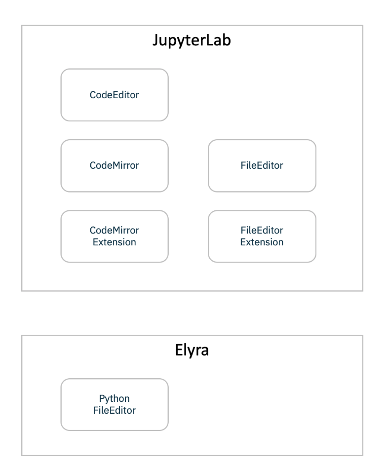

<!--

Copyright 2018-2020 IBM Corporation

Licensed under the Apache License, Version 2.0 (the "License");
you may not use this file except in compliance with the License.
You may obtain a copy of the License at

http://www.apache.org/licenses/LICENSE-2.0

Unless required by applicable law or agreed to in writing, software
distributed under the License is distributed on an "AS IS" BASIS,
WITHOUT WARRANTIES OR CONDITIONS OF ANY KIND, either express or implied.
See the License for the specific language governing permissions and
limitations under the License.

-->
# Enhanced Python Support

Elyra provides **Enhanced Python Support** where Python scripts can be developed and
executed. It also leverages the **Hybrid Runtime Support** to enable running
these scripts in remote environments.

The execution of the python script leverages the available `Python based Kernels`. This enables
users to run their scripts in different configurations and environments.

## Python script execution support

* In the Jupyter Lab Launcher, click the `Python File` icon to create a new Python Script.
* When used in conjunction with `Jupyter Enterprise Gateway`, the dropdown will be populated with more kernel options,
allowing users to run their scripts with remote kernels with more specialized resources.
* To run your script locally, select the `python3` option in the dropdown menu, and click the `Run` icon.

## Python Editor related components

The Elyra python editor is based on the JupyterLab editor which is currently based on CodeMirror.

