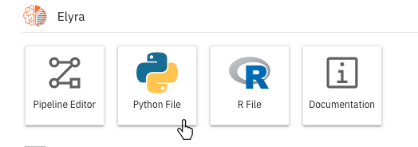
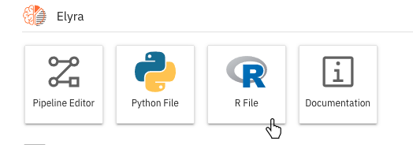

<!--

Copyright 2018-2021 Elyra Authors

Licensed under the Apache License, Version 2.0 (the "License");
you may not use this file except in compliance with the License.
You may obtain a copy of the License at

http://www.apache.org/licenses/LICENSE-2.0

Unless required by applicable law or agreed to in writing, software
distributed under the License is distributed on an "AS IS" BASIS,
WITHOUT WARRANTIES OR CONDITIONS OF ANY KIND, either express or implied.
See the License for the specific language governing permissions and
limitations under the License.

-->
# Enhanced Script Support

Elyra provides **Enhanced Script Support** where Python and R scripts can be developed and
executed. It also leverages the **Hybrid Runtime Support** to enable running
these scripts in remote environments.


The execution of these scripts leverages the available Python and R based Kernels. This enables users to run their scripts in different configurations and environments.

Elyra also allows submitting a Python and R scripts as a single node pipeline for execution in a Kubeflow Pipelines or Apache Airflow environment in the cloud. This feature is accessible when the Elyra [AI Pipelines](../user_guide/pipelines.md) extension is also enabled.

## Python script execution support

In the Jupyter Lab Launcher, click the `Python File` icon to create a new Python Script.



When used in conjunction with `Jupyter Enterprise Gateway`, the dropdown will be populated with more kernel options,
allowing users to run their scripts with remote kernels with more specialized resources.

To run your script locally, select the `Python 3` option in the dropdown menu, and click the `Run` icon.

## R script execution support

In the Jupyter Lab Launcher, click the `R File` icon to create a new R Script.



To run your R script locally you will need to install an R kernel.
1. If you are using a [conda](https://docs.conda.io/en/latest/miniconda.html) environment:
```
conda install -y r-irkernel
```

2. Alternatively, you can install it via [CRAN](https://cran.r-project.org/) on an R console:
```
install.packages('IRkernel')
```
then enable it on Jupyter:
```
IRkernel::installspec()
```

To run the script, from the Script editor toolbar, select the `R` option in the dropdown menu, and click the `Run` icon.

Similar to the extended support for Python kernels when using the `Jupyter Enterprise Gateway`, the Script editor dropdown in the toolbar will display all available remote kernel options for R scripts.

## Ability to run a Python and R scripts as a batch job

Elyra allows the execution of a Python and R scripts as a batch job in remote cloud environments. This feature leverages the AI pipelines feature and requires access to either a Kubeflow Pipelines or Apache Airflow deployment via a [runtime configuration](../user_guide/runtime-conf).

To submit a Python or R script as a batch job, open the script file and select `Submit Script...` button from the editor toolbar.


To learn more about [runtime configurations](../user_guide/runtime-conf) and [runtime images](../user_guide/runtime-image-conf), follow those sections provided in the Elyra user guide documentation.

## Script Editor related components

The Elyra Script editor is based on the JupyterLab editor which is currently based on CodeMirror.

