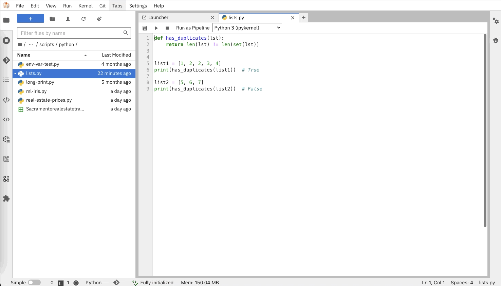

<!--

Copyright 2018-2022 Elyra Authors

Licensed under the Apache License, Version 2.0 (the "License");
you may not use this file except in compliance with the License.
You may obtain a copy of the License at

http://www.apache.org/licenses/LICENSE-2.0

Unless required by applicable law or agreed to in writing, software
distributed under the License is distributed on an "AS IS" BASIS,
WITHOUT WARRANTIES OR CONDITIONS OF ANY KIND, either express or implied.
See the License for the specific language governing permissions and
limitations under the License.

-->
# Enhanced Script Support

Elyra provides **Enhanced Script Support** where Python, R and Scala scripts can be edited and executed. It also leverages the **Hybrid Runtime Support** to enable running
these scripts in remote environments.


The execution of these scripts leverages the available Python, R and Scala based kernels. This enables users to run their scripts in different configurations and environments.

The python script debugger now available as an experimental feature. Users no longer need to go through the extra steps of enabling one by opening a console for the editor, or switching to a general-purpose IDE.

Elyra also allows submitting a Python and R scripts as a single node pipeline for execution in a Kubeflow Pipelines or Apache Airflow environment in the cloud. This feature is accessible when the Elyra [AI Pipelines](../user_guide/pipelines.md) extension is also enabled.

## Python script execution support

In the JupyterLab Launcher, click the `Python Editor` icon to create a new Python script and open the Python Editor.


When used in conjunction with `Jupyter Enterprise Gateway`, the dropdown in the editor's toolbar will be populated with more kernel options,
allowing users to run their scripts with remote kernels with more specialized resources.

To run your script locally, select the `Python 3` option in the dropdown menu, and click the `Run` icon.

## Python script debugging support (experimental)

Elyra users can now enhance their development experience by debugging scripts directly within the Python Editor.
In this experimental stage, we provide an integration between [Elyra's Script Editor](https://github.com/elyra-ai/elyra/tree/main/packages/script-editor) and the existing [JupyterLab debugger](https://jupyterlab.readthedocs.io/en/stable/user/debugger.html). This facilitates basic debugging tasks such as setting breakpoints, inspecting variables and navigating the call stack.

Elyra extends JupyterLab's visual debugger which will be visible and enabled in the editor's toolbar **if** a kernel with debugger support is installed and selected.

Currently the Jupyter kernels below are known to support the Jupyter Debug Protocol:
- [ipykernel](https://github.com/ipython/ipykernel) (6.0+)
- [xeus-python](https://github.com/jupyter-xeus/xeus-python)

To list installed kernels run the command below in a terminal window:
```bash
jupyter kernelspec list
```

Once a kernel with supporting debugger is selected, the debugger can be enabled by clicking the bug button in the editor's toolbar. A sidebar will display a variable explorer, the list of breakpoints, a source preview and buttons to navigate the call stack.

The user can set breakpoints from the editor's UI, and then click the `Run` button to execute the script. Visual markers will indicate where the current execution has hit a breakpoint.



Since Elyra's Python debugging support is experimental, [here](https://github.com/elyra-ai/elyra/pull/2087) you can find a list of known issues.
Before opening a bug report or enhancement suggestion for this feature in Elyra's repository, please also check [existing debugger issues open in JupyterLab](https://github.com/jupyterlab/jupyterlab/issues?q=is%3Aopen+is%3Aissue+label%3Apkg%3Adebugger).

### Troubleshooting
- Interrupting the kernel while the debugger is running does not trigger breakpoints on subsequent debug runs (same behavior in notebooks).
Solution:
Open the `Running terminal and kernels` tab on the left side, find and select the relevant file path under `Kernels`, click the `x` button to shut down the kernel, then reload the page.


## R script execution support

In the JupyterLab Launcher, click the `R Editor` icon to create a new R script and open the R Editor.


To run your R script locally you will need to install an R kernel.

If you are using a [conda](https://docs.conda.io/en/latest/miniconda.html) environment:
```bash
$ conda install -y r-irkernel
```

Alternatively, you can install it via [CRAN](https://cran.r-project.org/) on an R console:  
NOTE: You will need to have R installed and available prior to using this method of installing the R kernel.

In an R interactive console,
```bash
> install.packages('IRkernel')
```
then enable it on Jupyter:
```bash
> IRkernel::installspec()
```

You can check that the R kernel was successfully installed with:
```bash
jupyter kernelspec list
```

To run the script, from the Script editor toolbar, select the `R` option in the kernel selection drop-down, and click the `Run` icon.

Similar to the extended support for Python kernels when using the `Jupyter Enterprise Gateway`, the Script editor dropdown in the toolbar will display all available remote kernel options for R scripts.

### R-Editor Language Server Protocol
You can enable R language server features for the R Editor in a conda environment with the following command:
```bash
$ conda install -c conda-forge r-languageserver
```

You can find more documentation about conda-forge [here](https://github.com/conda-forge/r-languageserver-feedstock).

Another option is to install the R language server through the [CRAN](https://cran.r-project.org/). Once R is installed, use the following [command](https://github.com/REditorSupport/languageserver):
```bash
$ R -e install.packages("languageserver")
```

## Scala script execution support (experimental)

In the JupyterLab Launcher, click the `Scala Editor` icon to create a new Scala script and open the Scala Editor.


When used in conjunction with `Jupyter Enterprise Gateway`, the dropdown in the editor's toolbar will be populated with more kernel options,
allowing users to run their scripts with remote kernels with more specialized resources.

To run your script locally, select the `Spark/Scala Toree Kernel` option in the dropdown menu, and click the `Run` icon.

## Ability to execute a Python and R script as a pipeline

Elyra allows the execution of Python and R script as a pipeline or batch job in remote cloud environments. This feature leverages the AI pipelines feature and requires access to either a Kubeflow Pipelines or Apache Airflow deployment via a [runtime configuration](../user_guide/runtime-conf).

To run a Python or R script as a pipeline, open the script file and select `Run as Pipeline` button from the editor toolbar.


To learn more about [runtime configurations](../user_guide/runtime-conf) and [runtime images](../user_guide/runtime-image-conf), follow those sections provided in the Elyra user guide documentation.

## Script Editors components

The Elyra Python Editor, R Editor and Scala Editor are based on the JupyterLab editor which is currently based on CodeMirror.


