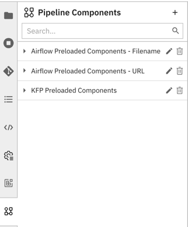

<!--

Copyright 2018-2021 Elyra Authors

Licensed under the Apache License, Version 2.0 (the "License");
you may not use this file except in compliance with the License.
You may obtain a copy of the License at

http://www.apache.org/licenses/LICENSE-2.0

Unless required by applicable law or agreed to in writing, software
distributed under the License is distributed on an "AS IS" BASIS,
WITHOUT WARRANTIES OR CONDITIONS OF ANY KIND, either express or implied.
See the License for the specific language governing permissions and
limitations under the License.

-->

## Pipeline components

### Overview

[Pipelines](pipelines.md) comprise of nodes that are implemented using components. A component typically only implements one unit-of-work, such as loading data, transforming data, training a model, or deploying a model to serve. The following depicts a basic pipeline in the Visual Pipeline Editor, which utilizes components to load a data file, split the file, truncates the resulting files, and counts the number of records in each file.


The same pipeline could be implemented using a single component that performs all these tasks, but that component might not be as universally re-usable. Consider, for example, that for another project the data resides in a different kind of storage. With fine-granular components you'd only have to replace the load data component with one that supports the other storage type and could retain everything else. 

Elyra includes three _generic components_ that allow for the processing of: Jupyter notebooks, Python scripts, and R scripts. These components are called generic because they can be used in all runtime environments that Elyra pipelines currently support: local/JupyterLab, Kubeflow Pipelines, and Apache Airflow.


Note: Refer to the [_Best practices_ topic in the _User Guide_](best-practices-file-based-nodes.md) to learn more about special considerations for generic components.

_Custom components_ are commonly only implemented for Kubeflow Pipelines or Apache Airflow, but not both.


There are many example custom components available that you can utilize in pipelines, but you can also create your own. Details on how to create a component can be found in the [Kubeflow Pipelines documentation](https://www.kubeflow.org/docs/components/pipelines/sdk/component-development/) and the [Apache Airflow documentation](https://airflow.apache.org/docs/apache-airflow/stable/concepts/operators.html). Do note that in Apache Airflow components are called operators, but for the sake of consistency the Elyra documentation refers to them as components.

Note: Refer to the [_Requirements and best practices for custom pipeline components_ topic in the _User Guide_](best-practices-custom-pipeline-components.md) to learn more about special considerations for custom components.

#### Component catalogs

Elyra does not include its own component repository. Instead you can configure it to pull components from local or remote catalogs, such as file systems, web resources, or source control systems. Elyra defines a connector API, which provides access to the catalogs resources.


Elyra includes connectors for the following component catalog types:
 - _Filesystem component catalogs_ provide access to components that are stored in a file system that is readable by JupyterLab/Elyra.

   Example: A filesystem component catalog that is configured using the `/users/jdoe/kubeflow_components/dev/my_component.yaml` path makes `my_component.yaml` available to Elyra.

 - _Directory component catalogs_ provide access to components that are stored in a directory.

   Example: A directory component catalog that is configured using the `/users/jdoe/kubeflow_components/test` path makes all component files in that directory available to Elyra.

 - _URL component catalogs_ provide access to components that are stored on the web and can be retrieved using anonymous HTTP `GET` requests.

    Example: A URL component catalog that is configured using the `http://myserver:myport/mypath/my_component.yaml` URL makes the `my_component.yaml` component file available to Elyra.

Refer to section [Built-in catalog connector reference](#built-in-catalog-connector-reference) for details about these connectors. 

You can add support for other component catalogs by installing a connector from the [catalog connector marketplace](https://github.com/elyra-ai/examples/tree/master/component-catalog-connectors/connector-directory.md) or by [implementing your own catalog connector](https://github.com/elyra-ai/examples/tree/master/component-catalog-connectors/build-a-custom-connector.md).

#### Example custom components

For illustrative purposes the Elyra includes a few custom components that you can use to get started. These example components and the generic components are pre-loaded into the pipeline editor palette by default.


Component details and demo pipelines can be found in the `https://github.com/elyra-ai/examples` repository:
- [Kubeflow Pipeline components](https://github.com/elyra-ai/examples/tree/master/pipelines/kubeflow_pipelines_component_examples)
- [Apache Airflow components](https://github.com/elyra-ai/examples/tree/master/pipelines/airflow_component_examples)

Note that example components are provided as is. Unless indicated otherwise they are not maintained by the Elyra community.

### Managing pipeline components

Components are managed in Elyra using the [JupyterLab UI](#managing-custom-components-using-the-jupyterlab-ui) or the [Elyra command line interface](#managing-custom-components-using-the-elyra-cli).

### Managing custom components using the JupyterLab UI

Custom components can be added, modified, and removed in the _Pipeline Components_ panel.



To access the panel in JupyterLab:

- Click the `Open Pipeline Components` button in the pipeline editor toolbar.

       

  OR     

- Select the `Pipeline Components` tab from the JupyterLab sidebar.

       

  OR

- Open the JupyterLab command palette (`Cmd/Ctrl + Shift + C`) and search for `Manage Pipeline Components`.

  

#### Adding a component catalog

To add components from a catalog:

1. Click `+` in the _Pipeline Components_ panel.
1. Select a component catalog type from the list of available options.
1. Define the registry entry. Refer to section [Configuration properties](#configuration-properties) for a description of each property.

If the registry entry validates correctly, the associated pipeline components are added  to the pipeline editor's palette. 

#### Modifying a component catalog entry

1. Click the `edit` (pencil) icon next to the entry name.
1. Modify the registry entry as desired.

#### Deleting a component catalog from the registry

To delete a component catalog entry and its referenced component(s) from the Visual Pipeline Editor palette:

1. Click the `delete` (trash) icon next to the entry name.
1. Confirm deletion.

Caution: Pipelines that utilize the referenced components are no longer valid after the component registry entry was deleted.

### Managing custom components using the Elyra CLI

Custom components can be added, modified, and removed using the [`elyra-metadata` command line interface](/user_guide/command-line-interface.md).

To list component registry entries:

```bash
$ elyra-metadata list component-registries

Available metadata instances for component-registries (includes invalid):

Schema               Instance                          Resource                                                                                                        
------               --------                          --------                                                                                                        
component-registry   elyra-airflow-filename-preconfig  .../jupyter/metadata/component-registries/elyra-airflow-filename-preconfig.json   
```

#### Adding components to the registry

To add a component registry entry run `elyra-metadata install component-registries`.

```bash
$ elyra-metadata install component-registries \
       --display_name="filter components" \
       --description="filter text in files" \
       --runtime=kfp \
       --location_type=URL \
       --paths="['https://raw.githubusercontent.com/elyra-ai/elyra/master/etc/config/components/kfp/filter_text_using_shell_and_grep.yaml']" \
       --categories='["filter content"]'
```

Refer to section [Configuration properties](#configuration-properties) for parameter descriptions.

#### Modifying a component registry entry

To replace a component registry entry run `elyra-metadata install component-registries` and specify the `--replace` option:

```bash
$ elyra-metadata install component-registries \
       --name="filter_components" \
       --display_name="filter components" \
       --description="filter text in files" \
       --runtime=kfp \
       --location_type=URL \
       --paths="['https://raw.githubusercontent.com/elyra-ai/elyra/master/etc/config/components/kfp/filter_text_using_shell_and_grep.yaml']" \
       --categories='["file operations"]' \
       --replace
```

Note: You must specify all property values, not only the ones that you want to modify.

Refer to section [Configuration properties](#configuration-properties) for parameter descriptions.

#### Deleting components from the registry

To delete a component registry entry and its component definitions:

```bash
$ elyra-metadata remove component-registries \
       --name="filter_components"
```

Refer to section [Configuration properties](#configuration-properties) for parameter descriptions.

### Configuration properties

The component registry entry properties are defined as follows. The string in the headings below, which is enclosed in parentheses, denotes the CLI option name.

##### Name (display_name)

A user-friendly name for the registry entry. Note that the registry entry name is not displayed in the palette. This property is required.

Example: `data load components`

##### N/A (name)

The canonical name for this registry entry. A value is generated from `Name` if no value is provided.

Example: `data_load_components`

##### Description (description)

A description for the registry entry.

Example: `Load data from external data sources`

##### Category (categories)

In the pipeline editor palette components are grouped into categories to make them more easily accessible. If no category is provided, the components defined by this registry entry are added to the palette under `no category`. A limit of 18 characters or fewer is enforced for each category.

Examples (CLI):

- `['load data from db']`
- `['train model','pytorch']`


##### Runtime (runtime)

The runtime environment that supports the component(s). Valid values are the set of configured runtimes that appear in the dropdown (UI) or help-text (CLI). This property is required.

Example:

- `airflow`

### Built-in catalog connector reference

Elyra supports fetching components from the file system and the web using its built-in connectors. 

#### Filesystem component catalog

The filesystem component catalog connector provides access to components that are stored in the file system where Elyra is running:
 - `~` may be used to denote the user's home directory.
 - Wildcards (e.g. `*` or `?`) are not supported.
 - You can specify one or more file names.
 - Best practice: Pipeline files include references to the location from where components were loaded. When adding files to the catalog, specify a `base directory` and a relative file path to make pipelines portable across environments.

Examples (GUI):
 - `/Users/patti/specs/load_data_from_public_source/http_operator.py`
 - `~patti/specs/filter_files/row_filter.yaml`

Examples (CLI):
 - `['/Users/patti/specs/load_data_from_public_source/http_operator.py']`
 - `['~patti/specs/filter_files/row_filter.yaml']`
 - `['/Users/patti/specs/comp1.yaml','/Users/patti/specs/comp2.yaml']`

#### Directory component catalog

The directory component catalog connector provides access to components that are stored in a file system directory: 
 - If `Path` is set to `/Users/patti/specs/load_from_database`, the connector searches  the specified directory for components for the selected runtime type.
 - The search is performed recursively if the subdirectory option is enabled.
 - `~` may be used to denote the user's home directory.
 - You can specify one or more directories.

Examples (GUI):
 - `/Users/patti/specs/load_from_database`
 - `~patti/specs/load_from_cloud_storage`

Examples (CLI):
 - `['/Users/patti/specs/load_from_database']`
 - `['~patti/specs/load_from_cloud_storage']`
 - `['/Users/patti/load_specs/','/Users/patti/cleanse_specs/']` 

#### URL component catalog

The URL component catalog connector provides access to components that are stored on the web:
- The specified URL must be retrievable using an anonymous HTTP `GET` request.
- You can specify one or more URLs.

Examples (GUI):
 - `https://raw.githubusercontent.com/elyra-ai/elyra/master/etc/config/components/kfp/run_notebook_using_papermill.yaml`

Examples (CLI):
 - `['https://raw.githubusercontent.com/elyra-ai/elyra/master/etc/config/components/kfp/run_notebook_using_papermill.yaml']`
 - `['<URL_1>','<URL_2>']` 
