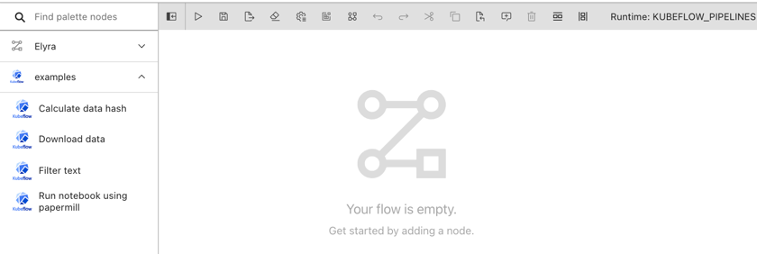

<!--

Copyright 2018-2021 Elyra Authors

Licensed under the Apache License, Version 2.0 (the "License");
you may not use this file except in compliance with the License.
You may obtain a copy of the License at

http://www.apache.org/licenses/LICENSE-2.0

Unless required by applicable law or agreed to in writing, software
distributed under the License is distributed on an "AS IS" BASIS,
WITHOUT WARRANTIES OR CONDITIONS OF ANY KIND, either express or implied.
See the License for the specific language governing permissions and
limitations under the License.

-->

## Pipeline components

### Overview

[Pipelines](pipelines.md) comprise of nodes that are implemented using components. A component typically only implements one unit-of-work, such as load data, prepare data, train a model, or deploy a model for serving. The following depicts a basic pipeline in the Visual Pipeline Editor, which utilizes components to load a data file, split the file, truncates the resulting files, and counts the number of records in each file.

The same pipeline could be implemented using a single component that performs all these tasks, but that component might not be as universally re-usable. Consider, for example, that for another project the data resides in a different kind of storage. With fine-granular components you'd only have to replace the load data component with one that supports the other storage type and could retain everything else. 

Elyra includes three _generic components_ that allow for the processing of Jupyter notebooks, Python scripts, and R scripts. These components are called generic because they can be used in all runtime environments that Elyra pipelines currently support: local/JupyterLab, Kubeflow Pipelines, and Apache Airflow.

Note: Refer to the [_Best practices_ topic in the _User Guide_](best-practices-file-based-nodes.md) to learn more about special considerations for generic components.

_Custom components_ are commonly only implemented for Kubeflow Pipelines or Apache Airflow, but not both.

There are many example custom components available that you can utilize in pipelines, but you can also create your own. Details on how to create a component can be found in the [Kubeflow Pipelines documentation](https://www.kubeflow.org/docs/components/pipelines/sdk/component-development/) and the [Apache Airflow documentation](https://airflow.apache.org/docs/apache-airflow/stable/concepts/operators.html). Do note that in Apache Airflow components are called operators, but for the sake of consistency the Elyra documentation refers to them as components.

#### Example custom components

For illustrative purposes Elyra includes a few custom components and pipelines that you can use to get started. 

Details can be found in the `https://github.com/elyra-ai/examples` repository:
- [Kubeflow Pipeline components and pipelines](https://github.com/elyra-ai/examples/tree/master/pipelines/kubeflow_pipelines_component_examples)
- [Apache Airflow components and pipelines](https://github.com/elyra-ai/examples/tree/master/pipelines/airflow_component_examples)

Note that example components are provided as is. Unless indicated otherwise they are not maintained by the Elyra community.

### Managing custom components

In this release Elyra utilizes an internal registry to store information about custom components that you can use in the Visual Pipeline Editor to create pipelines.

#### Adding a component to the registry

This feature is currently not available.

#### Modifying a component

This feature is currently not available.

#### Deleting a component from the registry

This feature is currently not available.

