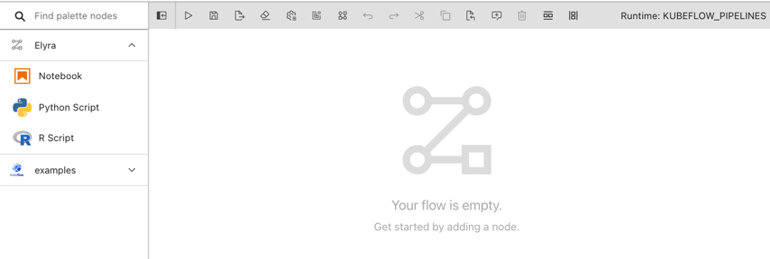
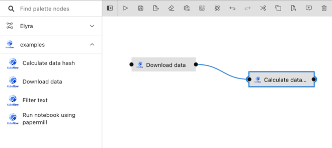

<!--

Copyright 2018-2022 Elyra Authors

Licensed under the Apache License, Version 2.0 (the "License");
you may not use this file except in compliance with the License.
You may obtain a copy of the License at

http://www.apache.org/licenses/LICENSE-2.0

Unless required by applicable law or agreed to in writing, software
distributed under the License is distributed on an "AS IS" BASIS,
WITHOUT WARRANTIES OR CONDITIONS OF ANY KIND, either express or implied.
See the License for the specific language governing permissions and
limitations under the License.

-->

## Pipeline components

### Overview

[Pipelines](pipelines.md) comprise of nodes that are implemented using components. A component typically only implements one unit-of-work, such as loading data, transforming data, training a model, or deploying a model to serve. The following depicts a basic pipeline in the Visual Pipeline Editor, which utilizes components to load a data file, split the file, truncates the resulting files, and counts the number of records in each file.


The same pipeline could be implemented using a single component that performs all these tasks, but that component might not be as universally re-usable. Consider, for example, that for another project the data resides in a different kind of storage. With fine-granular components you'd only have to replace the load data component with one that supports the other storage type and could retain everything else. 

#### Generic components

Elyra includes three _generic components_ that allow for the processing of Jupyter notebooks, Python scripts, and R scripts. These components are called generic because they can be included in pipelines for any supported runtime type: local/JupyterLab, Kubeflow Pipelines, and Apache Airflow. Components are exposed in the pipeline editor via the palette.



Note: Refer to the [_Best practices_ topic in the _User Guide_](best-practices-file-based-nodes.md) to learn more about special considerations for generic components.

#### Custom components

_Custom components_ are commonly only implemented for one runtime type, such as Kubeflow Pipelines or Apache Airflow. (The local runtime type does not support custom components.)


There are many custom components available on the web that you can include in pipelines, but you can also create your own. Details on how to create a component can be found in the [Kubeflow Pipelines documentation](https://www.kubeflow.org/docs/components/pipelines/sdk/component-development/) and the [Apache Airflow documentation](https://airflow.apache.org/docs/apache-airflow/stable/concepts/operators.html). Do note that in Apache Airflow components are called operators, but for the sake of consistency the Elyra documentation refers to them as components.

Note: Refer to the [_Requirements and best practices for custom pipeline components_ topic in the _User Guide_](best-practices-custom-pipeline-components.md) to learn more about special considerations for custom components.

#### Component catalogs

Elyra does not include its own component repository. Instead you can configure it to pull components from local or remote catalogs, such as filesystems, web resources, or source control systems. Elyra defines a connector API, which provides access to the catalogs resources.


Elyra includes connectors for the following component catalog types:
 - [_Filesystem component catalogs_](#filesystem-component-catalog) provide access to components that are stored in a filesystem that is readable by JupyterLab/Elyra.

   Example: A filesystem component catalog that is configured using the `/users/jdoe/kubeflow_components/dev/my_component.yaml` path makes `my_component.yaml` available to Elyra.

 - [_Directory component catalogs_](#directory-component-catalog) provide access to components that are stored in a directory.

   Example: A directory component catalog that is configured using the `/users/jdoe/kubeflow_components/test` path makes all component files in that directory available to Elyra.

 - [_URL component catalogs_](#url-component-catalog) provide access to components that are stored on the web and can be retrieved using HTTP `GET` requests.

    Example: A URL component catalog that is configured using the `http://myserver:myport/mypath/my_component.yaml` URL makes the `my_component.yaml` component file available to Elyra.

 - [_Apache Airflow package catalogs_](#apache-airflow-package-catalog) provide access to Apache Airflow operators that are stored in Apache Airflow built distributions.

 - [_Apache Airflow provider package catalogs_](#apache-airflow-provider-package-catalog) provide access to Apache Airflow operators that are stored in Apache Airflow provider packages.  

Refer to section [Built-in catalog connector reference](#built-in-catalog-connector-reference) for details about these connectors. 

You can add support for other component catalogs by installing a connector from the [catalog connector marketplace](https://github.com/elyra-ai/examples/tree/main/component-catalog-connectors/connector-directory.md) or by [implementing your own catalog connector](https://github.com/elyra-ai/examples/tree/main/component-catalog-connectors/build-a-custom-connector.md).

#### Example custom components

To help you get started with custom components, the Elyra community has selected a couple for Kubeflow Pipelines and makes them available using _example catalogs_. 



Whether or not your Elyra includes the example components depends on how you deployed it:
- The community maintained [pre-built container images](getting_started.html#docker) have the example component catalogs for Kubeflow Pipelines pre-installed and enabled. The components are ready to use in the pipeline editor.
- All-inclusive stand-alone installations (e.g. `pip install "elyra[all]"`) include the example components. However, the catalog must be explicitly added to the palette.
- Core-only installations (e.g. `pip install elyra`) do not include the example components. The example catalog must be separately installed and explicitly added to the palette. 

**Installing and enabling the component examples catalogs**

Follow the instructions in [Kubeflow Pipelines component examples catalog](https://github.com/elyra-ai/examples/tree/main/component-catalog-connectors/kfp-example-components-connector).

Details and demo pipelines for some of the included components can be found in the Elyra examples repository:
- [Kubeflow Pipeline components](https://github.com/elyra-ai/examples/tree/main/pipelines/kubeflow_pipelines_component_examples)


### Special considerations for custom Airflow components
Custom Airflow components imported from some types of component catalog connectors require additional configuration 
in order to be used in pipelines. See 
['Best Practices for Custom Pipeline Components'](best-practices-custom-pipeline-components.html#apache-airflow-components) 
for details.

### Managing pipeline components

Components are managed in Elyra using the [JupyterLab UI](#managing-custom-components-using-the-jupyterlab-ui) or the [Elyra command line interface](#managing-custom-components-using-the-elyra-cli).

### Managing custom components using the JupyterLab UI

Custom components can be added, modified, duplicated, and removed in the _Pipeline Components_ panel.


To access the panel in JupyterLab:

- Click the `Open Pipeline Components` button in the pipeline editor toolbar.

       

  OR     

- Select the `Pipeline Components` panel from the JupyterLab sidebar.

       

  OR

- Open the JupyterLab command palette (`Cmd/Ctrl + Shift + C`) and search for `Manage Pipeline Components`.

  

#### Adding a component catalog

To add components from a catalog:

1. Open the `Pipeline Components` panel.
1. Click `+` in the _Pipeline Components_ panel.
1. Select a component catalog type from the list of available options.
1. Enter the catalog information. Refer to section [Configuration properties](#configuration-properties) for a description of each property.
1. Save the catalog entry.

 Elyra queries the catalog, loads the components, and adds them to the Visual Pipeline Editor palette. 

 > Tip: check the log file for error messages if no components from the added catalog are displayed in the palette.

#### Reloading a component catalog entry

To reload a catalog entry if the underlying catalog has changed: 

1. Open the `Pipeline Components` panel.
1. Click the `reload` icon next to the entry name.
1. The catalog entry is re-loaded and changes are reflected in the Visual Pipeline Editor palette. How quickly the entry is processed depends on the catalog type, the number of entries in the catalog, and network connectivity.

> Tip: check the log file for error messages if no updates from the reloaded catalog are displayed in the palette. 

#### Modifying a component catalog entry

1. Open the `Pipeline Components` panel.
1. Click the `edit` (pencil) icon next to the entry name.
1. Modify the catalog entry as desired.

#### Duplicating a component catalog entry

To duplicate a component catalog entry:
1. Open the `Pipeline Components` panel.
1. Click the duplicate icon next to the entry name.
1. Follow the steps in '[_Modifying a component catalog entry_](#modifying-a-component-catalog-entry)' to customize the duplicated entry.

#### Removing a component catalog entry

To remove a component catalog entry and its referenced component(s) from the Visual Pipeline Editor palette:

1. Open the `Pipeline Components` panel.
1. Click the `delete` (trash) icon next to the entry name.
1. Confirm deletion.

Caution: Pipelines that utilize the referenced components are no longer valid after the catalog entry was deleted.

### Managing custom components using the Elyra CLI

Custom components can be added, modified, and removed using the [`elyra-metadata` command line interface](/user_guide/command-line-interface.md).

To list component catalog entries:

```bash
$ elyra-metadata list component-catalogs

Available metadata instances for component-catalogs (includes invalid):

Schema               Instance                            Resource
------               --------                            --------
elyra-kfp-examples-catalog       kubeflow_pipelines_examples  /.../Jupyter/metadata/component-catalogs/kubeflow_pipelines_examples.json
```

#### Adding a component catalog

To add a component catalog entry run `elyra-metadata create component-catalogs`.

```bash
$ elyra-metadata create component-catalogs \
       --display_name "filter components" \
       --description "filter text in files" \
       --runtime_type KUBEFLOW_PIPELINES \
       --schema_name "url-catalog"\
       --paths "['https://raw.githubusercontent.com/elyra-ai/examples/main/component-catalog-connectors/kfp-example-components-connector/kfp_examples_connector/resources/filter_text_using_shell_and_grep.yaml']" \
       --categories '["filter content"]'
```

Refer to section [Configuration properties](#configuration-properties) for parameter descriptions.

#### Modifying a component catalog entry

To replace a component catalog entry run `elyra-metadata update component-catalogs`:

```bash
$ elyra-metadata update component-catalogs \
       --name "filter_components" \
       --display_name "filter components" \
       --description "filter text in files" \
       --runtime_type KUBEFLOW_PIPELINES \
       --schema_name "url-catalog"\
       --paths "['https://raw.githubusercontent.com/elyra-ai/examples/main/component-catalog-connectors/kfp-example-components-connector/kfp_examples_connector/resources/filter_text_using_shell_and_grep.yaml']" \
       --categories='["file operations"]'
```

Note: You must specify all property values, not only the ones that you want to modify.

Refer to section [Configuration properties](#configuration-properties) for parameter descriptions.

#### Exporting component catalogs

To export component catalogs:

```bash
$ elyra-metadata export component-catalogs \
	--directory "/tmp/foo"
```

The above example will export all component catalogs to the "/tmp/foo/component-catalogs" directory.

Note that you must specify the `--directory` option.

There are two flags that can be specified when exporting component catalogs:
1. To include invalid component catalogs, use the `--include-invalid` flag.
2. To clean out the export directory, use the `--clean` flag. Using the `--clean` flag in the above example will empty the "/tmp/foo/component-catalogs" directory before exporting the component catalogs.

#### Importing component catalogs

To import component catalogs:

```bash
$ elyra-metadata import component-catalogs \
	--directory "/tmp/foo"
```

The above example will import all valid component catalogs in the "/tmp/foo" directory (files present in any sub-directories will be ignored).

Note that you must specify the `--directory` option. 

By default, metadata will not be imported if a component catalog instance with the same name already exists. The `--overwrite` flag can be used to override this default behavior and to replace any installed metadata with the newer file in the import directory.

#### Removing a component catalog entry

To remove a component catalog entry and its component definitions from the Visual Pipeline Editor palette:

```bash
$ elyra-metadata remove component-catalogs \
       --name "filter_components"
```

Refer to section [Configuration properties](#configuration-properties) for parameter descriptions.

### Migrating user-defined component registries
The Elyra 3.3 release renamed _Component Registries_ to _Component Catalogs_ and split the `component-registry` schema 
into three separate "component catalog" schemas based on the old schema's `location-type`.  As a result, any 
user-defined component registry instances created prior to Elyra 3.3 will not be available unless migrated. 

The Elyra 3.7 release, however, officially removes support for the `component-registries` schema, including the ability 
to migrate component registry instances to component catalog instances. If you have upgraded to Elyra 3.7+ from Elyra 
3.2 or earlier and would still like access to your previously-defined instances, you will first need to install a 
down-level release and migrate your instances using the instructions below. This migration is performed using the 
`elyra-metadata` CLI tool.

#### Determining instances to migrate
To determine the instances available to migrate, issue the following command:
```bash
$ elyra-metadata list component-registries
```
In this example, there are three user-defined instances.
```bash
Available metadata instances for component-registries (includes invalid):

Schema               Instance            Resource
------               --------            --------
component-registry   airflow_components  /Users/jovyan/Library/Jupyter/metadata/component-registries/airflow_components.json
component-registry   aa_custom           /Users/jovyan/Library/Jupyter/metadata/component-registries/aa_custom.json
component-registry   myoperators         /Users/jovyan/Library/Jupyter/metadata/component-registries/myoperators.json
```
You may find that some of these instances no longer apply.  If there are any that do not apply to 3.3, they can be removed individually:
```bash
$ elyra-metadata remove component-registries --name aa_custom

Metadata instance 'aa_custom' removed from schemaspace 'component-registries'.
````

Note: Because the `component-registries` schemaspace has been deprecated, instances can be listed, removed, or migrated, but not created.

#### Migrating instances
Once the set of component registry instances to migrate have been determined, issue the following command to migrate the remaining instances:
```bash
$ elyra-metadata migrate component-registries
```
Upon completion, which should be on the order of seconds, output similar to the following should be produced:
```
[I 2021-11-15 11:05:48,012.012] Migrating 'component-registries' instance 'myoperators' to schema 'local-file-catalog' of schemaspace 'component-catalogs'...
[I 2021-11-15 11:05:48,042.042] Migrating 'component-registries' instance 'airflow_components' to schema 'url-catalog' of schemaspace 'component-catalogs'...
The following component-registries instances were migrated: ['myoperators', 'airflow_components']
```
Once migrated, these entries should appear in the set of component catalogs.  This can be confirmed by listing the component-catalogs instances:
```bash
$ elyra-metadata list component-catalogs
Available metadata instances for component-catalogs (includes invalid):

Schema                    Instance                            Resource                                                                                                         
------                    --------                            --------                                                                                                             
local-file-catalog        aa_custom                           /Users/jovyan/Library/Jupyter/metadata/component-catalogs/aa_custom.json                                         
local-file-catalog        myoperators                         /Users/jovyan/Library/Jupyter/metadata/component-catalogs/myoperators.json                                       
url-catalog               airflow_components                  /Users/jovyan/Library/Jupyter/metadata/component-catalogs/airflow_components.json                                             
```

### Configuration properties

The component catalog entry properties are defined as follows. The string in the headings below, which is enclosed in parentheses, denotes the CLI option name.

##### Name (display_name)

A user-friendly name for the catalog entry. Note that the catalog entry name is not displayed in the palette. This property is required.

Example: `data load components`

##### N/A (name)

The canonical name for this catalog entry. A value is generated from `Name` if no value is provided.

Example: `data_load_components`

##### Description (description)

A description for the catalog entry.

Example: `Load data from external data sources`

##### Category (categories)

In the pipeline editor palette components are grouped into categories to make them more easily accessible. If no category is provided, the components defined by this catalog entry are added to the palette under `no category`. A limit of 18 characters or fewer is enforced for each category.

Examples (CLI):

- `['load data from db']`
- `['train model','pytorch']`

##### Runtime (runtime)

The runtime environment that supports the component(s). Valid values are the set of configured runtimes that appear in the dropdown (UI) or help-text (CLI). This property is required.

Examples:

- `APACHE_AIRFLOW`
- `KUBEFLOW_PIPELINES`

### Built-in catalog connector reference

Elyra supports fetching components from the filesystem and the web using its built-in connectors. 

#### Filesystem component catalog

The filesystem component catalog connector provides access to components that are stored in the filesystem where Elyra is running:
 - `~` may be used to denote the user's home directory.
 - Wildcards (e.g. `*` or `?`) are not supported.
 - You can specify one or more file names.
 - Best practice: Pipeline files include references to the location from where components were loaded. When adding files to the catalog, specify a `base directory` and a relative file path to make pipelines portable across environments.

Examples (GUI):
 - `/Users/patti/specs/load_data_from_public_source/http_operator.py`
 - `~patti/specs/filter_files/row_filter.yaml`

Examples (CLI):
 - `['/Users/patti/specs/load_data_from_public_source/http_operator.py']`
 - `['~patti/specs/filter_files/row_filter.yaml']`
 - `['/Users/patti/specs/comp1.yaml','/Users/patti/specs/comp2.yaml']`

#### Directory component catalog

The directory component catalog connector provides access to components that are stored in a filesystem directory: 
 - If `Path` is set to `/Users/patti/specs/load_from_database`, the connector searches  the specified directory for components for the selected runtime type.
 - The search is performed recursively if the subdirectory option is enabled.
 - `~` may be used to denote the user's home directory.
 - You can specify one or more directories.

Examples (GUI):
 - `/Users/patti/specs/load_from_database`
 - `~patti/specs/load_from_cloud_storage`

Examples (CLI):
 - `['/Users/patti/specs/load_from_database']`
 - `['~patti/specs/load_from_cloud_storage']`
 - `['/Users/patti/load_specs/','/Users/patti/cleanse_specs/']` 

#### URL component catalog

The URL component catalog connector provides access to components that are stored on the web:
- You can specify one or more URL resources.
- The specified URLs must be retrievable using an HTTP `GET` request. `http`, `https`, and `file` [URI schemes](https://www.iana.org/assignments/uri-schemes/uri-schemes.xhtml) are supported.
- If the resources are secured, provide credentials, such as a user id and password or API key.
- In secured environments where SSL server authenticity can only be validated using certificates based on private public key infrastructure (PKI) with root and optionally intermediate certificate authorities (CAs) that are not publicly trusted, you must define environment variable `TRUSTED_CA_BUNDLE_PATH` in the environment where JupyterLab/Elyra is running. The variable value must identify an existing [Privacy-Enhanced Mail (PEM) file](https://en.wikipedia.org/wiki/Privacy-Enhanced_Mail).

Examples (GUI):
 - HTTPS URL
   ```
   https://raw.githubusercontent.com/elyra-ai/examples/main/component-catalog-connectors/kfp-example-components-connector/kfp_examples_connector/resources/filter_text_using_shell_and_grep.yaml
   ```
 - Local file URL
   ```
   file:///absolute/path/to/component.yaml
   ```

Examples (CLI):
 - HTTPS URL
   ```
   ['https://raw.githubusercontent.com/elyra-ai/examples/main/component-catalog-connectors/kfp-example-components-connector/kfp_examples_connector/resources/filter_text_using_shell_and_grep.yaml']
   ```
 - Local file URL
   ```
   ['file:///absolute/path/to/component.yaml']
   ```
 - Multiple URLs
   ```
   ['<URL_1>','<URL_2>']
   ```


#### Apache Airflow package catalog

The [Apache Airflow package catalog connector](https://github.com/elyra-ai/elyra/tree/main/elyra/pipeline/airflow/package_catalog_connector) provides access to operators that are stored in Apache Airflow [built distributions](https://packaging.python.org/en/latest/glossary/#term-built-distribution):
- Only the [wheel distribution format](https://packaging.python.org/en/latest/glossary/#term-Wheel) is supported.
- The specified URL must be retrievable using an HTTP `GET` request. `http`, `https`, and `file` [URI schemes](https://www.iana.org/assignments/uri-schemes/uri-schemes.xhtml) are supported.
- In secured environments where SSL server authenticity can only be validated using certificates based on private public key infrastructure (PKI) with root and optionally intermediate certificate authorities (CAs) that are not publicly trusted, you must define environment variable `TRUSTED_CA_BUNDLE_PATH` in the environment where JupyterLab/Elyra is running. The variable value must identify an existing [Privacy-Enhanced Mail (PEM) file](https://en.wikipedia.org/wiki/Privacy-Enhanced_Mail).

Examples:
 - [Apache Airflow](https://pypi.org/project/apache-airflow/) (v1.10.15): 
   ```
   https://files.pythonhosted.org/packages/f0/3a/f5ce74b2bdbbe59c925bb3398ec0781b66a64b8a23e2f6adc7ab9f1005d9/apache_airflow-1.10.15-py2.py3-none-any.whl
   ```
 - Local copy of a downloaded Apache Airflow package
   ```
   file:///absolute/path/to/apache_airflow-1.10.15-py2.py3-none-any.whl
   ``` 

#### Apache Airflow provider package catalog
The [Apache Airflow provider package catalog connector](https://github.com/elyra-ai/elyra/tree/main/elyra/pipeline/airflow/provider_package_catalog_connector) provides access to operators that are stored in [Apache Airflow provider packages](https://airflow.apache.org/docs/apache-airflow-providers/):
- Only the [wheel distribution format](https://packaging.python.org/en/latest/glossary/#term-Wheel) is supported.
- The specified URL must be retrievable using an HTTP `GET` request. `http`, `https`, and `file` [URI schemes](https://www.iana.org/assignments/uri-schemes/uri-schemes.xhtml) are supported.
- In secured environments where SSL server authenticity can only be validated using certificates based on private public key infrastructure (PKI) with root and optionally intermediate certificate authorities (CAs) that are not publicly trusted, you must define environment variable `TRUSTED_CA_BUNDLE_PATH` in the environment where JupyterLab/Elyra is running. The variable value must identify an existing [Privacy-Enhanced Mail (PEM) file](https://en.wikipedia.org/wiki/Privacy-Enhanced_Mail).

Examples:
 - [apache-airflow-providers-http](https://airflow.apache.org/docs/apache-airflow-providers-http/stable/index.html) (v2.0.2): 
   ```
   https://files.pythonhosted.org/packages/a1/08/91653e9f394cbefe356ac07db809be7e69cc89b094379ad91d6cef3d2bc9/apache_airflow_providers_http-2.0.2-py3-none-any.whl
   ```

 - Local copy of a downloaded provider package
   ```
   file:///absolute/path/to/apache_airflow_providers_http-2.0.2-py3-none-any.whl
   ```
