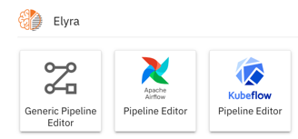
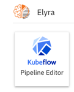
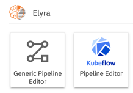

<!--

Copyright 2018-2023 Elyra Authors

Licensed under the Apache License, Version 2.0 (the "License");
you may not use this file except in compliance with the License.
You may obtain a copy of the License at

http://www.apache.org/licenses/LICENSE-2.0

Unless required by applicable law or agreed to in writing, software
distributed under the License is distributed on an "AS IS" BASIS,
WITHOUT WARRANTIES OR CONDITIONS OF ANY KIND, either express or implied.
See the License for the specific language governing permissions and
limitations under the License.

-->

## Configuring the pipeline editor

### Configuring supported runtimes

The pipeline editor supports three runtimes: Kubeflow Pipelines, Apache Airflow, and local execution in JupyterLab. By default, support for all runtimes is enabled when you [install Elyra](../getting_started/installation.md). The JupyterLab launcher window under the _Elyra_ category includes a tile for each enabled runtime:



If you are planning to use only a subset of the supported runtimes to execute pipelines, you can enable them selectively.

#### Enabling specific runtimes

When you explicitly enable one or more runtimes the other runtimes are disabled. You enable runtimes by overriding the Elyra default configuration. 

##### Override default using command line parameters

To enable one or more runtimes, launch JupyterLab with the Elyra-specific `--PipelineProcessorRegistry.runtimes` parameter:

```
$ jupyter lab --PipelineProcessorRegistry.runtimes=<runtime>
```

Supported parameter values for `<runtime>` are `kfp` (enable support for Kubeflow Pipelines), `airflow` (enable support for Apache Airflow), and `local` (enable support for local execution).

For example, to enable only support for Kubeflow Pipelines, run

```
$ jupyter lab --PipelineProcessorRegistry.runtimes=kfp
```



To enable support for more than one runtime, specify the parameter multiple times.

```
$ jupyter lab --PipelineProcessorRegistry.runtimes=kfp --PipelineProcessorRegistry.runtimes=local
```



##### Override default using customized configuration file

To permanently apply your runtime selection create a customized configuration file.

1. Stop JupyterLab.
1. Generate the `jupyter_elyra_config.py` configuration file.

   ```
   $ jupyter elyra --generate-config
   ```
   > Note: You must specify `elyra` as the `jupyter` subcommand instead of `lab`. 
1. Open the generated configuration file.
1. Locate the `PipelineProcessorRegistry` configuration section.
   ```
   #------------------------------------------------------------------------------
   # PipelineProcessorRegistry(SingletonConfigurable) configuration
   #------------------------------------------------------------------------------
   ```
1. Locate the configuration entry for `PipelineProcessorRegistry.runtimes`
   ```
   # c.PipelineProcessorRegistry.runtimes = []
   ```
1. Remove the leading `#` and add one or more of `kfp`,`airflow`, or `local`.
   ```
   c.PipelineProcessorRegistry.runtimes = ['kfp', 'local']
   ```
1. Save the customized configuration file.
1. Start JupyterLab. The pipeline editor tiles for the specified runtimes are displayed in the launcher window.

### Customizing the pipeline editor

You can customize the pipeline editor behavior by opening the settings link in the empty editor window or by navigating in the [JupyterLab menu bar](https://jupyterlab.readthedocs.io/en/stable/user/interface.html#menu-bar) to  `Settings > Advanced Settings Editor` and searching for `elyra`. Customization options vary by release.