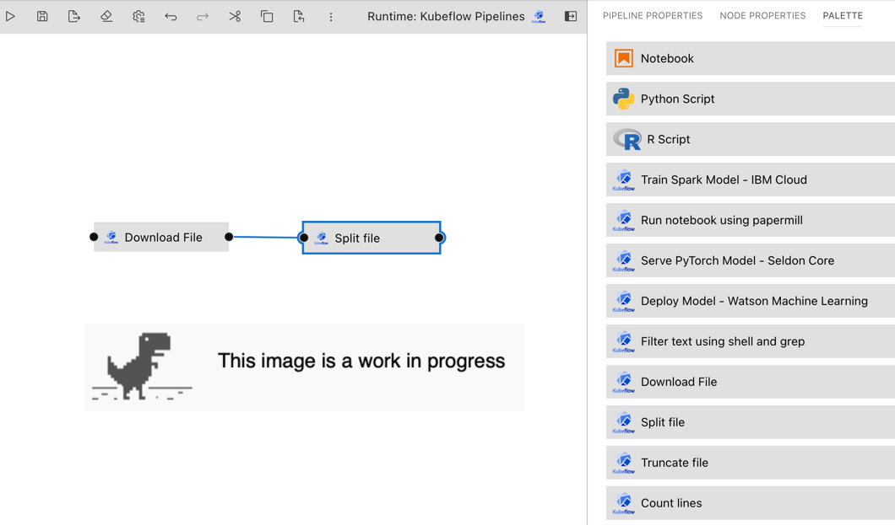
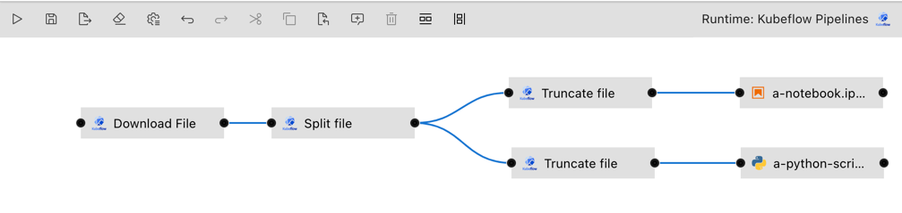

<!--

Copyright 2018-2021 Elyra Authors

Licensed under the Apache License, Version 2.0 (the "License");
you may not use this file except in compliance with the License.
You may obtain a copy of the License at

http://www.apache.org/licenses/LICENSE-2.0

Unless required by applicable law or agreed to in writing, software
distributed under the License is distributed on an "AS IS" BASIS,
WITHOUT WARRANTIES OR CONDITIONS OF ANY KIND, either express or implied.
See the License for the specific language governing permissions and
limitations under the License.

-->  

## Pipelines

### Overview

A pipeline comprises of one or more nodes that are (in many cases) connected with each other to define execution dependencies. A node is an instance of a configurable component that typically only implements one unit of work. A unit of work can represent any task, such as load data, cleanse data, analyze data, train a machine learning model, deploy a model for serving, query a service, or send an email. 


Note though that multiple components might implement the "same" task. For example, one component might load data from a SQL database, whereas another component might load data from a NoSQL database. Conceptually both components load data, but how they load it is entirely different.

Elyra supports two types of components: generic components and custom components. A pipeline that utilizes only generic components is called a generic pipeline, whereas a pipeline that utilizes generic components and/or custom components is referred to as typed pipeline.



The [_Pipeline components_ topic in the User Guide](pipeline-components.md) provides a comprehensive component overview. Please review the [_Best practices for file-based pipeline nodes_ topic](best-practices-file-based-nodes.md) if your pipelines include generic components.

Elyra pipelines support three types of runtime platforms:
- Local/JupyterLab
- [Kubeflow Pipelines](https://www.kubeflow.org/docs/components/pipelines/) (with Argo or [Tekton](https://github.com/kubeflow/kfp-tekton/) workflow engines)
- [Apache Airflow](https://airflow.apache.org/)

#### Generic pipelines

A generic pipeline comprises only of nodes that are implemented using generic components.
This Elyra release includes three generic components that allow for execution of Jupyter notebooks, Python scripts, and R scripts. 


Generic pipelines are portable, meaning they can run locally in JupyterLab, or remotely on Kubeflow Pipelines or Apache Airflow.

#### Typed pipelines

A typed pipeline is permanently associated with a runtime platform, such as Kubeflow Pipelines or Apache Airflow. A typed pipeline may include nodes that are implemented using generic components or custom components for that runtime.



Note that it is not possible to convert a pipeline from one type to another.

The [tutorials](/getting_started/tutorials.md) provide comprehensive step-by-step instructions for creating and running pipelines.

### Creating pipelines using the Visual Pipeline Editor

To create a pipeline using the editor:

1. Open the JupyterLab Launcher and select the desired pipeline editor type (Generic, Kubeflow Pipelines, or Apache Airflow).

   

1. Define pipeline properties. Pipeline properties include a description and default values for node properties. 

   

   Many pipeline properties values can be overridden by node properties. For example, if you set a pipeline default value for `runtime image` to `my-org/my-container-image`, all generic nodes would use this image. To use a different container image `my-org/my-other-container-image` in one of the generic nodes, set the property to a different value in that node.

   Note: Support for pipeline properties varies by release.

1. Drag and drop components from the palette onto the canvas.

   

   Note: You can also drag and drop Jupyter notebooks, Python scripts, or R scripts from the JupyterLab _File Browser_ onto the canvas.

1. Define the runtime properties for each node. (Right click, `Open Properties`)

   Runtime properties are component specific. For generic components (Jupyter notebook, Python script, and R script) the properties are defined as follows:

   **Runtime Image**
   - Required. The container image you want to use to run your notebook. 
   - Example: `TensorFlow 2.0`

   **File Dependencies**
   - Optional. A list of files to be passed from the `LOCAL` working environment into each respective step of the pipeline. Files should be in the same directory as the notebook it is associated with. Specify one file, directory, or expression per line. Supported patterns are `*` and `?`. 
   - Example: `dependent-script.py`

   **Environment Variables**
   - Optional. A list of environment variables to be set inside in the container.  Specify one variable/value pair per line, separated by `=`.
   - Example: `TOKEN=value`

   **Output Files**
   - Optional. A list of files generated by the notebook inside the image to be passed as inputs to the next step of the pipeline.  Specify one file, directory, or expression per line. Supported patterns are `*` and `?`.
   - Example: `data/*.csv`

1. Define the dependencies between nodes by connecting them, essentially creating a graph.

   

1. Associate each node with a comment to document its purpose.

1. Save the pipeline file.

   Note: You can rename the pipeline file in the JupyterLab _File Browser_.

### Running pipelines

Pipelines can be run from the Visual Pipeline Editor and the `elyra-pipeline` command line interface. Before you can run a pipeline on Kubeflow Pipelines or Apache Airflow you must create a [`runtime configuration`](runtime-conf.md). A runtime configuration contains information about the target environment, such as server URL and credentials.

**Running a pipeline from the Visual Pipeline Editor**

To run a pipeline from the Visual Pipeline Editor:
1. Click `Run Pipeline`in the editor's tool bar.

   

1. For generic pipelines select a runtime platform (local, Kubeflow Pipelines, Apache Airflow) and a runtime configuration for that platform. For typed pipelines select a runtime configuration.

   

1. Elyra does not include a pipeline run monitoring interface for pipelines:
   - For local/JupyterLab execution check the console output.
   - For Kubeflow Pipelines open the Central Dashboard link.
   - For Apache Airflow open the web GUI link.

1. The pipeline run output artifacts are stored in the following locations:
   - For local/JupyterLab execution all artifacts are stored in the local file system.
   - For Kubeflow Pipelines and Apache Airflow output artifacts for generic components are stored in the runtime configuration's designated object storage bucket.   

**Running a pipeline from the command line interface**

The [`elyra-pipeline` command line interface](https://elyra.readthedocs.io/en/latest/user_guide/command-line-interface.html#working-with-pipelines) provides two pipeline execution commands: `run` and `submit`.

Use the `elyra-pipeline run` command to run a generic pipeline in your JupyterLab environment:

```bash
$ elyra-pipeline run elyra-pipelines/a-notebook.pipeline
```

Use the `elyra-pipeline submit` command to run a generic or typed pipeline remotely on Kubeflow Pipelines or Apache Airflow, specifying a compatible runtime configuration as parameter:

```bash
$ elyra-pipeline submit elyra-pipelines/a-kubeflow.pipeline \
      --runtime-config kfp-shared-tekton
```

Note: Refer to the [Managing runtime configurations using the Elyra CLI](runtime-conf.html#managing-runtime-configurations-using-the-elyra-cli) topic in the _User Guide_ for details on how to list and manage runtime configurations.

### Exporting a pipeline

When you export a pipeline Elyra only prepares it for later execution, but does not upload it to the Kubeflow Pipelines or Apache Airflow server. Export performs two tasks. 
It packages dependencies for generic components and uploads them to cloud storage and it generates pipeline code for the target runtime. 

Before you can export a pipeline on Kubeflow Pipelines or Apache Airflow you must create a [`runtime configuration`](runtime-conf.md). A runtime configuration contains information about the target environment, such as server URL and credentials.

To export a pipeline from the Visual Pipeline Editor:
1. Click `Export Pipeline`in the editor's tool bar.

   

1. For generic pipelines select a runtime platform (Kubeflow Pipelines or Apache Airflow) and a runtime configuration for that platform. For typed pipelines select a runtime configuration.

1. Select an export format.
   
   
 