<!--

Copyright 2018-2021 Elyra Authors

Licensed under the Apache License, Version 2.0 (the "License");
you may not use this file except in compliance with the License.
You may obtain a copy of the License at

http://www.apache.org/licenses/LICENSE-2.0

Unless required by applicable law or agreed to in writing, software
distributed under the License is distributed on an "AS IS" BASIS,
WITHOUT WARRANTIES OR CONDITIONS OF ANY KIND, either express or implied.
See the License for the specific language governing permissions and
limitations under the License.

-->  

## Pipelines

### Overview

A _pipeline_ comprises one or more _nodes_ that are (in many cases) connected with each other to define execution _dependencies_. A node is an instance of a configurable _[component](pipeline-components.md)_ that commonly only implements a single unit of work to make it reusable. A unit of work can represent any task, such as loading data, pre-processing data, analyzing data, training a machine learning model, deploying a model for serving, querying a service, or sending an email. 

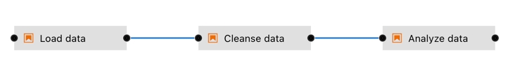

Note though that multiple components might implement the "same" task. For example, one component might load data from a SQL database, whereas another component might download data from S3 storage. Conceptually both components load data, but how they load it is entirely different.

Elyra supports two types of components: generic components and custom components. A pipeline that utilizes only generic components is called a _generic pipeline_, whereas a pipeline that utilizes generic components and/or custom components is referred to as _runtime-specific pipeline_.

Pipelines are assembled using the Visual Pipeline Editor. The editor includes a palette, the canvas, and a properties panel, shown on the left, in the center, and the right, respectively.

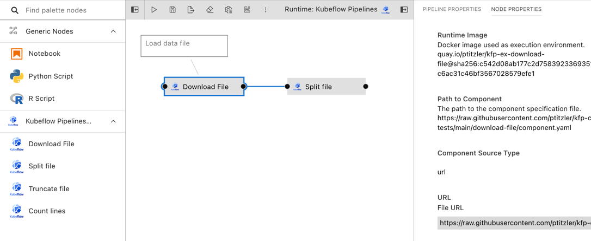

Please review the [_Best practices for file-based pipeline nodes_ topic in the _User Guide_](best-practices-file-based-nodes.md) if your pipelines include generic components.

Elyra pipelines support three runtime platforms:
- Local/JupyterLab
- [Kubeflow Pipelines](https://www.kubeflow.org/docs/components/pipelines/) (with Argo or [Tekton](https://github.com/kubeflow/kfp-tekton/) workflow engines)
- [Apache Airflow](https://airflow.apache.org/)

#### Generic pipelines

A generic pipeline comprises only of nodes that are implemented using generic components.
This Elyra release includes three generic components that allow for execution of Jupyter notebooks, Python scripts, and R scripts. 

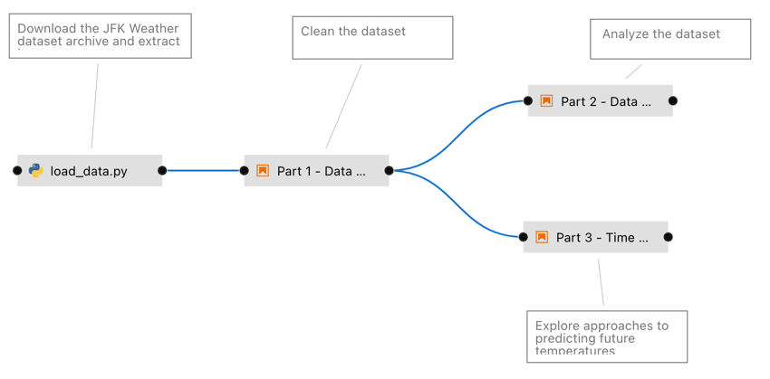

Generic pipelines are portable, meaning they can run locally in JupyterLab, or remotely on Kubeflow Pipelines or Apache Airflow.

#### Runtime-specific pipelines

A runtime-specific pipeline is permanently associated with a runtime platform, such as Kubeflow Pipelines or Apache Airflow. A runtime-specific pipeline may include nodes that are implemented using generic components or custom components for that runtime.


For illustrative purposes the Elyra component registry includes a couple example custom components. You can add your own components as outlined in [_Managing custom components_](https://elyra.readthedocs.io/en/latest/user_guide/pipeline-components.html#managing-custom-components).

Note that it is not possible to convert a generic pipeline to a runtime-specific pipeline or a runtime-specific pipeline from one type to another.

### Creating pipelines using the Visual Pipeline Editor

The [tutorials](/getting_started/tutorials.md) provide comprehensive step-by-step instructions for creating and running pipelines. To create a pipeline using the editor:

1. Open the JupyterLab Launcher and select the desired pipeline editor type (Generic, Kubeflow Pipelines, or Apache Airflow).

   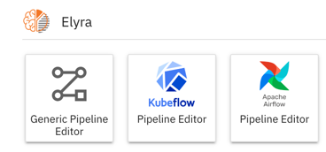

1. Expand the properties panel and define the pipeline properties. Pipeline properties include a description and default values for node properties. (Support for pipeline properties varies by release.)

   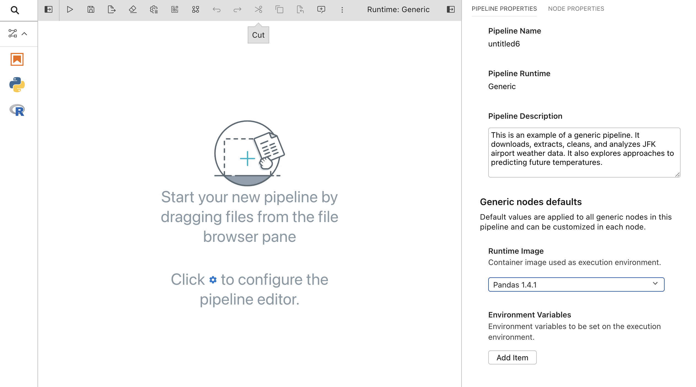

1. Drag and drop components from the palette onto the canvas or double click on a palette entry.

   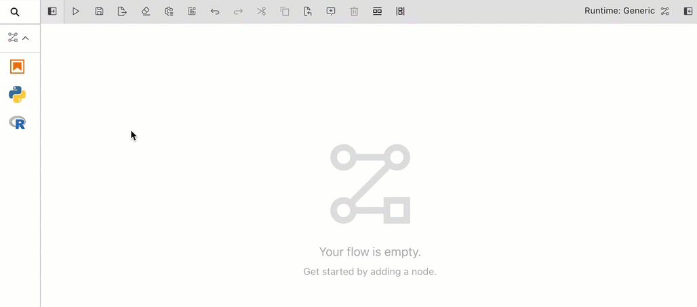

   You can also drag and drop Jupyter notebooks, Python scripts, or R scripts from the JupyterLab _File Browser_ onto the canvas.

   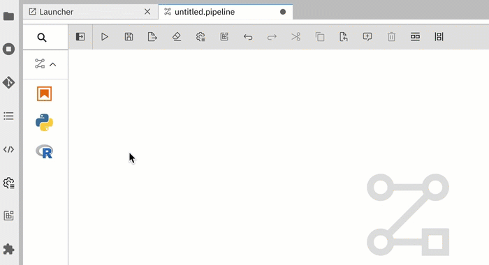

1. Define the dependencies between nodes by connecting them, essentially creating an execution graph.

   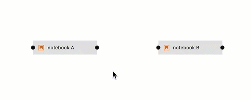

1. Define the runtime properties for each node. Highlight a node, right click, and select `Open Properties`. Runtime properties configure a component and govern its execution behavior.

   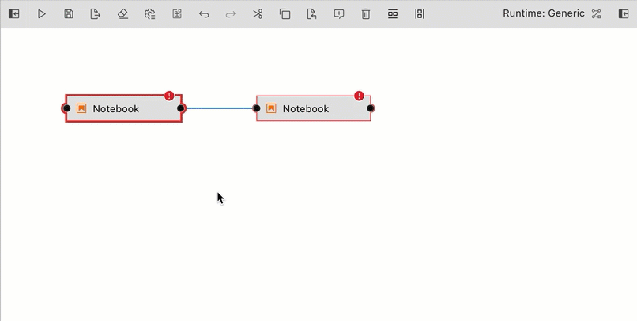

   Runtime properties are component specific. For generic components (Jupyter notebook, Python script, and R script) the properties are defined as follows:

   **Runtime Image**
   - Required. The container image you want to use to run the notebook or script. 
   - Example: `TensorFlow 2.0`

   **CPU, GPU, and RAM**
   - Optional. Resources that the notebook or script requires. 

   **File Dependencies**
   - Optional. A list of files to be passed from the local working environment into each respective step of the pipeline. Files should be in the same directory (or subdirectory thereof) as the file it is associated with. Specify one file, directory, or expression per line. Supported patterns are `*` and `?`. 
   - Example: `dependent-script.py`

   **Environment Variables**
   - Optional. A list of environment variables to be set inside in the container.  Specify one variable/value pair per line, separated by `=`.
   - Example: `TOKEN=value`

   **Output Files**
   - Optional. A list of files generated by the notebook inside the image to be passed as inputs to the next step of the pipeline.  Specify one file, directory, or expression per line. Supported patterns are `*` and `?`.
   - Example: `data/*.csv`

1. Associate each node with a comment to document its purpose.

   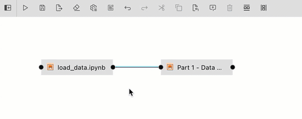

1. Save the pipeline file.

Note: You can rename the pipeline file in the JupyterLab _File Browser_.

### Running pipelines

Pipelines can be run from the Visual Pipeline Editor and the `elyra-pipeline` command line interface. Before you can run a pipeline on Kubeflow Pipelines or Apache Airflow you must create a [`runtime configuration`](runtime-conf.md). A runtime configuration contains information about the target environment, such as server URL and credentials.

**Running a pipeline from the Visual Pipeline Editor**

To run a pipeline from the Visual Pipeline Editor:
1. Click `Run Pipeline` in the editor's tool bar.

   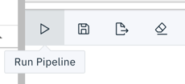

1. For generic pipelines select a runtime platform (local, Kubeflow Pipelines, Apache Airflow) and a runtime configuration for that platform. For runtime-specific  pipelines select a runtime configuration.

   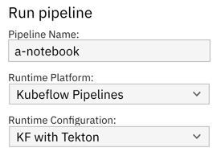

1. Elyra does not include a pipeline run monitoring interface for pipelines:
   - For local/JupyterLab execution check the console output.
   - For Kubeflow Pipelines open the Central Dashboard link.
   - For Apache Airflow open the web GUI link.

1. The pipeline run output artifacts are stored in the following locations:
   - For local/JupyterLab execution all artifacts are stored in the local file system.
   - For Kubeflow Pipelines and Apache Airflow output artifacts for generic components are stored in the runtime configuration's designated object storage bucket.   

**Running a pipeline from the command line interface**

The [`elyra-pipeline` command line interface](https://elyra.readthedocs.io/en/latest/user_guide/command-line-interface.html#working-with-pipelines)
provides an informative command: `describe` and two execution commands: `run` and `submit`.

Use the `elyra-pipeline describe` command to display pipeline details such as name, version, etc.

```bash
$ elyra-pipeline describe elyra-pipelines/a-notebook.pipeline
```

Use the `elyra-pipeline run` command to run a generic pipeline in your JupyterLab environment:

```bash
$ elyra-pipeline run elyra-pipelines/a-notebook.pipeline
```

Use the `elyra-pipeline submit` command to run a generic or runtime-specific pipeline remotely on Kubeflow Pipelines or Apache Airflow, specifying a compatible runtime configuration as parameter:

```bash
$ elyra-pipeline submit elyra-pipelines/a-kubeflow.pipeline \
      --runtime-config kfp-shared-tekton
```

Note: Refer to the [Managing runtime configurations using the Elyra CLI](runtime-conf.html#managing-runtime-configurations-using-the-elyra-cli) topic in the _User Guide_ for details on how to list and manage runtime configurations.

### Exporting a pipeline

When you export a pipeline Elyra only prepares it for later execution, but does not upload it to the Kubeflow Pipelines or Apache Airflow server. Export performs two tasks. 
It packages dependencies for generic components and uploads them to cloud storage and it generates pipeline code for the target runtime. 

Before you can export a pipeline on Kubeflow Pipelines or Apache Airflow you must create a [`runtime configuration`](runtime-conf.md). A runtime configuration contains information about the target environment, such as server URL and credentials.

To export a pipeline from the Visual Pipeline Editor:
1. Click `Export Pipeline` in the editor's tool bar.

   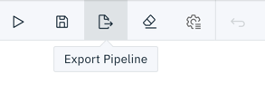

1. For generic pipelines select a runtime platform (local, Kubeflow Pipelines, or Apache Airflow) and a runtime configuration for that platform. For runtime-specific pipelines select a runtime configuration.

1. Select an export format.
   
   

1. Import the exported pipeline file using the Kubeflow Central Dashboard or add it to the Git repository that Apache Airflow is monitoring.   
