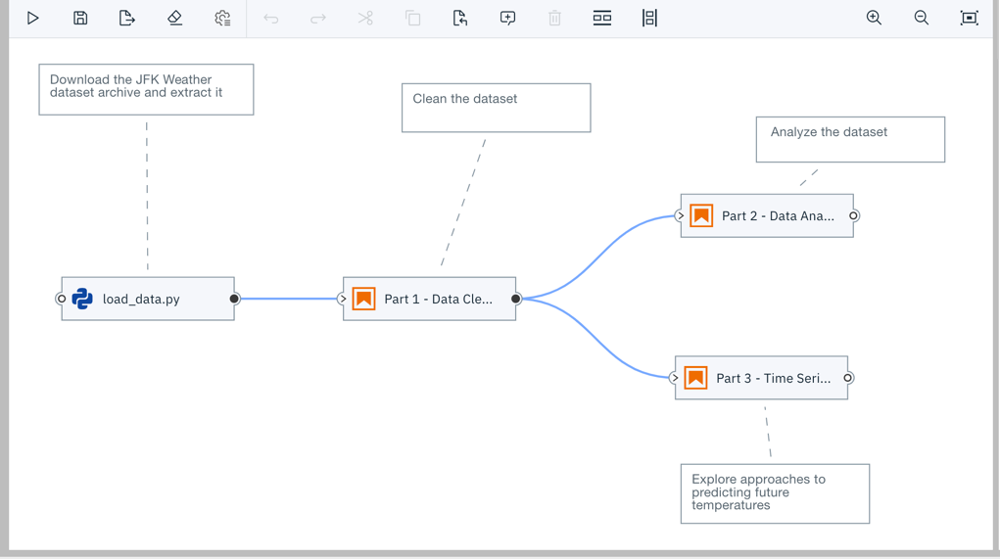
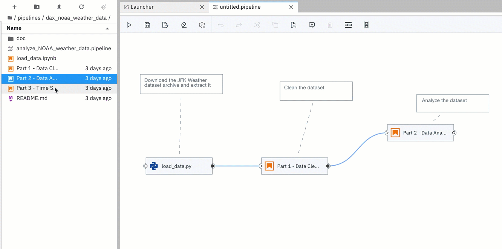
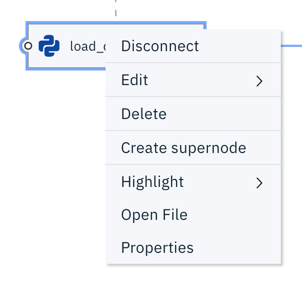
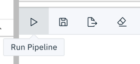
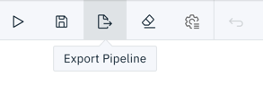

<!--

Copyright 2018-2021 Elyra Authors

Licensed under the Apache License, Version 2.0 (the "License");
you may not use this file except in compliance with the License.
You may obtain a copy of the License at

http://www.apache.org/licenses/LICENSE-2.0

Unless required by applicable law or agreed to in writing, software
distributed under the License is distributed on an "AS IS" BASIS,
WITHOUT WARRANTIES OR CONDITIONS OF ANY KIND, either express or implied.
See the License for the specific language governing permissions and
limitations under the License.

-->

# AI Pipelines

Elyra utilizes its [canvas component](https://github.com/elyra-ai/canvas) to enable assembling
multiple notebooks or Python scripts as a workflow.
Elyra provides a visual editor for building AI pipelines, simplifying the conversion
of multiple notebooks or Python scripts into batch jobs or workflows.  By leveraging cloud-based resources to run their
experiments faster, data scientists, machine learning engineers and AI developers are then more productive,
allowing them to spend time utilizing their technical skills.



Nodes in a pipeline represent notebooks or Python scripts and are connected with each other to define execution dependencies. Each node is configured using properties that define the runtime environment, input dependencies, and outputs.

The [tutorials](/getting_started/tutorials.md) provide comprehensive step-by-step instructions for creating and running pipelines.

### Creating a pipeline using the Pipeline Editor

To create a pipeline using the editor:

* Open the JupyterLab Launcher, if it is not open.
* Click the `Pipeline Editor` icon to create an empty pipeline.
  
* From the sidebar open the JupyterLab File Browser.
* Drag notebooks or Python scripts from the File Browser onto the canvas.
* Define the dependencies between nodes by connecting them, essentially creating a graph.
* Associate each node with a comment to document its purpose. 

  
* Right click on a node to open the associated file in the appropriate editor or define the node's runtime properties.

  
* Define the properties for each node in the pipeline.

  

  |Property   | Description  | Example |
  |:---:|:------|:---:|
  |Runtime Image| The container image you want to use to run your notebook |  `TensorFlow 2.0`   |
  |File Dependencies|  A list of files to be passed from the `LOCAL` working environment into each respective step of the pipeline. Files should be in the same directory as the notebook it is associated with. Specify one file, directory, or expression per line. Supported patterns are `*` and `?`. | `dependent-script.py` |
  |Environment Variables| A list of environment variables to be set inside in the container.  Specify one variable/value pair per line, separated by `=`. |  `TOKEN=value` |
  |Output Files|  A list of files generated by the notebook inside the image to be passed as inputs to the next step of the pipeline.  Specify one file, directory, or expression per line. Supported patterns are `*` and `?`. | `data/*.csv` |

### Running a pipeline

Pipelines run in your local JupyterLab environment or on Kubeflow Pipelines. 

#### Running a pipeline in JupyterLab

To run a pipeline in a sub-process in JupyterLab:

* Click the `Run Pipeline` icon in the pipeline editor.

  
* Assign a name to the run and choose the local runtime configuration.
* Monitor the run progress in the JupyterLab console. The pipeline editor displays a message when processing is finished. 
* Access any outputs that notebooks or Python scripts produce in the JupyterLab file browser.

Refer to the [local pipeline execution tutorial](/getting_started/tutorials.md) for details.

#### Running a pipeline on Kubeflow Pipelines

To run a pipeline on Kubeflow Pipelines:

* [Create a runtime configuration for your Kubeflow Pipelines](/user_guide/runtime-conf.md)
* Click the `Run Pipeline` icon in the pipeline editor.
* Assign a name to the run and choose the Kubeflow Pipelines runtime configuration.
* After the pipeline run was started open the Kubeflow Pipelines link to monitor the execution progress in the Kubeflow Pipelines UI.
* After the pipeline was executed use the cloud storage link to access the outputs that notebooks or Python scripts have produced.

Refer to the [Kubeflow Pipelines tutorial](/getting_started/tutorials.md) for details.

#### Running a pipeline using the command line

To run a pipeline on your local environment:

```bash
elyra-pipeline run elyra-pipelines/demo-heterogeneous.pipeline \
      --work-dir ~/opensource/jupyter-notebooks/
```

To submit a pipeline to be executed on the context of the JupyterLab server:

```bash
elyra-pipeline submit elyra-pipelines/demo-heterogeneous.pipeline \
      --work-dir ~/opensource/jupyter-notebooks/ \
      --runtime kfp
      --runtime-config kfp-shared-tekton
```

The `runtime` should be one of ['local', 'kfp', 'airflow'] and the `runtime-config`  should be a valid
[runtime configuration](/user_guide/runtime-conf.md)


### Distributing Your Pipeline
Oftentimes you'll want to share or distribute your pipeline (including its notebooks and their dependencies) with colleagues.  This section covers some of the best practices for accomplishing that, but first, it's good to understand the relationships between components of a pipeline.

#### Pipeline Component Relationships
The primary component of a pipeline is the pipeline file itself.  This JSON file (with a `.pipeline` extension) contains all relationships of the pipeline.  The notebook execution nodes each specify a notebook file (a JSON file with a `.ipynb` extension) who's path is **relative to the pipeline file**.  Each dependency of a given node is relative to the notebook location itself - **not** the pipeline file or the notebook server workspace.  When a pipeline is submitted for processing or export, the pipeline file itself is not sent to the server, only a portion of its contents are sent.

#### Distributing Pipelines - Best Practices
Prior to distributing your pipeline - which includes preserving the component relationships - it is best to commit these files (and directories) to a GitHub repository.  An alternative approach would be to archive the files using `tar` or `zip`, while, again, preserving the component relationships relative to the pipeline file.

When deploying a shared or distributed pipeline repository or archive, it is **very important** that the pipeline notebooks be extracted into the **same location relative to the pipeline file**.

##### Confirming Notebook Locations
Pipeline validation checks for the existence of the notebook file associated with each node upon opening the editor and will highlight any nodes with missing files. If a file is missing or in an unexpected location the file location can be changed using the adjacent `Browse` button.

## Pipeline Validation
Pipeline validation occurs when pipeline files are opened, as well as when pipelines are run or exported. Pipelines are validated for the following:
- **Circular References** - Circular references cannot exist in any pipeline because it would create an infinite loop. 
- **Notebook Existence** - The notebook for a given node must exist. 
- **Incomplete Properties** - Required fields in a given nodes' properties must be present.

## Exporting a pipeline

Elyra pipelines can be exported and manually uploaded to and run on Kubeflow Pipelines.

To export a pipeline from the pipeline editor:
- Click the `Export Pipeline` icon.

  
- Choose a Kubeflow Pipelines run configuration.
- Select an export file format:
   - The _YAML-formatted static pipeline configuration_ can be uploaded as is to Kubeflow Pipelines.
   - The pipeline Python DSL requires compilation into the YAML-formatted static pipeline configuration using the [Kubeflow Pipelines SDK](https://www.kubeflow.org/docs/pipelines/sdk/) before it can be used.
- Start the export. The operation generates two artifacts: a Kubeflow Pipelines pipeline file and a compressed archive that is uploaded to the cloud storage that's associated with the selected runtime configuration. Note that the exported pipelines file contains unencrypted cloud storage connectivity information.

- Upload the YAML-formatted static pipeline configuration using the Kubeflow Pipelines UI.
- Create an experiment and run it to execute the pipeline.

