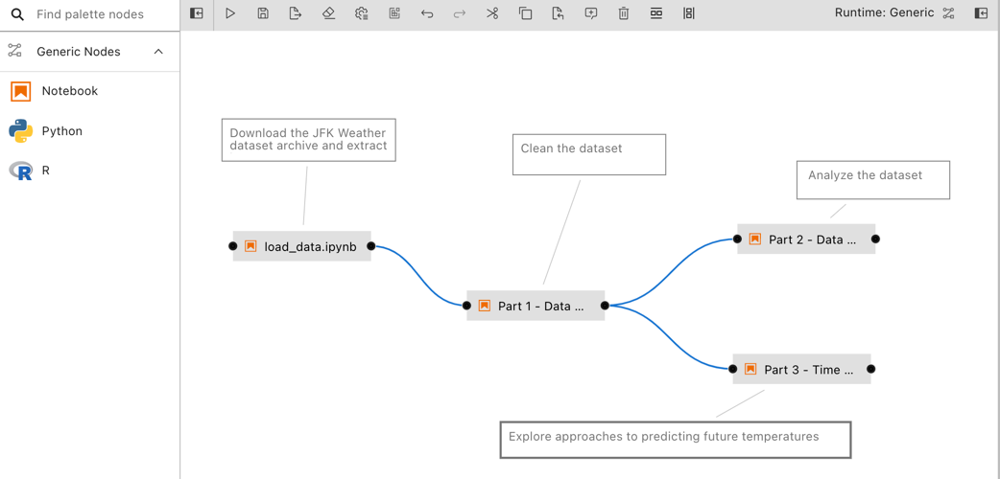
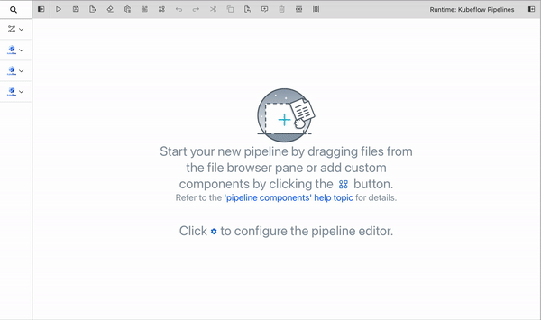
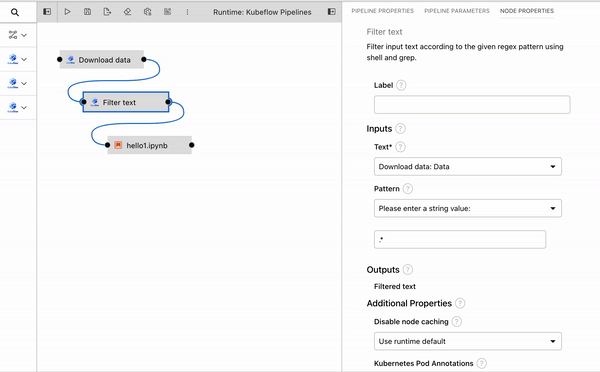
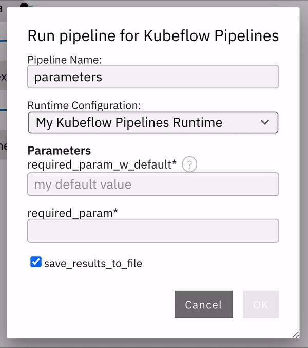
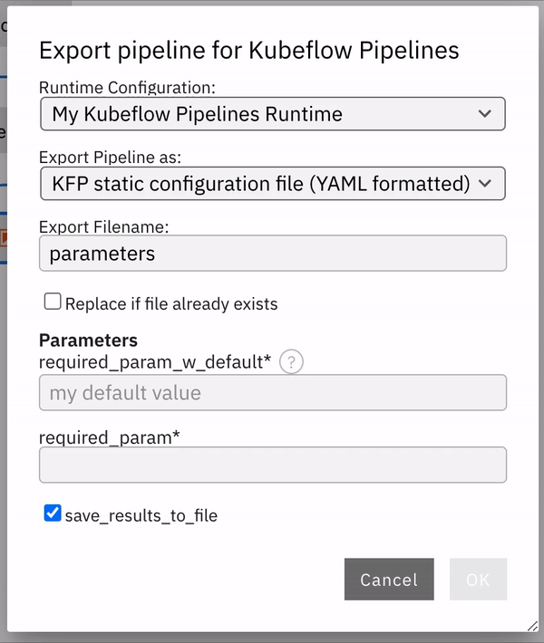

<!--

Copyright 2018-2022 Elyra Authors

Licensed under the Apache License, Version 2.0 (the "License");
you may not use this file except in compliance with the License.
You may obtain a copy of the License at

http://www.apache.org/licenses/LICENSE-2.0

Unless required by applicable law or agreed to in writing, software
distributed under the License is distributed on an "AS IS" BASIS,
WITHOUT WARRANTIES OR CONDITIONS OF ANY KIND, either express or implied.
See the License for the specific language governing permissions and
limitations under the License.

-->  

## Pipelines

### Overview

A _pipeline_ comprises one or more _nodes_ that are (in many cases) connected with each other to define execution _dependencies_. A node is an instance of a configurable _[component](pipeline-components.md)_ that commonly only implements a single unit of work to make it reusable. A unit of work can represent any task, such as loading data, pre-processing data, analyzing data, training a machine learning model, deploying a model for serving, querying a service, or sending an email. 


Note though that multiple components might implement the "same" task. For example, one component might load data from a SQL database, whereas another component might download data from S3 storage. Conceptually both components load data, but how they load it is entirely different.

Elyra supports two types of components: generic components and custom components. A pipeline that utilizes only generic components is called a _generic pipeline_, whereas a pipeline that utilizes generic components and/or custom components is referred to as _runtime-specific pipeline_.

Pipelines are assembled using the Visual Pipeline Editor. The editor includes a palette, the canvas, and a properties panel, shown on the left, in the center, and the right, respectively.


Please review the [_Best practices for file-based pipeline nodes_ topic in the _User Guide_](best-practices-file-based-nodes.md) if your pipelines include generic components.

Elyra pipelines support three runtime platforms:
- Local/JupyterLab
- [Kubeflow Pipelines](https://www.kubeflow.org/docs/components/pipelines/) (with Argo or [Tekton](https://github.com/kubeflow/kfp-tekton/) workflow engines)
- [Apache Airflow](https://airflow.apache.org/)

#### Generic pipelines

A generic pipeline comprises only of nodes that are implemented using generic components.
This Elyra release includes three generic components that allow for execution of Jupyter notebooks, Python scripts, and R scripts. 



Generic pipelines are portable, meaning they can run locally in JupyterLab, or remotely on Kubeflow Pipelines or Apache Airflow.

#### Runtime-specific pipelines

A runtime-specific pipeline is permanently associated with a runtime platform, such as Kubeflow Pipelines or Apache Airflow. A runtime-specific pipeline may include nodes that are implemented using generic components or custom components for that runtime.


For illustrative purposes the Elyra component registry includes a couple example custom components. You can add your own components as outlined in [_Managing custom components_](https://elyra.readthedocs.io/en/latest/user_guide/pipeline-components.html#managing-custom-components).

Note that it is not possible to convert a generic pipeline to a runtime-specific pipeline or a runtime-specific pipeline from one type to another.

### Creating pipelines using the Visual Pipeline Editor

The [tutorials](/getting_started/tutorials.md) provide comprehensive step-by-step instructions for creating and running pipelines. To create a pipeline using the editor open the JupyterLab Launcher and select the desired pipeline editor type.

   

If you open an existing pipeline file from the JupyterLab File Browser the appropriate editor is launched.

#### Defining pipeline properties

Pipelines include metadata, which is configurable in the "Pipeline Properties" panel.
To access the panel click the "Open panel" button on the right side and select the "Pipeline Properties" tab.

   

##### Generic node properties

Generic node properties apply to all generic pipeline nodes. These properties cannot be customized for individual nodes.

 **Object storage path prefix**

Elyra stores pipeline input and output artifacts in a cloud object storage bucket. By default these artifacts are located in the `/<pipeline-instance-name>` path. The example below depicts the artifact location for several pipelines in the `pipeline-examples` bucket:
   

   Configure an object storage path prefix to store artifacts in a pipeline-specific location `/<path-prefix>/<pipeline-instance-name>`:
   

##### Default node properties

Each pipeline node is configured using properties. Default node properties are applied to all applicable nodes but can be customized for individual nodes, as outlined in section [_Configuring nodes_](#configuring-nodes). 

**Default properties that apply to all nodes**

 - [Data volumes](#data-volumes)
 - [Kubernetes tolerations](#kubernetes-tolerations)
 - [Kubernetes pod annotations](#kubernetes-pod-annotations)
 - [Kubernetes pod labels](#kubernetes-pod-labels)
 - [Shared memory size](#shared-memory-size)

**Default properties that apply only to generic nodes**

 - [Runtime image](#runtime-image)
 - [Environment variables](#environment-variables)
 - [Kubernetes secrets](#kubernetes-secrets)

**Default properties that apply only to custom nodes**

 - [Disable node caching](#disable-node-caching)

#### Defining pipeline parameters

Certain runtime-specific pipelines include support for pipeline parameters, which are configurable in the "Pipeline Editor Properties" panel.
To access the panel click the "Open panel" button on the right side and select the "Pipeline Parameters" tab. The tab will only be present for those runtime platforms that support pipeline parameters.

   

Click `Add` to add a parameter to this pipeline. Each parameter has the following attributes:

 - `Parameter Name`: The name of this parameter. This must be a unique identifier among all defined parameters. Hover over the tooltip (`?`) to display a description that may include runtime-specific constraints on the format of a parameter name.
 - `Description`: Optional. A description for this parameter.
 - `Type`: The type of this parameter. The options displayed in this dropdown will be unique to the pipeline runtime platform.
 - `Default Value`: Optional. A default value for the parameter. This value can be overridden by providing a value for this parameter during pipeline submit or export.
 - `Required`: Whether a value is required for this parameter during pipeline submit or export. The default is `False`.

Next, configure node properties to use the defined parameters as desired. This process will differ for generic nodes and custom nodes. See the [`Node properties reference` subsection](#pipeline-parameters) or the [best practices guide](best-practices-file-based-nodes.html#pipeline-parameters) for information on configuring parameters for generic nodes.
For custom nodes, a parameter can be selected to use as input to a node in the dropdown list for an input property. Only parameters that have the same type as the given node property can be selected to use as input for that property.

   

On pipeline submit or export, all parameters that have been referenced by generic or custom nodes will be displayed in the pop-up dialog. Values can be assigned in this dialog box in order to override any defined default values. A value must be provided if a parameter has been marked as required, and the `OK` button will be disabled until a value is entered. See [Running pipelines](#running-a-pipeline-from-the-visual-pipeline-editor) or [Exporting pipelines](#exporting-a-pipeline-from-the-visual-pipeline-editor) for more information.

#### Adding nodes

Generic nodes are added to a pipeline by dragging notebooks or scripts from the JupyterLab File Browser onto the canvas. 

   

Generic nodes can also be added from the palette.

   

Custom nodes can only be added from the palette. Refer to [_Managing pipeline components_](pipeline-components.html#managing-pipeline-components) for details on how to add custom components to the pipeline editor.

#### Configuring nodes

Most nodes need to be configured before they can be used. To access the node properties
highlight the node and choose _Open Properties_ from the context menu. 

   

Tip: You can configure the pipeline editor to open the node properties using double click. To change the default behavior:
 - Open the advanced settings editor ("Settings" > "Advanced Settings Editor")
 - Search for "elyra pipeline editor"
 - Enable option "Double-click on pipeline node opens properties"

You can also use the shortcut to the pipeline editor settings that's displayed on the empty editor canvas.

 

Pipeline editor configuration settings vary by release.

##### Configuring common node properties

Generic nodes and custom nodes share common properties but also include properties that are specific to the component that implements the node. Shared properties include:
   - [Label](#label)

##### Configuring generic nodes

Nodes that are implemented using [generic components](pipeline-components.html#generic-components) are configurable using these properties:

   - [Filename](#filename)
   - [Runtime image](#runtime-image)
   - [Resources (CPU, GPU, and RAM)](#resources-cpu-gpu-and-ram) 
   - [Pipeline parameters](#pipeline-parameters)
   - [File dependencies](#file-dependencies)
   - [Include subdirectories](#file-dependencies)
   - [Environment variables](l#environment-variables)
   - [Kubernetes secrets](#kubernetes-secrets)
   - [Output files](#output-files)
   - [Data volumes](#data-volumes)
   - [Kubernetes tolerations](#kubernetes-tolerations)
   - [Kubernetes pod annotations](#kubernetes-pod-annotations)
   - [Kubernetes pod labels](#kubernetes-pod-labels)
   - [Shared memory size](#shared-memory-size)

##### Configuring custom nodes

Nodes that are implemented using [custom components](pipeline-components.html#custom-components) are configured using these properties:

   - [Data volumes](#data-volumes)
   - [Kubernetes tolerations](#kubernetes-tolerations)
   - [Kubernetes pod annotations](#kubernetes-pod-annotations)
   - [Kubernetes pod labels](#kubernetes-pod-labels)
   - [Disable node caching](#disable-node-caching)
   - [Shared memory size](#shared-memory-size)

#### Defining dependencies between nodes

Dependencies between nodes are defined by connecting them, essentially creating an execution graph.

   

In the example above node labeled "notebook A" is referred to as upstream node, because its output port is connected to the input port of the other node. Node "notebook B" is a downstream node. If "notebook A" declares any output its downstream nodes have access to the output.

The following rules are applied:
 - If two nodes are connected the upstream node is executed first. The upstream node is the node who's output port is directly or indirectly connected to the input port of the other node.
 - If nodes are not directly or indirectly connected, they will be executed in any order. If supported by the runtime environment, execution might be performed in parallel.
 - If node execution fails pipeline execution is aborted.

In the following example nodes "notebook A", "notebook B", "notebook C", "notebook D", and "notebook E" are assumed to be implemented using generic components. However, the same rules apply to custom components.

   

   - "notebook A" and "notebook E" are not dependent on each other and can be executed in any order
   - "notebook B" and "notebook C" are executed only after "notebook A" was successfully executed
   - "notebook B" and "notebook C" are executed in any order
   - "notebook C" has access to the outputs of it's upstream node "notebook A", but not to the outputs "notebook B" has declared, because "notebook B" is not an upstream node
   - "notebook D" is executed after "notebook B" and "notebook C"
   - "notebook D" has access to the outputs of it's upstream nodes "notebook A", "notebook B", and "notebook C"   
   - "notebook E" does not have access to outputs that "notebook A", "notebook B", "notebook C", or "notebook D" have declared  

#### Adding node documentation

Each pipeline node can be associated with comments to describe its purpose.

   


#### Node properties reference

The following alphabetically sorted list identifies the node properties that are supported in this Elyra release. 

##### Data volumes
   - A list of [Persistent Volume Claims](https://kubernetes.io/docs/concepts/storage/persistent-volumes/) (PVC) to be mounted into the container that executes the component. 
   - Format: 
     - _Mount path_: the path where the PVC shall be mounted in the container. Example: `/mnt/datavol/`
     - _Persistent volume claim name_: a valid [Kubernetes resource name](https://kubernetes.io/docs/concepts/overview/working-with-objects/names/#names) identifying a PVC that exists in the Kubernetes namespace where the pipeline nodes are executed. Example: `my-data-pvc`
     - _Sub path_: relative path within the volume from which the container's volume should be mounted. Defaults to the volume's root. Example: `existing/path/in/volume`
     - _Mount volume read-only_: whether to mount the volume in read-only mode
   - Data volumes are not mounted when the pipeline is executed locally.

##### Disable node caching
   - Pipeline nodes produce output, such as files. Some runtime environments support caching of these outputs, eliminating the need to re-execute nodes, which can improve performance and reduce resource usage. If a node does not produce output in a deterministic way - that is, when given the same inputs, the generated output is different - re-using the output from previous executions might lead to unexpected results.
   - Format:
     - `True` node output is not cached
     - `False` node output is cached
     - If no behavior is specified, the runtime environment's default caching behavior is applied.
   - Caching can only be disabled for pipelines that are executed on Kubeflow Pipelines.

##### Environment Variables
   - This property applies only to generic components.
   - A list of environment variables to be set inside in the container.
   - Format:
     - _Environment variable_: name of the variable to be set. Example: `optimize`
     - _Value_: the value to be assigned to said variable. Example: `true`
   - A set of default environment variables can also be set in the pipeline properties tab. If any default environment variables are set, the **Environment Variables** property in the node properties tab will include these variables and their values with a note that each is a pipeline default. Pipeline default environment variables are not editable from the node properties tab. Individual nodes can override a pipeline default value for a given variable by re-defining the variable/value pair in its own node properties.

##### File Dependencies
   - This property applies only to generic components.
   - A list of files to be passed from the local working environment into each respective step of the pipeline. Files should be in the same directory (or subdirectory thereof) as the file it is associated with. Specify one file, directory, or expression per line. Supported patterns are `*` and `?`.
   - If the specified file dependencies reference one or more directories and the 'Include subdirectories' option is enabled, Elyra will include files that are stored in the specified locations.  
   - Example: `dependent-script.py`

##### Filename
   - This property applies only to generic components.
   - The filename identifies a Jupyter notebook a script that is stored in the filesystem where JupyterLab is running.
   - Format: `path/to/supported/file.type`

##### Kubernetes Pod Annotations
   - A list of [annotations](https://kubernetes.io/docs/concepts/overview/working-with-objects/annotations/#attaching-metadata-to-objects) to be attached to the pod that executes the node.
   - Format:
     - _Key_: a [valid Kubernetes annotation key](https://kubernetes.io/docs/concepts/overview/working-with-objects/annotations/#syntax-and-character-set). Example: `project`
     - _Value_: value to be assigned to said annotation key. Example: `abandoned basket analysis`
   - Annotations are ignored when the pipeline is executed locally.

##### Kubernetes Pod Labels
   - A list of [labels](https://kubernetes.io/docs/concepts/overview/working-with-objects/labels) to be attached to the pod that executes the node.
   - Format:
     - _Key_: a [valid Kubernetes label key](https://kubernetes.io/docs/concepts/overview/working-with-objects/labels/#syntax-and-character-set). Example: `project`
     - _Value_: value to be assigned to said label key. Example: `abandoned basket analysis`
   - Labels are ignored when the pipeline is executed locally.

##### Kubernetes Secrets
   - A list of [Kubernetes Secrets](https://kubernetes.io/docs/concepts/configuration/secret/) to be accessed as environment variables during Jupyter notebook or script execution.
   - Format:
     - _Environment variable_: name of the variable to be set. Example: `optimize`
     - _Secret Name_: a valid [Kubernetes resource name](https://kubernetes.io/docs/concepts/overview/working-with-objects/names/#names) identifying a [secret](https://kubernetes.io/docs/concepts/configuration/secret/#restriction-names-data) that exists in the Kubernetes namespace where the pipeline nodes are executed. Example: `database-credentials`
     - _Secret Key_: key that is defined in said secret. Example: `uid`
   - Secrets are ignored when the pipeline is executed locally. For remote execution, if an environment variable was assigned both a static value (via the 'Environment Variables' property) and a Kubernetes secret value, the secret's value is used.

##### Kubernetes Tolerations
   - A list of [Kubernetes tolerations](https://kubernetes.io/docs/concepts/scheduling-eviction/taint-and-toleration/) to be applied to the pod where the component is executed.
   - Format: 
     - _Key_: taint key the toleration applies to
     - _Operator_: represents the key's relationship to the value. Must be `Equal` or `Exists`.
     - _Value_: taint value the toleration matches to
     - _Effect_: indicates the taint effect to match. If specified, must be `NoExecute`, `NoSchedule`, or `PreferNoSchedule`.
   - Refer to [the toleration specification](https://kubernetes.io/docs/reference/generated/kubernetes-api/v1.23/#toleration-v1-core) for a description of each property.
   - Tolerations are ignored when the pipeline is executed locally.

##### Label
   - Specify a label to replace the default node name. For generic components the default label is the file name. For custom components the default name is the component name.
   - Example: `analyze data`

##### Output Files
   - A list of files generated by the notebook inside the image to be passed as inputs to the next step of the pipeline.  Specify one file, directory, or expression per line. Supported patterns are `*` and `?`.
   - Example: `data/*.csv`

##### Pipeline Parameters
   - This property applies only to generic components. Custom components can also use pipeline parameters, but the [method by which to configure them](#defining-pipeline-parameters) is different.
   - A list of defined [pipeline parameters](#defining-pipeline-parameters) that should be passed to this generic component.
   - Check the box next to a parameter name to indicate that it should be passed to this node. Parameters are passed to generic components by setting them as environment variables in the node container. Due to constraints imposed by environment variables, the parameter value will appear as a string when accessed in the generic node regardless of the `Type` that was selected for the parameter in the `Pipeline Parameters` tab.

##### Resources: CPU, GPU, and RAM
   - Resources that the notebook or script requires. RAM takes units of gigabytes (10<sup>9</sup> bytes).
   - Specify a custom Kubernetes GPU vendor, if desired. The default vendor is `nvidia.com/gpu`. See [this topic in the Kubernetes documentation](https://kubernetes.io/docs/tasks/manage-gpus/scheduling-gpus/) for more information.
   - The values are ignored when the pipeline is executed locally.
   - Example: `amd.com/gpu`

##### Runtime image

   - The container image you want to use to run the notebook or script.
   - The value is ignored when the pipeline is executed locally. 
   - A default runtime image can also be set in the pipeline properties tab. If a default image is set, the **Runtime Image** property in the node properties tab will indicate that a pipeline default is set. Individual nodes can override the pipeline default value. 
   - Example: `TensorFlow 2.0`

##### Shared memory size

Shared memory to be allocated on the pod where the component is executed. 
   - Format: 
     - _Memory size_: Custom shared memory size in gigabytes (10<sup>9</sup> bytes). The Kubernetes default is used if set to zero.
   - Shared memory size is ignored when the pipeline is executed with the `local` runtime option.
 
### Running pipelines

Pipelines can be run from the Visual Pipeline Editor and the `elyra-pipeline` command line interface. Before you can run a pipeline on Kubeflow Pipelines or Apache Airflow you must create a [`runtime configuration`](runtime-conf.md). A runtime configuration contains information about the target environment, such as server URL and credentials.

#### Running a pipeline from the Visual Pipeline Editor

To run a pipeline from the Visual Pipeline Editor:
1. Click `Run Pipeline` in the editor's tool bar.

   

2. For generic pipelines select a runtime platform (local, Kubeflow Pipelines, Apache Airflow) and a runtime configuration for that platform. For runtime-specific  pipelines select a runtime configuration.

   

3. [Configure pipeline parameters](pipelines.html#defining-pipeline-parameters), if applicable. If any nodes reference parameters defined in the `Pipeline Parameters` panel, the value these parameters take can be customized here. If a parameter is marked as required and no default value is set, a value must be provided before the `OK` button is enabled.

   

4. Select `OK`

5. Elyra does not include a pipeline run monitoring interface for pipelines:
   - For local/JupyterLab execution check the console output.
   - For Kubeflow Pipelines open the Central Dashboard link.
   - For Apache Airflow open the web GUI link.

6. The pipeline run output artifacts are stored in the following locations:
   - For local/JupyterLab execution all artifacts are stored in the local file system.
   - For Kubeflow Pipelines and Apache Airflow output artifacts for generic components are stored in the runtime configuration's designated object storage bucket.   

#### Running a pipeline from the command line interface

Use the [`elyra-pipeline`](command-line-interface.html#working-with-pipelines) `run` command to execute a generic pipeline in your JupyterLab environment.

```bash
$ elyra-pipeline run elyra-pipelines/a-notebook.pipeline
```

Use the [`elyra-pipeline`](command-line-interface.html#working-with-pipelines) `submit` command to run a generic or runtime-specific pipeline remotely on Kubeflow Pipelines or Apache Airflow, specifying a compatible runtime configuration as parameter:

```bash
$ elyra-pipeline submit elyra-pipelines/a-kubeflow.pipeline \
      --runtime-config kfp-shared-tekton
```

For Kubeflow Pipelines the `--monitor` option is supported. If specified, the pipeline execution status is monitored for up to `--monitor-timeout` minutes (default: 60) and the `elyra-pipeline submit` command terminates as follows:
- pipeline run completes successfully before `--monitor-timeout` is exceeded: exit code 0
- pipeline run does not complete before `--monitor-timeout` is exceeded: exit code 124 (Note: the pipeline continues running on Kubeflow Pipelines, only monitoring is stopped.)
- pipeline run on Kubeflow Pipelines fails before `--monitor-timeout` is exceeded: non-zero exit code but not 124

Note: Refer to the [Managing runtime configurations using the Elyra CLI](runtime-conf.html#managing-runtime-configurations-using-the-elyra-cli) topic in the _User Guide_ for details on how to list and manage runtime configurations. If the specified `--runtime-config` is not compatible with the specified pipeline an error is raised.

### Exporting pipelines

When you export a pipeline Elyra only prepares it for later execution, but does not upload it to the Kubeflow Pipelines or Apache Airflow server. Export performs two tasks. 
It packages dependencies for generic components and uploads them to cloud storage, and it generates pipeline code for the target runtime. 

Before you can export a pipeline on Kubeflow Pipelines or Apache Airflow you must create a [`runtime configuration`](runtime-conf.md). A runtime configuration contains information about the target environment, such as server URL and credentials.

#### Exporting a pipeline from the Visual Pipeline Editor

To export a pipeline from the Visual Pipeline Editor:
1. Click `Export Pipeline` in the editor's toolbar.

   

2. For generic pipelines select a runtime platform (local, Kubeflow Pipelines, or Apache Airflow) and a runtime configuration for that platform. For runtime-specific pipelines select a runtime configuration.

3. Select an export format.

4. Customize your file name using the Export Filename box
   
   

5. [Configure pipeline parameters](pipelines.html#defining-pipeline-parameters), if applicable. If any nodes reference parameters defined in the `Pipeline Parameters` panel, the value these parameters take can be customized here. If a parameter is marked as required and no default value is set, a value must be provided before the `OK` button is enabled.

   

6. Select `OK`

7. Import the exported pipeline file using the Kubeflow Central Dashboard or add it to the Git repository that Apache Airflow is monitoring.


#### Exporting a pipeline from the command line interface

Use the [`elyra-pipeline`](command-line-interface.html#working-with-pipelines) `export` command to export a pipeline to a runtime-specific format:
- Kubeflow Pipelines: [Python DSL](https://v1-5-branch.kubeflow.org/docs/components/pipelines/sdk/build-pipeline/) or YAML
- Apache Airflow: Python DAG

```bash
$ elyra-pipeline export a-notebook.pipeline --runtime-config kfp_dev_env --output /path/to/exported.yaml --overwrite
```

By default, export produces YAML formatted output for Kubeflow Pipelines and <u>ONLY</u> Python DAGs for Apache Airflow. To choose a different format for Kubeflow Pipelines, specify the `--format` option. Supported values are `py` and `yaml` for Kubeflow Pipelines.

To learn more about supported parameters, run
```bash
$ elyra-pipeline export --help
```

Note: Refer to the [Managing runtime configurations using the Elyra CLI](runtime-conf.html#managing-runtime-configurations-using-the-elyra-cli) topic in the _User Guide_ for details on how to list and manage runtime configurations. If the specified `--runtime-config` is not compatible with the specified pipeline an error is raised.

### Describing pipelines

#### Describing a pipeline from the command line interface

Use the [`elyra-pipeline`](command-line-interface.html#working-with-pipelines) `describe` command to display pipeline information, such as description, version, and dependencies.

```bash
$ elyra-pipeline describe a-notebook.pipeline
```

To learn more about supported parameters, run
```bash
$ elyra-pipeline describe --help
```

The pipeline dependencies output includes:
 - Jupyter notebooks
 - Python or R scripts
 - Local files that the notebooks or scripts require
 - Custom components 
 - Data volumes that custom and generic nodes are mounting
 - Container images that generic nodes are using to run notebooks or scripts 
 - Kubernetes secrets that generic nodes are exposing as environment variables to notebooks or scripts

Specify the `--json` option to format the output as JSON.


### Migrating pipelines

The Visual Pipeline Editor stores information about the pipeline, nodes, node configuration, and node dependencies in a `.pipeline` file. How this information is persisted may change between major or minor Elyra releases. You might therefore have to migrate existing pipelines if you switch from one version of Elyra to another. The Visual Pipeline Editor and the [`elyra-pipeline` CLI](command-line-interface.html#working-with-pipelines) raise an error if an attempt is made to process a pipeline file version that is incompatible with the installed Elyra version.

If the pipeline was last modified using a version of Elyra that is older than the installed version, you must migrate the pipeline using the Visual Pipeline Editor before you can use it. If the pipeline was last modified using a version of Elyra that is newer than the installed version, you must upgrade your Elyra installation to a more current release. 

To migrate a pipeline open it in the Visual Pipeline Editor and follow the prompts.
