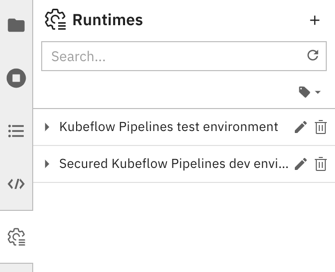
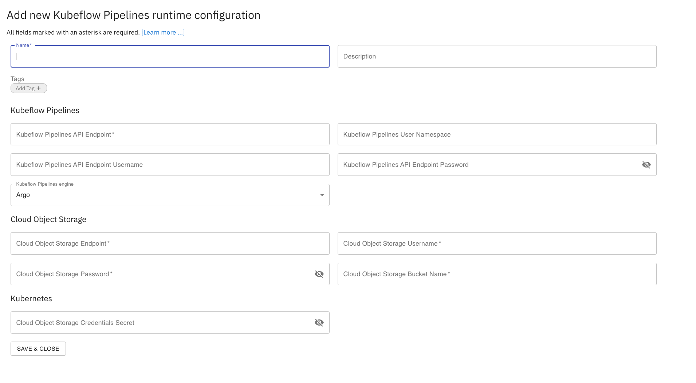
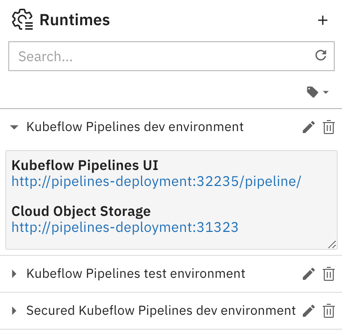

<!--

Copyright 2018-2020 Elyra Authors

Licensed under the Apache License, Version 2.0 (the "License");
you may not use this file except in compliance with the License.
You may obtain a copy of the License at

http://www.apache.org/licenses/LICENSE-2.0

Unless required by applicable law or agreed to in writing, software
distributed under the License is distributed on an "AS IS" BASIS,
WITHOUT WARRANTIES OR CONDITIONS OF ANY KIND, either express or implied.
See the License for the specific language governing permissions and
limitations under the License.

-->
## Runtime Configuration

A runtime configuration provides Elyra access to external resources, such as a Kubeflow Pipelines deployment. You can manage runtime configurations using the [JupyterLab UI](#managing-runtime-configurations-using-the-jupyterlab-ui) or the [Elyra CLI](#managing-runtime-configurations-using-the-elyra-cli).

### Prerequisites

A Kubeflow Pipelines runtime configuration requires connectivity details for 
* A Kubeflow Pipelines deployment
* S3-based Object Storage (e.g. minio or IBM Cloud Object Storage)

### Managing runtime configurations using the JupyterLab UI

To create, edit, or delete runtime configurations using the UI select the `Runtimes` tab from the JupyterLab sidebar.

  

#### Creating a runtime configuration

To create a runtime configuration for a Kubeflow Pipelines deployment:
1. Select the `Runtimes` tab from the JupyterLab sidebar.
1. Click `+` to add a new runtime configuration.
    
1. Provide a runtime display name, an optional description, and tag the configuration to make it more easily discoverable. 
1. Enter the Kubeflow Pipelines and Cloud Storage connectivity information. Refer to section [Configuration settings](#configuration-settings) for details.
1. Save the runtime configuration. The new entry is displayed in the list.
1. Expand the entry and verify that you can access the Kubeflow Pipelines UI and the Cloud Storage UI using the displayed links.

    

#### Modifying a runtime configuration

To edit a runtime configuration for a Kubeflow Pipelines deployment:
1. Select the `Runtimes` tab from the JupyterLab sidebar.
1. Click the pencil next to the runtime configuration.

#### Deleting a runtime configuration

To delete a runtime configuration for a Kubeflow Pipelines deployment:
1. Select the `Runtimes` tab from the JupyterLab sidebar.
1. Click the trash can next to the runtime configuration.

### Managing runtime configurations using the Elyra CLI

You can list, create, edit, or delete runtime configurations using the `elyra-metadata` CLI.

#### Listing runtime configurations

To list runtime configurations run

```
elyra-metadata list runtimes
```

The output lists for each runtime the name and the name of the associated JSON formatted metadata file, which is stored in the JupyterLab data directory in the `metadata/runtimes` subdirectory.

```
Available metadata instances for runtimes (includes invalid):

Schema   Instance  Resource  
------   --------  -------- 
kfp      my_kfp    /Users/jdoe/Library/Jupyter/metadata/runtimes/my_kfp.json
```

To format the output as JSON run `elyra-metadata list runtimes --json`. Note that the JSON export includes the content of the metadata files, not just their names.

#### Creating a runtime configuration

To create a runtime configuration for a Kubeflow Pipelines deployment:

```bash
elyra-metadata install runtimes \
       --display_name="My Kubeflow Pipeline Runtime" \
       --api_endpoint=https://kubernetes-service.ibm.com/pipeline \
       --api_username=username@email.com \
       --api_password=mypassword \
       --cos_endpoint=http://minio-service.kubeflow:9000 \
       --cos_username=minio \
       --cos_password=minio123 \
       --cos_bucket=test-bucket
```

Refer to section [Configuration settings](#configuration-settings) for an explanation of the parameters.

#### Modifying a runtime configuration

To edit a runtime configuration:

```bash
elyra-metadata install runtimes \
       --replace \
       --name="my_kubeflow_pipeline_runtime" \
       --display_name="My Kubeflow Pipeline Runtime" \
       --api_endpoint=https://kubernetes-service.ibm.com/pipeline \
       --api_username=username@email.com \
       --api_password=mypassword \
       --cos_endpoint=http://minio-service.kubeflow:9000 \
       --cos_username=minio \
       --cos_password=minio123 \
       --cos_bucket=test-bucket
```

Refer to section [Configuration settings](#configuration-settings) for an explanation of the parameters. Note that you must specify the `--name` parameter. 

#### Deleting a runtime configuration

To delete a runtime configuration run the following command, replacing the configuration name
as appropriate.

```bash
elyra-metadata remove runtimes --name=my_kfp
```

### Configuration settings

#### Runtime configuration settings

This section defines the runtime configuration settings.

##### display_name

A user-friendly name for the runtime configuration. This setting is required.

Example: `Kubeflow Pipelines dev environment`

##### name

A unique identifier for this configuration. A value is automatically generated from `display_name`.

Example: `kubeflow_pipelines_dev_environment`

##### description

A user-friendly description for this runtime configuration.

Example: `Kubeflow Pipelines deployment in QA`

##### tags

Zero or more tags for this runtime configuration.

Example: `['test','unsecured']`

#### Kubeflow Pipeline settings

This section defines the settings for the Kubeflow Pipelines deployment that you want to associate with this runtime configuration.

##### api_endpoint
The KubeFlow Pipelines API Endpoint you wish to run your Pipeline. This setting is required.

Example: `https://kubernetes-service.ibm.com/pipeline`

##### api_username
Username used to access your KubeFlow Pipelines API endpoint. This setting is required if the Kubeflow Pipelines deployment is multi-user, auth enabled. SEE NOTE.

Example: `username@email.com`

##### api_password
Password used to access your KubeFlow Pipelines API endpoint. This setting is required if the Kubeflow Pipelines deployment is multi-user, auth enabled. SEE NOTE.

Example: `mypassword`

##### user_namespace
The namespace used to run your pipeline in kfp. This setting is required if the Kubeflow Pipelines deployment is multi-user, auth enabled. SEE NOTE.

Example: `mynamespace`

#### Cloud Storage settings

This section defines the settings for the cloud storage that you want to associate with this runtime configuration.

##### cos_endpoint
This should be the URL address of your S3 Object Storage. If running an Object Storage Service within a kubernetes cluster (Minio), you can use the kubernetes local DNS address. This setting is required

Example: `https://minio-service.kubeflow:9000`

##### cos_username
Username used to access the Object Store. This setting is required. SEE NOTE.

Example: `minio`

##### cos_password
Password for cos_username. This setting is required. SEE NOTE.

Example: `minio123`

##### cos_bucket
Name of the bucket you want your artifacts in. This setting is required. If the bucket doesn't exist, it will be created. The specified bucket name must meet the naming conventions imposed by the object storage service.

Example: `test-bucket`

Note: If using IBM Cloud Object Storage, you must generate a set of [HMAC Credentials](https://cloud.ibm.com/docs/services/cloud-object-storage/hmac?topic=cloud-object-storage-uhc-hmac-credentials-main) 
and grant that key at least [Writer](https://cloud.ibm.com/docs/services/cloud-object-storage/iam?topic=cloud-object-storage-iam-bucket-permissions) level privileges.
Your `access_key_id` and `secret_access_key` will be used as your `cos_username` and `cos_password` respectively.

### Troubleshooting 

I am seeing this error when using Elyra with Kubeflow Pipelines that is Dex enabled: 
```bash
HTTP response body: {"error":"Validate experiment request failed.: Invalid input error: Invalid resource references for experiment. Expect one namespace type with owner relationship.
```
- Ensure that you have logged into the Kubeflow dex landing page (https://kubeflow.cluster:31380....) at least once with 
your credentials via the UI. You should have been greeted with a dialog box and request to create a new namespace. 
Without this step complete, Elyra will not be able to create pipelines on the Kubeflow cluster. 

- Ensure your credentials in the `runtimes` section of Elyra is accurate and up to date. Ensure that 
`user_namespace`, `api_username` and `api_password` are all filled out. When using Dex, the `api_username` is typically 
your email address and `user_namespace` is your email shortname (elyra if elyra@email.org)
