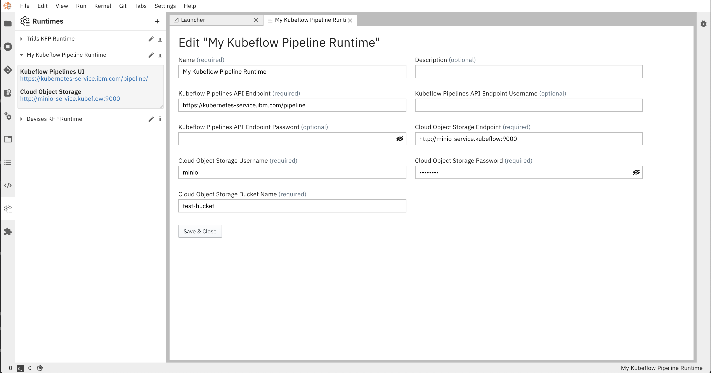

<!--

Copyright 2018-2020 IBM Corporation

Licensed under the Apache License, Version 2.0 (the "License");
you may not use this file except in compliance with the License.
You may obtain a copy of the License at

http://www.apache.org/licenses/LICENSE-2.0

Unless required by applicable law or agreed to in writing, software
distributed under the License is distributed on an "AS IS" BASIS,
WITHOUT WARRANTIES OR CONDITIONS OF ANY KIND, either express or implied.
See the License for the specific language governing permissions and
limitations under the License.

-->
## Runtime Configuration

### Prerequisites
* A Kubeflow Pipelines Endpoint
* IBM Cloud Object Storage or other S3 Based Object Store

### Configuring Runtime Metadata
**AI Pipelines** require configuring a pipeline runtime to enable its full potential. 
AI Pipelines currently only support `Kubeflow Pipelines` , and `Apache Airflow (Experimental)`with plans to expand support for other runtimes
in the future.

#### Using Command Line Interface
To configure runtime metadata for `Kubeflow Pipelines` use the `elyra-metadata install runtimes` command providing appropriate options.  This command will create a json file in your local Jupyter Data directory under its `metadata/runtimes` subdirectories.  If not known, the Jupyter Data directory can be discovered by issuing a ```jupyter --data-dir```
command on your terminal.

Here's an example invocation of `elyra-metadata install runtimes --schema_name=kfp` to create runtime metadata for use by `Kubeflow Pipelines` corresponding to the example values in the table below. Following its invocation, a file containing the runtime metadata can be found in `[JUPYTER DATA DIR]/metadata/runtimes/my_kfp.json`.
```bash
elyra-metadata install runtimes --schema_name=kfp \
       --name=my_kfp \
       --display_name="My Kubeflow Pipeline Runtime" \
       --api_endpoint=https://kubernetes-service.ibm.com/pipeline \
       --api_username=username@email.com \
       --api_password=mypassword \
       --cos_endpoint=http://minio-service.kubeflow:9000 \
       --cos_username=minio \
       --cos_password=minio123 \
       --cos_bucket=test-bucket
```
This produces the following content in `my_kfp.json`:
```json
{
    "display_name": "My Kubeflow Pipeline Runtime",
    "schema_name": "kfp",
    "metadata": {
        "api_endpoint": "https://kubernetes-service.ibm.com/pipeline",
        "api_username": "username@email.com",
        "api_password": "mypassword",
        "cos_endpoint": "http://minio-service.kubeflow:9000",
        "cos_username": "minio",
        "cos_password": "minio123",
        "cos_bucket": "test-bucket"
    }
}
```
NOTE: In case of typing a custom bucket name using minio cloud storage, make sure the bucket name has no underscores

To validate your new configuration is available, run:
```bash
elyra-metadata list runtimes

Available metadata instances for runtimes (includes invalid):

Schema   Instance  Resource  
------   --------  -------- 
kfp      my_kfp    /Users/jdoe/Library/Jupyter/metadata/runtimes/my_kfp.json
```

Existing runtime metadata configurations can be removed via `elyra-metadata remove runtimes --name=[runtime]`:
```bash
elyra-metadata remove runtimes --name=my_kfp
```

`Elyra` depends on its runtime metadata to determine how to communicate with your KubeFlow Pipelines
Server and with your chosen Object Store to store artifacts.   

#### Using Elyra Runtimes User Interface
Elyra also has UI support to accessing runtime metadata directly in JupyterLab, 
where user can easily view, add, edit or remove runtimes configurations, as an option to the CLI method described above. 
It can be accessed from the Runtimes icon on JupyterLab's left tab bar, which opens a side panel widget displaying available pipeline runtimes.
Click on the `+` button to add a new pipeline runtime, or on the edit icon to edit an existing configuration. 
These actions will open the Metadata Editor as a new tab in the main area, where runtime metadata parameters can be edited 
and will also be saved in json format in `[JUPYTER DATA DIR]/metadata/runtimes/`.


#### Parameters

##### api_endpoint
The Pipelines API Endpoint you wish to run your Pipeline.

KubeFlow Example: `https://kubernetes-service.ibm.com/pipeline`  
Airflow Example: `http://your.apache.webserver:port`

##### api_username
Username used to access your KubeFlow Pipelines API endpoint. SEE NOTE.

Example: `username@email.com`

##### api_password
Password used to access your KubeFlow Pipelines API endpoint. SEE NOTE.

Example: `mypassword`

##### cos_endpoint
This should be the URL address of your S3 Object Storage. If running an Object Storage Service within a kubernetes cluster (Minio), you can use the kubernetes local DNS address.

Example: `https://minio-service.kubeflow:9000`

##### cos_username
Username used to access the Object Store. SEE NOTE.

Example: `minio`

##### cos_password
Description: Password used to access the Object Store. SEE NOTE.

Example: `minio123`

##### cos_bucket
Name of the bucket you want your artifacts in. If the bucket doesn't exist, it will be created

Example: `test-bucket`

##### cos_dag_bucket (Only Required for Apache Airflow)
Name of the bucket you want Elyra to upload DAG files to. This is a separate bucket that will be used
to sync with Apache Airflow's DAG directory

Example: 'dag-bucket' 

NOTE: 
If using an authentication-restricted Kubeflow environment, you must enter your credentials in `api_username` and `api_password` fields 
to allow pipeline uploads through Elyra.

If using IBM Cloud Object Storage, you must generate a set of [HMAC Credentials](https://cloud.ibm.com/docs/services/cloud-object-storage/hmac?topic=cloud-object-storage-uhc-hmac-credentials-main) 
and grant that key at least [Writer](https://cloud.ibm.com/docs/services/cloud-object-storage/iam?topic=cloud-object-storage-iam-bucket-permissions) level privileges.
Your `access_key_id` and `secret_access_key` will be used as your `cos_username` and `cos_password` respectively.
