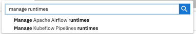

<!--

Copyright 2018-2022 Elyra Authors

Licensed under the Apache License, Version 2.0 (the "License");
you may not use this file except in compliance with the License.
You may obtain a copy of the License at

http://www.apache.org/licenses/LICENSE-2.0

Unless required by applicable law or agreed to in writing, software
distributed under the License is distributed on an "AS IS" BASIS,
WITHOUT WARRANTIES OR CONDITIONS OF ANY KIND, either express or implied.
See the License for the specific language governing permissions and
limitations under the License.

-->
## Runtime Configuration

A runtime configuration provides Elyra access to external resources, such as Kubeflow Pipelines or Apache Airflow for scalable pipeline execution.

You can manage runtime configurations using the [JupyterLab UI](#managing-runtime-configurations-using-the-jupyterlab-ui) or the [Elyra CLI](#managing-runtime-configurations-using-the-elyra-cli).

### Prerequisites

A runtime configuration requires connectivity details for 
* A Kubeflow Pipelines deployment or an Apache Airflow deployment
* S3-based Object Storage (e.g. Minio or IBM Cloud Object Storage)

Note: Elyra is only tested with Kubeflow v1.2.x and v1.3.x and Apache Airflow v1.10.x.

### Managing runtime configurations using the JupyterLab UI

Runtime configurations can be listed, added, modified, duplicated, and removed in the _Runtimes_ panel.


To access the panel in JupyterLab:

- Select the `Runtimes` panel from the JupyterLab sidebar.

       

  OR

- Open the JupyterLab command palette (`Cmd/Ctrl + Shift + C`) and search for `manage runtimes`.

  

#### Creating a runtime configuration

To create a runtime configuration:
1. Open the `Runtimes` panel.
1. Click `+` to add a new runtime configuration and choose the desired runtime configuration type, e.g. Kubeflow Pipelines or Apache Airflow. 
   
1. Provide a runtime configuration display name, an optional description, and tag the configuration to make it more easily discoverable. 
1. Enter the Kubeflow Pipelines or Apache Airflow deployment information. Refer to section [Kubeflow Pipelines configuration settings](#kubeflow-pipelines-configuration-settings) or [Apache Airflow configuration settings](#apache-airflow-configuration-settings) for details.
1. Enter the Cloud Storage connectivity information. Refer to section [Cloud Storage settings](#cloud-storage-settings) for details.
1. Save the runtime configuration. The new entry is displayed in the list.
1. Expand the entry and verify that you can access the Kubeflow Pipelines or Apache Airflow GUI and the Cloud Storage GUI using the displayed links.
    

#### Modifying a runtime configuration

To edit a runtime configuration:
1. Open the `Runtimes` panel.
1. Click the pencil next to the runtime configuration.

#### Duplicating a runtime configuration

To duplicate a runtime configuration:
1. Open the `Runtimes` panel.
1. Click the duplicate icon next to the runtime configuration.
1. Follow the steps in '[_Modifying a runtime image configuration_](#modifying-a-runtime-configuration)' to customize the duplicated configuration.

#### Deleting a runtime configuration

To delete a runtime configuration:
1. Open the `Runtimes` panel.
1. Click the trash can next to the runtime configuration.
1. Confirm deletion.

### Managing runtime configurations using the Elyra CLI

You can list, create, edit, or delete runtime configurations using the `elyra-metadata` CLI.

#### Listing runtime configurations

To list runtime configurations run

```
$ elyra-metadata list runtimes
```

The output lists for each runtime the name and the name of the associated JSON formatted metadata file, which is stored in the JupyterLab data directory in the `metadata/runtimes` subdirectory.

```
Available metadata instances for runtimes (includes invalid):

Schema   Instance  Resource  
------   --------  -------- 
kfp      my_kfp    /Users/jdoe/Library/Jupyter/metadata/runtimes/my_kfp.json
```

To format the output as JSON run `elyra-metadata list runtimes --json`. Note that the JSON export includes the content of the metadata files, not just their names.

#### Creating a runtime configuration

To create a runtime configuration for a Kubeflow Pipelines deployment:

```bash
$ elyra-metadata create runtimes \
       --schema_name kfp \
       --display_name "My Kubeflow Pipelines Runtime" \
       --api_endpoint https://kubernetes-service.ibm.com/pipeline \
       --auth_type "DEX_STATIC_PASSWORDS" \
       --api_username username@email.com \
       --api_password mypassword \
       --engine Argo \
       --cos_endpoint http://minio-service.kubeflow:9000 \
       --cos_auth_type "USER_CREDENTIALS" \
       --cos_username minio \
       --cos_password minio123 \
       --cos_bucket test-bucket \
       --tags "['kfp', 'v1.0']"
```

Refer to the [Kubeflow Pipelines Configuration settings](#kubeflow-pipelines-configuration-settings) section for an explanation of the parameters.

#### Modifying a runtime configuration

To edit a runtime configuration, use the `update` command along with `--name` and `--schema_name` (to locate the instance), followed by the modified property values.  In this case, we're updating the `api_password` and `tags` properties:

```bash
$ elyra-metadata update runtimes \
       --name "my_kubeflow_pipelines_runtime" \
       --schema_name kfp \
       --api_password mynewpassword \
       --tags "['kfp', 'v1.1']"
```

Refer to the [Kubeflow Pipelines Configuration settings](#kubeflow-pipelines-configuration-settings) section for an explanation of the parameters. 

#### Exporting runtime configurations

To export runtime configurations:

```bash
$ elyra-metadata export runtimes \
	--directory "/tmp/foo"
```

The above example will export all runtime configurations to the "/tmp/foo/runtimes" directory.

Note that you must specify the `--directory` option. 

There are two flags that can be specified when exporting runtime configurations:
1. To include invalid runtime configurations, use the `--include-invalid` flag.
2. To clean out the export directory, use the `--clean` flag. Using the `--clean` flag in the above example will empty the "/tmp/foo/runtimes" directory before exporting the runtime configurations.

#### Importing runtime configurations

To import runtime configurations:

```bash
$ elyra-metadata import runtimes \
	--directory "/tmp/foo"
```

The above example will import all valid runtime configurations in the "/tmp/foo" directory (files present in any sub-directories will be ignored).

Note that you must specify the `--directory` option. 

By default, metadata will not be imported if a runtime configuration instance with the same name already exists. The `--overwrite` flag can be used to override this default behavior and to replace any installed metadata with the newer file in the import directory.

#### Deleting a runtime configuration

To delete a runtime configuration run the following command, replacing the configuration name as appropriate.

```bash
$ elyra-metadata remove runtimes --name my_kubeflow_pipelines_runtime
```

### Configuration settings

#### Common configuration settings

Configurations include the following   common settings for all supported runtime types. The string in the headings below, which is enclosed in parentheses, denotes the CLI option name.

##### Name (display_name)

A user-friendly name for runtime configuration. This property is required.

Example: `Kubeflow Pipelines dev environment`

##### N/A (name)

A unique identifier for this configuration. A value is automatically generated from `display_name`.

Example: `kubeflow_pipelines_dev_environment`

##### Description (description)

Description for this runtime image configuration. This property is optional.

Example: `Kubeflow Pipelines deployment in QA`

##### Tags (tags)

Zero or more tags for this runtime configuration.

Example: `['test-env','airflow']`

#### Kubeflow Pipelines configuration settings

This section defines the settings for the Kubeflow Pipelines deployment that you want to associate with this runtime configuration.

##### Kubeflow Pipelines API endpoint (api_endpoint)

The KubeFlow Pipelines API endpoint you want to utilize. This setting is required.

Example: `https://kubernetes-service.domain.com/pipeline`


##### Public Kubeflow Pipelines API endpoint (public_api_endpoint)

If the `KubeFlow Pipelines API endpoint` setting identifies a URL that can only be resolved within the Kubeflow cluster, Elyra cannot generate valid links to the Kubeflow Central Dashboard pipeline runs page. This is the case, for  example, if Kubeflow is configured to use `KUBERNETES_SERVICE_ACCOUNT_TOKEN` authentication. If a public URL is configured for the Kubeflow Central Dashboard, specify it as `Public Kubeflow Pipelines API endpoint`.

Example: `https://public-kubernetes-service-url/pipeline`


##### Kubeflow Pipelines user namespace (user_namespace)
The namespace used to run your pipeline in Kubeflow Pipelines. This setting is required if namespaces are defined in Kubeflow Pipelines. SEE NOTE.

Example: `anonymous`

##### Kubeflow authentication type (auth_type)
Authentication type Elyra uses to gain access to Kubeflow Pipelines. This setting is required. Supported types are:
- No authentication (`NO_AUTHENTICATION`).
- Kubernetes service account token (`KUBERNETES_SERVICE_ACCOUNT_TOKEN`). This authentication type is only supported if Elyra runs as a pod in Kubernetes, e.g. as a Kubeflow notebook server. You must configure a service account token in Kubernetes, as outlined [here](https://www.kubeflow.org/docs/components/pipelines/sdk/connect-api/#multi-user-mode).
- DEX configured for static password authentication (`DEX_STATIC_PASSWORDS`). This authentication requires a username and a password.
- DEX configured for LDAP authentication (`DEX_LDAP`). This authentication requires a username and a  password.
- DEX (`DEX_LEGACY`). Use this type only if none of the other authentication types applies or if your Kubeflow deployment is not configured for any other listed type. This authentication requires a username and a password.

##### Kubeflow Pipelines API endpoint username (api_username)

A username is required for most authentication types. Refer to the Kubeflow authentication type setting for details.

Example: `user@example.com`

##### Kubeflow Pipelines API endpoint password (api_password)

A password is required for most authentication types. Refer to the Kubeflow authentication type setting for details.

Example: `mypassword`

##### Kubeflow Pipelines engine (engine)
The engine being used by Kubeflow Pipelines to run pipelines: `Argo` or `Tekton`. If you have access to the Kubernetes cluster where Kubeflow Pipelines is deployed, run these commands in a terminal window to determine the engine type.

```
# If this command completes successfully, the engine type is Argo.
kubectl describe configmap -n kubeflow workflow-controller-configmap

# If this command completes successfully, the engine type is Tekton.
kubectl describe configmap -n kubeflow kfp-tekton-config
```

The default is `Argo`.

Example: `Argo`

#### Apache Airflow configuration settings

This section defines the settings for the Apache Airflow deployment that you want to associate with this runtime configuration.

##### Apache Airflow UI endpoint (api_endpoint)

The Apache Airflow API endpoint you want to utilize. This setting is required.

Example: `https://your-airflow-webserver:port`

##### Apache Airflow user namespace (user_namespace)
The namespace used to run your DAG in Apache Airflow. The Kubernetes namespace must be configured with the correct permissions prior to use in Apache Airflow. This setting is Optional. 

The default namespace is `default`.

Example: `anonymous`

##### Git Type (git_type)

Identifies which git type shall be used to store DAGs. Supported types are `GitHub` and `GitLab`. `GitLab` is only supported if the [`gitlab` dependency is installed](../getting_started/installation.html#packaging). This setting is required.

##### GitHub API Endpoint (github_api_endpoint)

The GitHub, GitHub Enterprise, GitLab, or GitLab Enterprise API endpoint where the git client will attempt to connect. This setting is required. Keep the default `https://api.github.com` for github.com or use `https://gitlab.com` for gitlab.com.

Example: `https://api.private.githubenterprise.com`

##### GitHub DAG Repository (github_repo)

The GitHub repository or GitLab project that Apache Airflow utilizes to store DAGs. This setting is required. The specified repository/project must exist.

Example: `user-or-org/dag-repo-name`

##### GitHub DAG Repository Branch (github_branch)
The name of the branch in `github_repo` where DAGs are stored. 
This setting is required and the branch must exist.

Example: `dag-branch`

##### GitHub Personal Access Token (github_repo_token)
For GitHub and GitHub Enterprise: [Personal access token](https://docs.github.com/en/github/authenticating-to-github/creating-a-personal-access-token) with write access to the GitHub DAG Repository. For GitLab and GitLab Enterprise: [Personal access token](https://docs.gitlab.com/ee/user/profile/personal_access_tokens.html), which has been granted `api` access to the project. This setting is required. 

Example: `766f7c267519fee7c71d7f96bdf42e646dc65433`

#### Cloud Storage settings

This section defines the settings for the cloud storage that you want to associate with this runtime configuration.

##### Cloud Object Storage endpoint (cos_endpoint)

This should be the URL address of your S3-compatible Object Storage. If running an Object Storage Service within a Kubernetes cluster (Minio), you can use the Kubernetes local DNS address. This setting is required.

Example: `https://minio-service.kubeflow:9000`

##### Public Cloud Object Storage endpoint (public_cos_endpoint)

If the `Cloud Object Storage endpoint` setting identifies a URL that can only be resolved within the Kubernetes cluster, Elyra cannot generate valid links to the object storage page. 
If your installation requires a different public URL specify it as `Public Cloud Object Storage endpoint`.

Example: `https://public-kubernetes-service-url/storage`

##### Cloud Object Storage bucket name (cos_bucket)

Name of the bucket you want Elyra to store pipeline artifacts in. This setting is required. If the bucket doesn't exist, it will be created. The specified bucket name must meet the naming conventions imposed by the Object Storage service.

Example: `test-bucket`

> If using IBM Cloud Object Storage, you must generate a set of [HMAC Credentials](https://cloud.ibm.com/docs/services/cloud-object-storage/hmac?topic=cloud-object-storage-uhc-hmac-credentials-main)
and grant that key at least [Writer](https://cloud.ibm.com/docs/services/cloud-object-storage/iam?topic=cloud-object-storage-iam-bucket-permissions) level privileges.
Specify `access_key_id` and `secret_access_key` as `cos_username` and `cos_password`, respectively.

##### Cloud Object Storage Authentication Type (cos_auth_type)

Authentication type Elyra uses to gain access to Cloud Object Storage. This setting is required. Supported types are:
- Username and password (`USER_CREDENTIALS`). This authentication type requires a username and password. Caution: this authentication mechanism exposes the credentials in plain text. When running Elyra on Kubernetes, it is highly recommended to use the `KUBERNETES_SECRET` authentication type instead.
- Username, password, and Kubernetes secret (`KUBERNETES_SECRET`). This authentication type requires a username, password, and the name of an existing Kubernetes secret in the target runtime environment. Refer to section [Cloud Object Storage Credentials Secret](#cloud-object-storage-credentials-secret) for details.
- IAM roles for service accounts (`AWS_IAM_ROLES_FOR_SERVICE_ACCOUNTS`). Supported for AWS only. Refer to the [AWS documentation](https://docs.aws.amazon.com/eks/latest/userguide/iam-roles-for-service-accounts.html) for details.

##### Cloud Object Storage Credentials Secret (cos_secret)

Kubernetes secret that's defined in the specified user namespace, containing the Cloud Object Storage username and password.
If specified, this secret must exist on the Kubernetes cluster hosting your pipeline runtime in order to successfully
execute pipelines. This setting is optional but is recommended for use in shared environments to avoid exposing a user's 
Cloud Object Storage credentials. 

Example: `my-cos-secret`

The following is an example of how your secret on the Kubernetes cluster hosting your runtime should be defined. The variable
names defined under `data`, must be `AWS_ACCESS_KEY_ID` and `AWS_SECRET_ACCESS_KEY` followed by each respective value 
encoded in base64. Learn how to create, deploy, or configure [Kubernetes Secrets](https://kubernetes.io/docs/concepts/configuration/secret/).

```yaml
apiVersion: v1
kind: Secret
metadata:
  name: <cos_secret>
type: Opaque
data:
  AWS_ACCESS_KEY_ID: <BASE64_ENCODED_YOUR_AWS_ACCESS_KEY_ID>
  AWS_SECRET_ACCESS_KEY: <BASE64_ENCODED_YOUR_AWS_SECRET_ACCESS_KEY>
```

##### Cloud Object Storage username (cos_username)

Username used to connect to Object Storage, if credentials are required for the selected authentication type.

Example: `minio`

##### Cloud Object Storage password (cos_password)

Password for cos_username, if credentials are required for the selected authentication type.

Example: `minio123`


### Verifying runtime configurations

The [Elyra examples repository contains a basic pipeline](https://github.com/elyra-ai/examples/pipelines/setup_validation) that you can use to verify your runtime configurations:

1. Launch JupyterLab.
1. Clone `https://github.com/elyra-ai/examples.git` (`Git` > `Clone A Repository`) into the current working directory.
1. In the File Browser navigate to `examples/pipelines/setup_validation/` and follow the instructions in `README.md`. If your runtime configuration is correct and the target runtime environment configured correctly, the validation pipeline should run as is without any modifications.

### Troubleshooting 

I am seeing this error when using Elyra with Kubeflow Pipelines that is Dex enabled: 
```bash
HTTP response body: {"error":"Validate experiment request failed.: Invalid input error: Invalid resource references for experiment. Expect one namespace type with owner relationship.
```
- Ensure that you have logged into the Kubeflow Dex landing page (https://kubeflow.cluster:31380....) at least once with 
your credentials via the GUI. You should have been greeted with a dialog box and request to create a new namespace. 
Without this step complete, Elyra will not be able to create pipelines on the Kubeflow cluster. 

- Ensure you've configured Kubeflow Pipelines credentials and that they are correct. When using Dex, the `api_username` is typically 
your email address and `user_namespace` is your email shortname (e.g. `elyra` for `elyra@email.org`).
