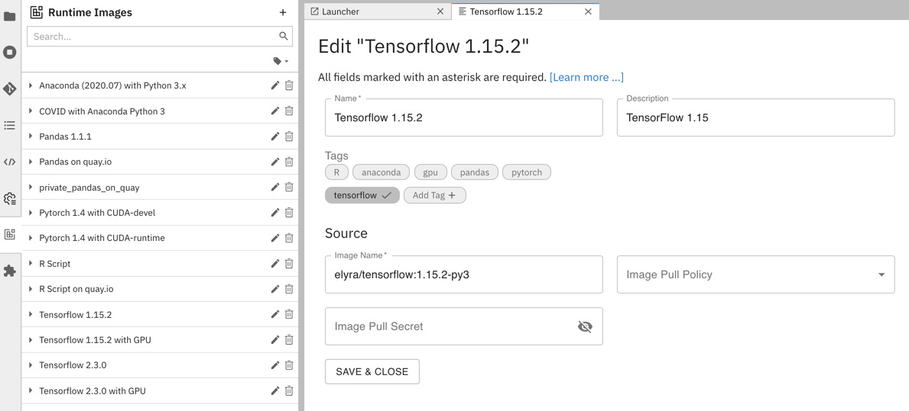
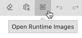
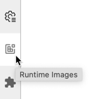
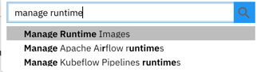

<!--

Copyright 2018-2022 Elyra Authors

Licensed under the Apache License, Version 2.0 (the "License");
you may not use this file except in compliance with the License.
You may obtain a copy of the License at

http://www.apache.org/licenses/LICENSE-2.0

Unless required by applicable law or agreed to in writing, software
distributed under the License is distributed on an "AS IS" BASIS,
WITHOUT WARRANTIES OR CONDITIONS OF ANY KIND, either express or implied.
See the License for the specific language governing permissions and
limitations under the License.

-->
## Runtime Image Configuration

A runtime image configuration identifies a container image that Elyra can utilize to run pipeline nodes on container-based platforms, such as Kubeflow Pipelines or Apache Airflow.

### Prerequisites

A runtime image configuration is associated with a container image that must meet these prerequisites:

- The image is stored in a container registry in a public or private network that the container platform in which the pipeline is executed can connect to. Examples of such registries are [hub.docker.com](https://hub.docker.com) or a self-managed registry in an intranet environment.
- The image must have a current `Python 3` version pre-installed and `python3` in the search path.
- The image must have `curl` pre-installed and in the search path.

Refer to [Creating a custom runtime container image](/recipes/creating-a-custom-runtime-image.md) for details.

You can manage runtime image configurations using the [JupyterLab UI](#managing-runtime-configurations-using-the-jupyterlab-ui) or the [Elyra CLI](#managing-runtime-image-configurations-using-the-elyra-cli).

### Managing runtime image configurations using the JupyterLab UI

Runtime image configurations can be added, modified, duplicated, and removed in the _Runtime Images_ panel.



To access the panel in JupyterLab:

- Click the `Open Runtime Images` button in the pipeline editor toolbar.

       

  OR     

- Select the `Runtime Images` panel from the JupyterLab sidebar.

       

  OR

- Open the JupyterLab command palette (`Cmd/Ctrl + Shift + C`) and search for `Manage Runtime Images`.

  

#### Adding a runtime image configuration

To add a runtime image configuration:

1. Open the `Runtime Images` panel.
1. Click `+` to add a runtime image.
1. Add the runtime image properties as appropriate.

#### Modifying a runtime image configuration

To edit a runtime image configuration:

1. Open the `Runtime Images` panel.
1. Click the `edit` icon next to the runtime image name.
1. Modify the runtime image properties as desired.

#### Duplicating a runtime image configuration

To duplicate a runtime image configuration:
1. Open the `Runtime Images` panel.
1. Click the duplicate icon next to the runtime image configuration.
1. Follow the steps in '[_Modifying a runtime image configuration_](#modifying-a-runtime-image-configuration)' to customize the duplicated configuration.

#### Deleting a runtime image configuration

To delete a runtime image configuration:
1. Open the `Runtime Images` panel.
1. Click the `delete` icon next to the runtime image name.
1. Confirm deletion.

### Managing runtime image configurations using the Elyra CLI

Runtime image configurations can be added, replaced, and removed with the `elyra-metadata` command line interface.

To list runtime image configurations:

```bash
$ elyra-metadata list runtime-images

Available metadata instances for runtime-images (includes invalid):

Schema          Instance               Resource                                                                                                       
------          --------               --------                                                                                                       
runtime-image   anaconda               /Users/jdoe/.../jupyter/metadata/runtime-images/anaconda.json
...  
```

#### Adding a runtime configuration

To add a runtime image configuration for the public `jdoe/my-image:1.0.0` container image:

```bash
$ elyra-metadata create runtime-images \
       --name "my_image_name" \
       --display_name "My runtime image" \
       --description "My custom runtime container image" \
       --image_name "jdoe/my-image:1.0.0"
```

#### Modifying a runtime configuration

To replace a runtime image configuration use the `update` command:

```bash
$ elyra-metadata update runtime-images \
       --name "my_image_name" \
       --display_name "My runtime image" \
       --description "My other custom runtime container image" \
       --image_name "jdoe/my-other-image:1.0.1"
```

#### Exporting runtime image configurations

To export runtime image configurations:

```bash
$ elyra-metadata export runtime-images \
	--directory "/tmp/foo"
```

The above example will export all runtime image configurations to the "/tmp/foo/runtime-images" directory.

Note that you must specify the `--directory` option.

There are two flags that can be specified when exporting runtime image configurations:
1. To include invalid runtime image configurations, use the `--include-invalid` flag.
2. To clean out the export directory, use the `--clean` flag. Using the `--clean` flag in the above example will empty the "/tmp/foo/runtime-images" directory before exporting the runtime image configurations.

#### Importing runtime image configurations

To import runtime image configurations:

```bash
$ elyra-metadata import runtime-images \
	--directory "/tmp/foo"
```

The above example will import all valid runtime image configurations in the "/tmp/foo" directory (files present in any sub-directories will be ignored).

Note that you must specify the `--directory` option. 

By default, metadata will not be imported if a runtime image configuration instance with the same name already exists. The `--overwrite` flag can be used to override this default behavior and to replace any installed metadata with the newer file in the import directory.

#### Deleting a runtime configuration

To delete a runtime image configuration:

```bash
$ elyra-metadata remove runtime-images \
       --name "my_image_name"
```

### Configuration properties

The runtime image configuration properties are defined as follows. The string in the headings below, which is enclosed in parentheses, denotes the CLI option name.

##### Name (display_name)

A user-friendly name for runtime image configuration. This property is required.

Example: `My runtime image`

##### Description (description)

Description for this runtime image configuration.

Example: `My custom runtime container image`

##### Image Name (image_name)

The name and tag or name and SHA256-digest of an existing container image in a container registry that meets the stated prerequisites. This property is required.

Example:

- `jdoe/my-image:1.0.0`  
OR
- `jdoe/my-image@sha256:ee783a4c0fccc7317c150450e84579544e171dd01a3f76cf2711262aced85767`

Providing only `owner/image[@SHA256]:tag/hash` uses default registry: Docker Hub registry

In general for other public container registries, the URL shall contain also `registry`, therefore the complete URL to be used in this case is: `registry/owner/image:tag`

Example:

- `quay.io/jdoe/my-image:1.0.0`

NOTE: Use SHA256-digest format in airgapped Openshift environments to support ImageContentSourcePolicy and automatic referral of images to a target repository server or to 
just support unique non-modifiable image digests instead of potentially mutable tags. SHA256-digest format is supported on all platforms (Kubernetes, Openshift, Docker) 
for image references.  

NOTE: If you want to verify the hash signatures of our factory images you can compare the image hash signature to its official published image in DockerHub. 
For example, our tensorflow image is defined as `tensorflow/tensorflow@sha256:7c01f75d58fadc2cd1109d5baac1925ed131e05925d840b1b49363c794d1c4db`  
You can navigate to the tensorflow's [official Dockerhub page](https://hub.docker.com/layers/tensorflow/tensorflow/2.8.0/images/sha256-7c01f75d58fadc2cd1109d5baac1925ed131e05925d840b1b49363c794d1c4db?context=explore)
find the image version (in this example its 2.8.0) and verify the hash matches the one listed under `DIGEST: sha256: XXXXX.....`

##### Image Pull Policy (pull_policy)

This field will be the pull policy of the image when the image is selected to be part of the pipeline. This field
is optional and not required to run a pipeline. If not selected, the behavior will [default](https://kubernetes.io/docs/concepts/containers/images/#updating-images) to that of the kubernetes 
cluster. The three options are : `Always` `IfNotPresent` `Never`

Example:

- `IfNotPresent`

This example will tell the kubelet to only pull the image if it does not exist. 

##### Image Pull Secret (pull_secret)

If `Image Name` references a container image in a secured registry (requiring credentials to pull the image), [create a Kubernetes secret in the appropriate namespace](https://kubernetes.io/docs/tasks/configure-pod-container/pull-image-private-registry/) and specify the secret name as _image pull secret_.

Restrictions:
 - Only supported for generic components.

Example:

- `my-registry-credentials-secret`

##### N/A (name)

A unique internal identifier for the runtime image configuration. The property is required when the command line interface is used manage a configuration. An identifier is automatically generated from the user-friendly name when a configuration is added using the UI.

Example: `my_runtime_image`
